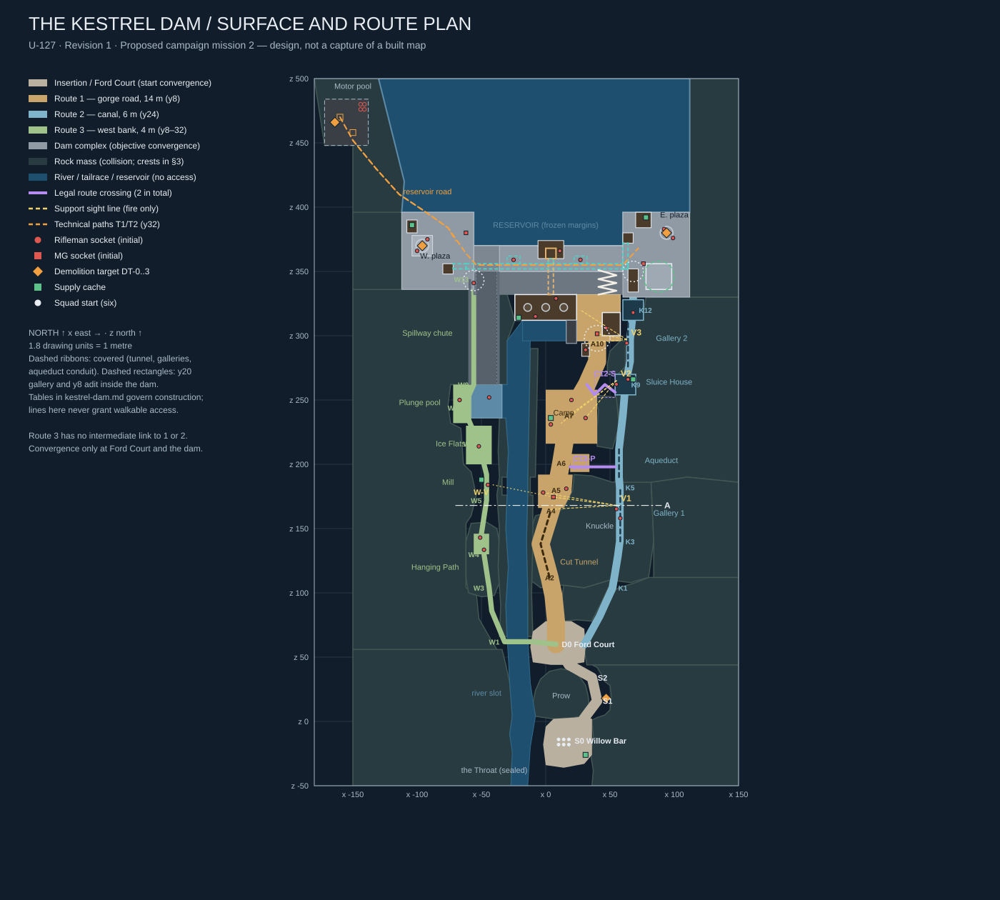
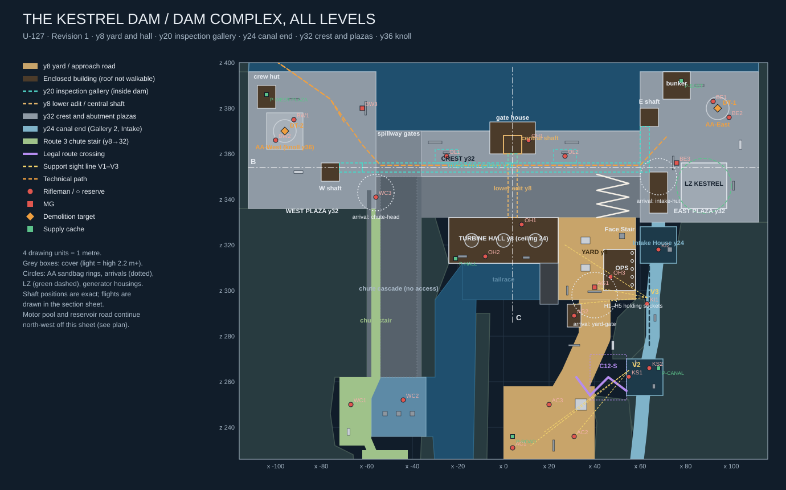
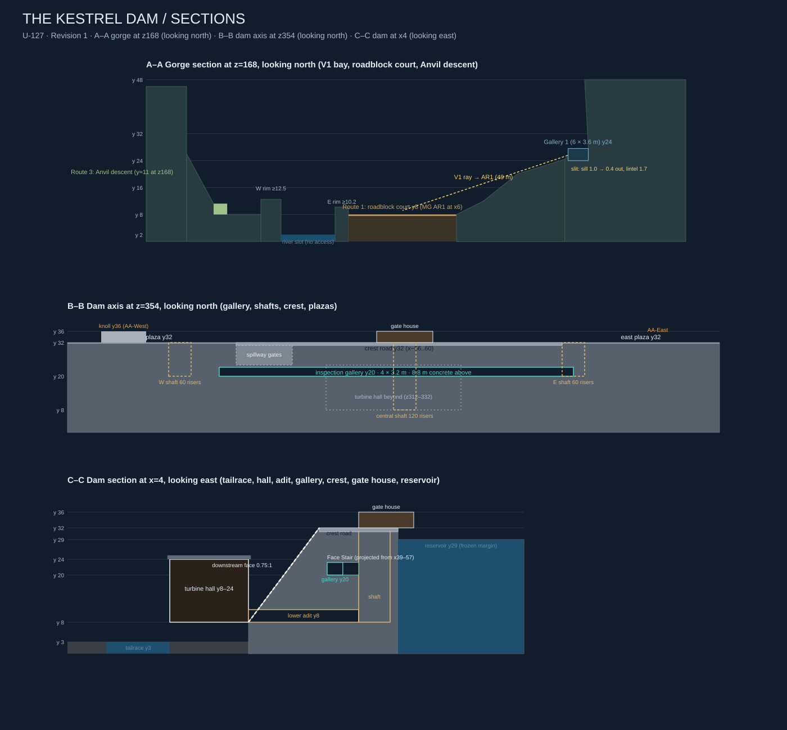

# Mission 2 construction specification — The Kestrel Dam

**Revision 1 · 2026-10-05 · U-127 · design for a new campaign map.**

This is the canonical construction brief for campaign mission 2, world and mission
`kestrel-dam`. Nothing in the game represents it yet. It is written to the same
contract as [the Qalat Road specification](qalat-road.md) and goes further where
that document left choices to the builder: every fight has a stated intent, every
window has a computed sight line, the noise each fight makes is mapped to the
groups that hear it, and every elevated edge has a named construction that stops
it becoming a shortcut.

The measurements, encounter placement and timing below are the design to build,
not optional examples. They have not been implemented or playtested, and the owner
has not approved the resulting play feel. Implementation depends on capability
work that Mission 1 has not finished yet (§17). Under [the campaign's order of
work](../CAMPAIGN.md#5-order-of-work), it is also expected to wait for Mission 1's
owner playtest unless the owner says otherwise (§20). Artists may vary surface
detail within §18's tolerances. Route geometry, cover, openings, enemy sockets,
demolition targets and mission behaviour are fixed by this document.

Companions: [mission brief](../MISSION-02.md), [shared creation standard](../MAP-MISSION-CREATION.md),
[task and evidence](../../backlog/U-127.md), [campaign](../CAMPAIGN.md), [Mission 1 specification](qalat-road.md).

## Contents

1. [Experience and fiction](#1-experience-and-fiction)
2. [Coordinates and construction rules](#2-coordinates-and-construction-rules)
3. [Topology and terrain](#3-topology-and-terrain)
4. [Willow Bar insertion and route discovery](#4-willow-bar-insertion-and-route-discovery)
5. [Route 1 — the gorge road](#5-route-1--the-gorge-road)
6. [Route 2 — the canal](#6-route-2--the-canal)
7. [Route 3 — the west bank](#7-route-3--the-west-bank)
8. [The dam complex](#8-the-dam-complex)
9. [Demolition — the new element](#9-demolition--the-new-element)
10. [Enemy placement and behaviour](#10-enemy-placement-and-behaviour)
11. [Objectives, stages and events](#11-objectives-stages-and-events)
12. [The counterattack: technicals](#12-the-counterattack-technicals)
13. [Prisoners: carried in and captured](#13-prisoners-carried-in-and-captured)
14. [Supplies, loot and carry-over](#14-supplies-loot-and-carry-over)
15. [Pacing and squad plans](#15-pacing-and-squad-plans)
16. [Presentation](#16-presentation)
17. [Engineering prerequisites and data contract](#17-engineering-prerequisites-and-data-contract)
18. [Construction order and tolerances](#18-construction-order-and-tolerances)
19. [Verification and review](#19-verification-and-review)
20. [Owner design acceptance](#20-owner-design-acceptance--2026-10-09)

## 1. Experience and fiction

January 2002, a few weeks after the Qalat Road. A Soviet-built hydroelectric dam
closes the head of a narrow limestone gorge. Its crest road is the only vehicle
crossing of the river for a day's drive. The enemy holds it as a supply crossing
and has put an anti-aircraft battery on its two abutments: two towed twin-barrel
23 mm guns, generic and unmarked. Twice this month the battery has turned back
helicopters trying to use the valley. The prisoner recovered on the Qalat Road
reported where the guns stand and that the enemy keeps captives in the dam's
operations block.

The squad must **silence both guns without destroying the dam**: the valley below
lives on its water and power. The squad's tool is a supply of demolition charges
sized for the guns, not for the dam, and this mission teaches using them (§9).
With the guns down, a helicopter can come up the gorge. It lands on the old
helipad on the east abutment, **LZ Kestrel**, once nothing that can shoot at it
is left on the dam.

The squad inserts on foot at **Willow Bar**, a gravel bar under an overhang at
the gorge's last bend, beside the old river-gauging hut. A dogleg around a rock
buttress, **the Prow**, hides the bar from everything upstream. Around the
dogleg, **Ford Court** offers three readable choices, none of which shows the
dam:

- **Route 1, the gorge road.** The old construction road vanishes into the **Cut
  Tunnel**, where a machine gun waits at the far portal. It then crosses the
  mouth of a side ravine under the canal's stone aqueduct, fights through a
  ruined workers' camp and reaches the dam's **Yard Gate** below the concrete wall.
- **Route 2, the canal.** The **Keeper's Stair** climbs the east wall to a dry
  irrigation canal cut 16 m above the road. The squad walks the empty concrete
  trough, crosses the ravine inside the aqueduct and passes through two
  **galleries** cut in the rock. Window embrasures in the galleries look straight
  down on the road's three fights. The canal ends in the **Intake House**, under
  the east battery.
- **Route 3, the west bank.** A cable **footbridge** crosses the river slot to a
  goat path. It winds through boulders, climbs the **Hanging Path** under a rock
  overhang, passes through a ruined **mill** and crosses frozen flats to the
  **plunge pool**. It then climbs the dry **spillway chute** to the west battery's
  own plaza, with the battery's guard looking down the stair.

Every route ends at the dam, and the dam forces the mission's central decision.
The two guns stand on **opposite abutments**, and the prisoners are held **at the
foot of the dam**. Every squad must cross the dam at least once: over the
exposed 116 m **crest road**, through the **inspection gallery** inside the
concrete, or down and up through the powerhouse by the central shaft. A split
squad can take both guns at once.

The first gun's explosion is heard at the motor pool on the reservoir's west
shore. Twenty seconds later two **technicals**, pickup trucks carrying heavy
machine guns, race along the reservoir road and across the crest. They are the
counterattack: fast, fragile and lethal in the open. When both are wrecked, LZ
Kestrel is clear. The mission ends when the whole squad stands on the pad.
There is no return trip: this is a **through-mission**, deliberately unlike
Mission 1's there-and-back escort.

**Pacing target, not a timer gate:** 2–3 minutes insertion and planning; 9–13
minutes on the chosen approach; 12–16 minutes for the dam objectives (two guns,
prisoners, the crossing); 4–7 minutes for the counterattack; 1–3 minutes to
regroup on the pad. That is 28–42 minutes for a first coordinated playthrough,
inside the campaign's 30–45. Faster expert runs are allowed. Distance does not
create this time. The walking distances in §15 are short on purpose, and combat,
demolition and the crossing decision supply the minutes. Measure them in play
(§19).

## 2. Coordinates and construction rules

### 2.1 Datum and extents

- All triples are **(x, y, z) metres**, with y at **feet or floor height** unless
  labelled eye, ceiling or top. Positive x is east and positive z is north, as in
  Mission 1. The river flows **south**: downstream is −z.
- Floor heights:

  | Floor | y |
  |---|---|
  | River water (visual, no access) | 2 |
  | Tailrace water (visual) | 3 |
  | Insertion, Ford Court, road, yard, turbine hall, lower adit, west bank, plunge pool | 8 |
  | Anvil pad | 16 |
  | Inspection gallery | 20 |
  | Canal | 24 |
  | Reservoir water (visual) | 29 |
  | Crest, plazas, reservoir road, motor pool | 32 |
  | Knoll | 36 |

  Every walkable floor is at y ≥ 8. No actor stands at the engine's zero plane.
- Traversable content fits approximately x = −172..112, z = −36..484. The bounding
  box is not a playable rectangle. Walkable space is the union of the ribbons,
  courts and rooms below, with rock filling everything else.
- Technical floor bounds: halfWidth 200, halfDepth 520, centred on the origin.
  The floor is a backing plane, not visible open ground. Scenery seals every
  edge out to it.
- Register the world and mission as `kestrel-dam`. Coordinates are new and have
  no relationship to Qalat's.

### 2.2 Movement facts this design builds against

From `DEFAULT_MOVE_CONFIG` in `packages/shared/src/sim/CharacterController.ts`:

| Fact | Value |
|---|---|
| Body | radius 0.35, standing height 1.8, crouched 1.2, prone 0.8 |
| Eye | 1.55 standing (`muzzle.ts`) |
| Step up | 0.45 |
| Vault | obstacles up to 1.25 high, 1.5 m traverse, jump input required |
| Jump | 6.0 m/s up, gravity 19.6 m/s², so the apex is about 0.92 m |
| Fall damage | none |

The last row decides most edges. Without fall damage, **any open drop is a free
one-way crossing**, and a drop into the river is a soft-lock. Every edge that
stands above another floor therefore uses one of the constructions below. **No
permitted drop exists anywhere in this map.**

### 2.3 Construction elements

Mission 1's §2.2 recipes apply unchanged: standard and basement stairs (0.20 m
rise, 0.40 m tread, a 2 m landing after every 10 risers), 4 × 3 m doorways, low
cover 1.1 m high and 0.8 m deep, high cover 2.2 m high and 1.2 m deep, and 4 m
minimum clearance through every required passage. This map adds:

| Element | Build rule |
|---|---|
| **RK** rock edge | Natural rock rising at least 1.6 m above the higher walking surface, with no stepped approach, along the whole edge |
| **SB** slit balustrade | Solid parapet to 1.0 m above the walking surface, a 0.7 m open slit to 1.7 m, then a solid coping beam to 2.3 m. Posts at most 3 m apart, 0.3 m wide. Fire passes through the slit. No body passes: prone is 0.8 m, and a vault needs clearance the beam denies. Used wherever a person must look down from an edge |
| **SE** slit embrasure | A window in rock or masonry. Inner opening 2.4 m wide, sill 1.0 m, lintel 1.7 m above the floor. The 0.5 m reveal splays to 3.2 m wide at the outer face. The sill plunges from 1.0 m (inner) to 0.4 m (outer) so steep downward rays clear it. The firing anchor is 0.4 m inside the inner face. Embrasures come in threes, 2.8 m apart, in an 8 m bay |
| **CT** canal trough | 6 m clear, floor y24, concrete walls rising 2.4 m above the floor on both sides, 0.5 m thick, backed by rock or earth |
| **RG** rock gallery | 6 m × 3.6 m clear, at least 1 m of rock to any outer face except at an SE |
| **IG** inspection gallery | 4 m × 3.2 m clear, cast concrete, at least 6 m of dam concrete to any face |
| **SS** shaft stair | Switchback in an 8 × 8 m clear shaft: two 4 m flights side by side, 10 risers each (4 m run), 2 m landings at both ends, solid walls. A landing returns to the starting side after every even flight |
| **CS** concrete stair | Cantilevered from the dam face, 4 m clear, 20-riser flights (10 risers, 2 m landing, 10 risers), 4 × 4 m turning landings, SB on the open side |
| **CW** compound wall | Concrete or masonry, 3.0 m above the floor, no walkable top |
| **SC** spillway cascade | 1.6 m risers, 1.2 m treads. Taller than the vault limit, so visual only, separated from any stair by a 1.8 m solid divider |

Bridges, aqueducts and footbridges take their edge construction from this table
(§6, §7). "Rim" in this document means the rock lip of the river slot; §3.4
assigns each rim its construction.

### 2.4 Legend and diagrams

`S` insertion; `D` Ford Court; `A` road; `K` canal; `W` west bank; `C` legal route
crossing; `V` support bay; `DT` demolition target; `P` supply cache; `H` holding
socket; `T` technical. Spine nodes name geometry. Enemy, cover, cache and trigger
IDs are separate stable IDs.







The diagrams are drawn from the same coordinates as the tables and are
orientation aids. Tables and dimensions govern construction. A line on a drawing
never grants walkable access.

## 3. Topology and terrain

### 3.1 Approach movement graph

```text
S0 -- S0x -- S1 -- S2 -- S3 -- D0 (Ford Court)
                               |\
                               | +-- Keeper's Stair -- K1 -- K2 -- K3 [Gallery 1] K4(V1) K5 -- K6 [aqueduct] K7 -- K8 -- K9 (Sluice House, V2) -- K10 [Gallery 2] K11(V3) -- K12 (Intake House) -- Intake Stair -- EAST PLAZA
                               |                                                                    |                          |
                               |                                                                  C12-P                      C12-S
                               |                                                                    |                          |
                               +-- A0 -- A1 -- A2 [Cut Tunnel] A3 -- A4 -- A5 (roadblock) -------- A6 (causeway) -- A7 (camp) -- A8 -- A9 -- A10 (Yard Gate) -- YARD
                               |
                               +-- footbridge -- W1 -- W2 -- W3 [Hanging Path] W4 (Anvil pad) W4b -- W5 [Mill] W6 -- W7 -- W8 -- W9 [chute stair] W12 -- W13 -- WEST PLAZA

All infantry edges run in both directions. C12-P joins A6 to the aqueduct (K6–K7);
C12-S joins A8 to the Sluice House (K9). Vehicle paths (§12) are not approaches.
```

The road and canal have **two intermediate crossings**, C12-P and C12-S, whose road-side doors are
58 m apart along the boundary. The west bank has **zero intermediate links** to
either: the river slot is continuous from the footbridge to the plunge-pool
outlet wall. **Ford Court** (D0, bounds in §4.3) is the bounded start
convergence. **The dam complex** (§8) is the bounded objective convergence, and
each route enters it through exactly one arrival: Route 1 through the Yard Gate,
Route 2 through the Intake Stair hut, Route 3 through the chute head. No other
movement link is permitted.

### 3.2 Objective-complex graph

```text
YARD (y8) -- hall loading door -- TURBINE HALL -- north door -- LOWER ADIT (y8) -- CENTRAL SHAFT (y8 -> y20 -> y32) -- CREST (y32)
   |  \                                                              |
   |   +-- Ops Block (guard room -- holding room H1-H5)        GALLERY branch (y20)
   |                                                                 |
   +-- FACE STAIR (6 flights, y8 -> y32) -- CREST       W link -- INSPECTION GALLERY (y20) -- E link
                                                           |                                    |
                                                      W SHAFT (y20 -> y32)                 E SHAFT (y20 -> y32)
                                                           |                                    |
CHUTE HEAD (Route 3 arrival) -- WEST PLAZA (y32) -- CREST (x -56 .. 60) -- EAST PLAZA (y32) -- INTAKE HUT (Route 2 arrival)
                                  |      \                                     |
                         KNOLL (y36, AA-West)  RESERVOIR ROAD -- MOTOR POOL    AA-East, bunker, LZ KESTREL
```

The complex's internal links are not route crossings. It is a destination with
three ways across it:

| Crossing method | Path | Length | Exposure |
|---|---|---|---|
| Crest road | west plaza ↔ east plaza at y32 | 116 m, about 17 s sprinting | Open to both plazas, the gate house and arriving technicals; SB both sides; cover only on the service strip |
| Inspection gallery | W shaft ↔ gallery ↔ E shaft | about 231 m including two 60-riser shafts | Enclosed; two occupied instrument chambers; close quarters |
| Through the powerhouse | yard ↔ hall ↔ adit ↔ central shaft ↔ gallery or crest | 120-riser central shaft | Enclosed; the only interior route between the yard and the upper levels |

The Face Stair joins the yard to the crest directly. It is exposed to the crest,
the gate house and the east plaza's south balustrade.

### 3.3 Terrain mass register

Each row is an (x, z) polygon around solid rock, with a minimum crest y. Masses
are envelopes. Subtract only the explicit ribbons, rooms, galleries, stairs and
view fans in §4–§8, never a whole vertical column. Galleries, the tunnel, the
Intake House and the stair under the east plaza are voids **inside** masses, with
rock above them. Where a mass meets a walking edge, follow §3.4.

| Mass | Plan polygon vertices in order | Crest y | Job |
|---|---|---|---|
| T-PROW | (−8,4),(6,2),(22,3),(30,5),(34,11),(33,20),(31,28),(27,34),(22,39),(12,41),(3,39),(−4,33),(−8,24),(−10,14) | 36 | Hides Willow Bar from the gorge; west side of the dogleg |
| T-E-SOUTH | (36,−50),(150,−50),(150,44),(36,44),(40,42),(43,37),(46,31),(50,28),(51,20),(50,9),(46,5),(40,3),(36,1),(37,−12),(35,−26),(37,−38) | 48 | East wall of the bar; carves the S1 notch that holds the training truck |
| T-W-SOUTH | (−26,−50),(−150,−50),(−150,56),(−34,56),(−31,44),(−28,30),(−27,18),(−26,4),(−28,−10),(−25,−24),(−27,−38) | 46 | West gorge wall downstream; seals the Throat |
| T-KEEPER-RIB | (14,78),(24,79),(35.7,78),(42,90),(49.3,105.3),(50,110),(30,104),(14,106),(12,92) | 30 | Rib between the road and the Keeper's Stair cleft |
| T-E-MID | (32,44),(150,44),(150,112),(80,112),(70,108),(57,104),(54.7,102.7),(48,90),(40,75),(32.7,58.7),(30,56) | 48 | East wall above Ford Court; east side of the Keeper's cleft |
| T-KNUCKLE | (−12,110),(−4,104),(14,106),(30,104),(50,110),(66,108),(80,112),(84,140),(82,186),(66,190),(52,186),(36,191),(22,192),(21,180),(14,166),(10,163),(0,162),(−8,160),(−14,140) | 44 | Spur pierced by the Cut Tunnel (y8) and Gallery 1 (y24); blocks every long view up the gorge from Ford Court |
| T-E-UPPER | (84,112),(150,112),(150,186),(110,190),(82,186),(84,140) | 50 | East skyline behind the Knuckle |
| T-E-NORTH | (54,186),(82,186),(110,190),(150,186),(150,330),(112,330),(78,330),(76,318),(68,310),(66,296),(62,276),(56,270),(54,254),(58,232),(56,214) | 48 | East wall holding the canal, Gallery 2 and the Intake House |
| T-E-SLOPE | (40,214),(52,212),(57,230),(55,252),(38,254),(41,242),(40,228) | 22 | Slope between the camp and the canal, south of the Sluice Stair well |
| T-E-SLOPE-N | (48,270),(56,270),(62,276),(62,296),(58,296),(50,288),(48,278) | 22 | Slope north of the well; the yard's east cliff |
| T-W-MID | (−38,56),(−150,56),(−150,336),(−112,336),(−60,336),(−60,262),(−74,262),(−76,246),(−74,232),(−66,228),(−64,200),(−58,194),(−54,176),(−58,160),(−62,154),(−62,104),(−54,100),(−52,80),(−44,66) | 46 | West gorge wall; the west bank's outer side and the chute's west wall |
| T-ANVIL | (−60,100),(−50,97),(−40,98),(−36,108),(−34,118),(−35,134),(−38,150),(−46,155),(−58,154),(−62,140),(−62,112) | 26 | Rock island that the Hanging Path climbs and the descent leaves |
| T-W-RIM | (−36,66),(−30,66),(−31,90),(−29,120),(−31,150),(−30,176),(−34,176),(−34,190),(−30,190),(−29,210),(−31,236),(−36,236),(−37,210),(−36,190),(−38,176),(−36,150),(−37,120),(−35,90) | 12.5 | West rim of the river slot (§3.4) |
| T-E-RIM | (−14,66),(−10,66),(−11,100),(−10,140),(−10,176),(−12,176),(−12,190),(−8,190),(−7,240),(−6,290),(−12,290),(−13,240),(−14,190),(−14,176),(−15,140),(−14,100) | 10.2 | East rim of the river slot (§3.4) |
| T-SPILL-RIB | (−36,262),(−30,262),(−30,296),(−24,312),(−30,332),(−36,344) | 24 | Rock between the spillway chute and the river, tailrace and turbine hall |
| T-W-ABUT | (−150,336),(−112,336),(−112,396),(−150,396) | 46 | West abutment behind the west plaza |
| T-N-WEST | (−112,396),(−150,396),(−150,448),(−172,448),(−180,500),(−130,500),(−110,420) | 48 | West reservoir shore; carved by the reservoir road and the motor-pool shelter |
| T-N-EAST | (112,330),(150,330),(150,500),(112,500) | 50 | East reservoir shore behind the east plaza |

The river slot runs between the rims from the Throat (z −50, sealed by a jam of
rock taller than the rims) to the tailrace at z 312. Its west bank line is about
x = −26..−31 and its east bank about x = −8..−15, both irregular. The water is
visual at y2 and has no nav. The reservoir fills the space north of the crest
between the abutments, (−56,370),(60,370),(60,396),(112,396),(112,500),(−130,500),(−110,420),(−112,396),(−56,396),
with water at y29 and frozen margins.

### 3.4 Boundary register

Every boundary between floors or routes, its construction and what stops it being
crossed. Walls and rock here are collision **and** bullet-blocking unless a slit
is listed.

| Boundary | Where | Construction | Shortcut prevention |
|---|---|---|---|
| B-01 Route 1 / river | East rim, z 66–290, except B-03 | RK, top ≥ y10.2 (≥ 2.2 above the road) | Taller than vault plus jump; no boulder within 1.5 m of its foot is under 1.6 m tall |
| B-02 Route 3 / river | West rim, z 66–236, except B-03 | RK, top ≥ y12.5 (≥ 4.5 above the path) | Also screens the west path from the canal's embrasures (§6.3) |
| B-03 Mill gap | Both rims, z 176–190 | Masonry mill-weir walls with an SB-style slit at y9.0–9.7 (1.0–1.7 above both floors); solid arch above to the rim height | The level cross-river sight line of §7.4 passes; no body can pass; rays from the canal pass over the east wall and strike the west wall's solid arch |
| B-04 Footbridge sides | x −30..−10, z 60 and 64 | 1.8 m solid timber side walls on a 4 m deck at y8 | Cannot be vaulted; no gap to the slot |
| B-05 Road / canal | East wall, z 104–330 | RK; the canal's west CT wall 2.4 m; RG with SE at V1–V3 | The only links are C12-P and C12-S. SE slits block bodies; the Pier Stair bridge and the Sluice Stair well have SB or solid sides |
| B-06 Canal / sky | Open trough stretches | CT walls 2.4 m above the canal floor | Neither a jump nor a vault reaches the top; no ladder or prop within reach |
| B-07 Route 3 / west wall | West bank, z 56–262 | RK of T-W-MID and T-ANVIL | The Hanging Path's river side is a 1.0 m rock lip with a solid canopy whose underside is 1.7 m above the path, the Mission 1 bay construction, continuous from z 104 to 130 |
| B-08 Plunge pool / river | x −34..−30, z 236–262 | Concrete pool-outlet wall 1.8 m above the ice; water leaves through a submerged culvert | No drop to the slot |
| B-09 Chute stair / cascade | x −54, z 262–344 | 1.8 m solid divider | The SC cascade beside it is visual only |
| B-10 Chute / river and hall | x −38..−24 | East training wall (3.0 m above the cascade) plus T-SPILL-RIB to y24 | No link between Route 3 and the tailrace, yard or hall |
| B-11 Yard / tailrace | x 16..24, z 294–312 | Switchgear building, enclosed, no doors | The tailrace channel is walled 5 m below the yard and sealed |
| B-12 Crest edges | z 350 and z 370, x −56..60 | SB both sides; openings only at the Face Stair head (x 39..43) and the gate-house doors | No drop to the face, the yard or the reservoir |
| B-13 Plaza edges | East plaza z 330 and z 396; west plaza z 336, the knoll's sides, the reservoir side | SB where the edge overlooks a lower floor or water; RK elsewhere | The east plaza's south SB overlooks the yard and the Face Stair (fire only) |
| B-14 Face Stair | Open side of every flight and landing | SB | Drops to lower flights or the yard are blocked |
| B-15 Pier bridge | x 32..54, z 196 and 200 | SB both sides at y24 | No drop to the ravine floor or the road |
| B-16 Knoll | x −104..−88, z 362..378, 4 m above the plaza | RK on the north, west and south faces; SB on the east face beside the stair | The knoll stair is the only way up |
| B-17 Reservoir road | Shore side | SB | No drop into the reservoir |
| B-18 Motor pool | Shelter perimeter | RK and canopy | Out-and-back spur only; no other exit |

Seal ends and corners as well as straight runs. Where a rim meets a building,
stair or wall, the higher construction wraps the corner for at least 2 m.
Decorative boulders and ice must not create a 0.45 m step chain onto any edge.
Run §19's shortcut tests (GEO-05) against built collision **and** art.

## 4. Willow Bar insertion and route discovery

### 4.1 Willow Bar and the dogleg

| ID | Centre or bounds (y8) | Construction and view |
|---|---|---|
| S0 Willow Bar | Polygon (0,−34),(14,−36),(30,−33),(36,−26),(36,−8),(36,2),(31,4),(22,3),(6,2),(0,−4),(−2,−18) | Gravel bar inside the river's last bend. Three leafless willows on the river edge (trunk collision 0.3 m radius at (2,8,−26), (−1,8,−12), (4,8,−2); branches never block). West edge: the S0 rim, RK top ≥ y10.2 |
| Gauging overhang | Rock canopy over x 10..36, z −34..−4; underside y14, 1.5 m thick, merged into T-E-SOUTH | Screens elevated observers and gives 6 m of headroom. Sky stays open to the west and south |
| Gauging hut | Inside x 26..34, z −30..−22; floor 8, ceiling 11; 4 m door in the west face at z −28..−24 | Dry-stone hut with the river gauge's dead instruments. Holds P-START |
| S0x | (31,8,4) | 8 m exit between the Prow's south-east toe and the east wall |
| S1 | (40,8,16) | The notch: T-E-SOUTH steps back to x 50 for z 8..28. DT-0 sits against the notch's east wall |
| S2 | (36,8,34) | Turn north-west behind the Prow. Ford Court is still hidden |
| S3 | (18,8,44) | Ford Court revealed only in the last 10 m |
| D0 Ford Court | Polygon (−10,46),(4,44),(18,44),(30,46),(31,58),(30,72),(20,78),(0,78),(−10,70),(−12,58); centre (8,8,60) | The decision court (§4.3) |

The S0→S1→S2→S3 ribbon is 8 m clear. Between the Prow and the east wall the
gravel widens to 10–16 m. All of it is floor at y8, with no props in the ribbon.

Six squad start feet, all facing (31, 4):
`(10,8,−18), (14,8,−18), (18,8,−18), (10,8,−14), (14,8,−14), (18,8,−14)`.
Host, local and headless starts use the same authored array (U-110). Willow Bar
is **not** the extraction point: extraction is LZ Kestrel (§8.9).

### 4.2 Spawn protection is a geometric contract

Mission 1's §4.2 contract applies unchanged. For every initial spawn and every
point of S0's floor, every ray from every possible enemy eye or muzzle must hit
solid terrain before it reaches standing, crouched or prone body sample heights.
The enemy positions are guard sockets, full interpolated patrols, alert regions,
reserve sockets, both technicals' gunners along their whole paths, and any roof
or overlook an enemy can reach. The contract holds after alert and on return
visits, not only during a grace period.

**Design check performed for this revision** (a 2.5D test against §3.3's mass
envelopes; GEO-06 must repeat it against built collision and art):

- **Samples:** S0 on a 2 m grid inside its polygon, plus the six start feet, at
  body heights 0.4, 1.0 and 1.7 m.
- **Sources:** all 33 initial guard eyes and the 4 reserve eyes, plus both
  technical gunner eyes (2.6 m above y32) every 6 m along T1 and T2.
- **Result:** all **114,912 rays** pass through a listed mass below its crest.
  The smallest clearance under a crest is **8.4 m**.
- **Hearing:** the nearest guard to Willow Bar's centre is WA1 at 162.7 m. Every
  start point is more than 150 m from every guard socket, beyond the gunfire
  hearing radius in `data/stimuli.json`. Nothing done on the bar is heard.

No enemy alert region includes S0–S3 or Ford Court. The southern limits are
z 138 on the road (the tunnel's bend), z 128 on the canal and z 116 on the
west bank. These leashes add to the landform; the landform must pass the ray
test without them.

### 4.3 Ford Court and route signage

Ford Court is the start convergence: bounded by its polygon, floor y8, a gravel
fan where the old construction track forded the river before the footbridge was
built. The three entrances must read from S3 without a marker:

- **Left (west):** the cable footbridge at z 60..64, slung between two pairs of
  concrete pylons. Each pylon has 2 × 2 m collision, at (−12,8,58), (−12,8,66),
  (−28,8,58) and (−28,8,66), outside the 4 m deck. High above, an abandoned
  gauging cableway crosses the gorge at y20 from a lattice tower at (−4,8,50).
  The tower has 2 × 2 m collision; the cable has none. It reads as "this side
  goes across".
- **Ahead (north):** the road's rock cut. The black mouth of the Cut Tunnel is 52 m
  away under the Knuckle. The tunnel hides everything beyond it.
- **Right (east):** the Keeper's Stair, cut into a cleft. A whitewashed marker stone
  stands at its foot (30,8,60). High on the east wall, the canal's straight
  concrete lip reads as a line.

First entry into the court (any standing soldier inside the polygon, feet
y7.5..10.5) shows once per run, and a checkpoint restores it:
**"Tunnel road ahead. Canal stair to the right. Footbridge to the west bank on
the left. All three reach the dam."**

No enemy can see the court. Its nearest guard is WA1, 92.7 m away and screened
by T-ANVIL's summit. **A shot fired in Ford Court is heard** (150 m) by
west-anvil (93 m), canal-gallery (111 m), road-roadblock (115 m) and west-mill
(135 m). They become alert in their own
regions, which is acceptable and expected. The training truck's blast is not
heard (§4.4).

### 4.4 The training truck (DT-0)

A bogged enemy ammunition truck sits in the S1 notch. It is centred at
(47,8,18), 6.5 × 2.6 × 2.4 m with its long axis north-south, and rocket crates
are visible in its bed. It has two charge points: **C0a** (45.0,8,18) on its west
side, facing east, and **C0b** (47,8,14.0) at its tail, facing north. The ribbon
passes within the 6 m lethal radius, so a planter must walk at least 10 m along
the ribbon, to S0 or to S2, before the 10 s fuse ends. The nearest guard is
**141.3 m** away (KG2), beyond the 120 m blast hearing radius. The lesson is
silent and safe unless someone stands next to it.

Destroying it is optional (objective 1) and changes nothing else. Its wreck,
4.5 × 2.4 × 1.2 m, stays as low cover. The first time a standing soldier comes
within 8 m, show: **"An abandoned ammunition truck. Hold Use at a charge point
for 4 seconds to plant a charge, then get 10 metres clear."** §9 has the full
demolition rules.

## 5. Route 1 — the gorge road

### 5.1 Spine

A 10 m road with 2 m shoulders gives a **14 m clear walking ribbon** at y8. Where
the gorge is wider, the floor runs from the east rim's face (B-01) to the foot of
the east wall. The ribbon is the minimum, not the edge. No vehicle uses this road.

| Node | (x,y,z) | Beat |
|---|---|---|
| A0 | (8,8,78) | Ford Court north exit; the tunnel mouth framed by the Knuckle |
| A1 | (6,8,98) | Rock-cut approach |
| A2 | (3,8,112) | Cut Tunnel south portal |
| A3 | (−4,8,138) | Tunnel bend (19°); burnt-out bus. Neither portal is visible from the other |
| A4 | (4,8,164) | Cut Tunnel north portal |
| A5 | (8,8,180) | **Roadblock court**: sandbag line with a machine gun facing into the tunnel |
| A6 | (12,8,201) | **Kestrel causeway** across the side ravine's mouth; Pier Stair door (C12-P) |
| A7 | (18,8,238) | **Workers' Camp**: three roofless prefab barracks |
| A8 | (32,8,262) | Camp north; Sluice Stair door (C12-S) |
| A9 | (40,8,280) | Last bend; the dam face and the Face Stair fill the view |
| A10 | (40,8,294) | **Yard Gate** opening (x 34..46); Route 1 arrival |

Horizontal length from Ford Court to the gate is 242 m. There are three fights,
each in its own space: the tunnel and roadblock, the camp, and the gate. The
Knuckle, the ravine's walls and the last bend cut the long sight lines between
them. No hostile line of fire along the road exceeds 60 m, apart from the canal
embrasures' deliberate views (§6.3).

### 5.2 The Cut Tunnel

- **Bore:** 10 m clear, ceiling y15 (7 m), rough rock walls over a concrete
  invert. Its axis runs A2 → A3 → A4 with a 19° bend at A3; length is about 53 m.
  The Knuckle rises at least 20 m above it. Gallery 1 passes through the same
  spur about 50 m east and never above the bore.
- **The bend is the tunnel's cover.** AR1's sight lines from the roadblock toward
  the whole south-portal width pass outside the bore at A3 (design check in
  §19.1). A squad entering from the south is invisible to the machine gun until
  it rounds the bend, 26 m from the north portal.
- **Contents:** A-C01, a burnt-out bus, 9 × 2.6 × 3.0 m, solid proxy, at
  (−6.7,8,141) along the west wall. It leaves at least 7 m clear on the east.
  Two refuge niches in the east wall, centred z 126 and z 152, are 3 m long,
  2 m deep and 3 m high: cover from the bore's axis. Three dead caged lamps
  hang at z 120, 138 and 156 (decor).
- **Light:** daylight at both portals with a 6 m lit transition. Inside, keep
  enough ambient light that silhouettes stay readable against the portals.
  Darkness is not cover here.
- No enemy starts inside the tunnel, and no alert region extends into its
  southern half (z < 138).

### 5.3 Roadblock court

The court polygon is (−6,166),(14,166),(20,178),(21,192),(−6,192). The enemy's
**A-C06** sandbag line, 8 × 0.8 × 1.1 m, runs across the road at (6,8,172.5),
x 2..10. It leaves 8 m clear to the west and 10 m to the east. Behind it, **AR1**
(MG) at (6,8,174.5) faces (3,140), straight into the tunnel's north half. AR2 at
(−2,8,178) and AR3 at (16,8,181) cover the portal's flanks. The player's cover
leaving the portal is two jersey barriers, A-C04 and A-C05, 6 m short of the
sandbags. Beyond the line are rock A-C07 (east) and the jeep wreck A-C08 (west).

Two support angles reach this fight from other routes. **V1**, the canal's
Gallery 1 bay, sees AR1 and AR2 from 49–58 m, high and to the east. **W-V**, the
mill's embrasure on the west bank, sees AR1's open west flank from 48 m across
the river (§7.4). Neither is required. A road-only squad answers the machine gun
with smoke (Ortiz), concussion (Preach) or fire from the niches and the bus.

### 5.4 Kestrel causeway (z 192..212)

The road crosses the mouth of the Kestrel ravine on a culvert causeway. On the
river side, A-C09 is the culvert's parapet, 6 × 0.8 × 1.1 m at (5,8,201),
standing in front of the east rim. East of the road, the ravine floor is
walkable only inside the pocket x 19..34, z 194..208, the approach to the Pier
Stair tower (x 22..32, z 196..206). The tower's door is on its west face at
z 196..200. Beyond x 34 the ravine is a boulder choke (RK) rising to the
aqueduct's footings. The aqueduct spans the ravine 40 m east of the road
(x 54..60), its three arches 16 m tall. It is the route's landmark and the canal
team's crossing.

### 5.5 Workers' Camp (court x 0..40, z 216..258)

Abandoned Soviet construction-camp barracks: prefab concrete panels 0.3 m thick,
3.0 m tall, roofless, with no walkable tops.

| Building | Bounds | Doors (4 m) | Contents |
|---|---|---|---|
| B1 | x 0..8, z 222..240 | East wall at z 228..232 and z 236..240 | AC1; P-ROAD at (4,8,236) |
| B2 | x 28..36, z 226..244 | West wall at z 230..234 and z 238..242 | AC2 |
| B3 (collapsed) | x 4..16, z 250..256 | Remnant walls 1.1 m tall, open | Low cover; may be vaulted (inside the camp) |

Other cover: A-C10 fuel drums at (14,8,226), A-C12 low wall at (22,8,232) and
A-C11, a water tank on a solid 5 × 5 × 4 m plinth, at (34,8,250). A rusted tower
crane stands on the east slope as scenery, with no collision in the court.
**V2** (Sluice House) overlooks the court from 23–54 m. The camp's north side,
A8, holds the Sluice Stair door (C12-S) at (38,8,254).

### 5.6 Last bend and the Yard Gate

At A9 the road turns north and the dam fills the view. The concrete face is 24 m
tall, with the Face Stair zigzagging up its eastern third and the gate house on
the crest. Player cover: rock A-C13 at (48,8,276) and the low wall A-C14 at
(31,8,276).

The yard's south boundary is a CW compound wall along z 294 from x 24 to x 58,
with a **12 m gate opening at x 34..46**. Its boom barrier is fixed raised and
blocks nothing. The **gatehouse** stands outside the wall: inside x 28..34,
z 284..294, floor 8, ceiling 11.5. It has a 4 m door in its east face at
z 287..291 and glassless south windows with a 1.2 m sill. AG2 is inside at
(31,8,289). Inside the gate, **AG1** (MG) sits behind the sandbags Y-C01
(6 × 0.8 × 1.1 m at (40,8,299.5)) at (40,8,301.5), facing straight out through the
gate. **V3** overlooks AG1 from 23 m. Route 1's arrival volume is a circle centred
(40,298), radius 10, feet y7.5..10.5.

### 5.7 Road cover register

Box dimensions are length × depth × height. "ns" or "ew" gives the long axis.

| ID | Centre (feet) | Size, axis | Use |
|---|---|---|---|
| A-C01 | (−6.7,8,141) | 9 × 2.6 × 3.0, ns | Burnt-out bus (solid proxy) |
| A-C04 | (−1,8,166.5) | 4 × 0.8 × 1.1, ns | Jersey barrier, west side of the north portal |
| A-C05 | (11,8,166.5) | 4 × 0.8 × 1.1, ns | Jersey barrier, east side of the north portal |
| A-C06 | (6,8,172.5) | 8 × 0.8 × 1.1, ew | Enemy sandbag line (AR1 behind) |
| A-C07 | (17,8,186) | 4 × 1.2 × 2.2, ns | Rock: AR3's cover, the squad's east flank |
| A-C08 | (−3,8,186) | 4 × 2.0 × 1.1, ns | Jeep wreck (solid proxy) |
| A-C09 | (5,8,201) | 6 × 0.8 × 1.1, ns | Culvert parapet |
| A-C10 | (14,8,226) | 3 × 1.0 × 1.1, ew | Fuel drums (inert; no explosion) |
| A-C11 | (34,8,250) | 5 × 5 × 4.0 | Water tank on a solid plinth |
| A-C12 | (22,8,232) | 5 × 0.8 × 1.1, ns | Camp low wall |
| A-C13 | (48,8,276) | 4 × 1.2 × 2.2, ns | Rock at the last bend |
| A-C14 | (31,8,276) | 5 × 0.8 × 1.1, ew | Low wall remnant |

## 6. Route 2 — the canal

### 6.1 Spine

| Node | (x,y,z) | Construction / beat |
|---|---|---|
| K0 | (30,8,60) | Keeper's Stair foot, Ford Court's east edge |
| Keeper's Stair | (30,8,60) → (36,12,71) → (42,16,82) → (47,20,93) → (52,24,104) | 80 risers over 49.2 m of run (46.0 needed), **6 m clear**, cut into the cleft between T-KEEPER-RIB and T-E-MID. RK cheeks both sides. A rock canopy covers the upper half (z 82..104) |
| K1 | (52,24,104) | 8 × 8 m head landing. South of it, the canal continues into a tunnel closed by an iron grille over a rockfall (no access) |
| K2 | (56,24,128) | Open trough (CT) |
| K3 | (57.6,24,140) | Gallery 1 south portal |
| K4 | (57.6,24,168) | **V1 bay** |
| K5 | (57.6,24,182) | Gallery 1 north portal |
| K6–K7 | (57,24,190) → (57,24,212) | **Aqueduct conduit** over the Kestrel ravine; C12-P's door at z 196..200 |
| K8 | (60,24,238) | Open trough |
| K9 | (62,24,262) | **Sluice House**, V2 bay; C12-S's door |
| K10 | (65.6,24,280) | Gallery 2 south portal |
| K11 | (65.6,24,297) | **V3 bay** |
| K12 | (68,24,320) | **Intake House** |
| Intake Stair | (68,24,328) → (68,32,350) | 40 risers over 22 m, 6 m clear (x 65..71); Route 2 arrival in its hut |

Horizontal length from Ford Court to the east plaza is 319 m. The canal falls
less than 0.2 m over its length; treat the floor as flat at y24.

### 6.2 Canal construction

| Stretch | Bounds | Construction | Notes |
|---|---|---|---|
| Open trough 1 | K1 → K3 | CT. Ice patches are cosmetic and do not slow movement | |
| Gallery 1 | K3 → K5; interior x 54.6..60.6 at the bay | RG through T-KNUCKLE, ceiling y27.6 | Rockfall K-C03 against the east wall at (60,24,150); KG2 holds behind it |
| Open trough 2 | K5 → K6 | CT | |
| Aqueduct conduit | x 54..60, z 190..212 | Covered stone conduit, interior 6 × 3.6 m, vaulted roof at y27.6, carried on three arches over the ravine. 0.5 × 0.5 m vents are decor | West-wall door at z 196..200 to the pier bridge (C12-P) |
| Open trough 3 | K7 → K9 | CT | KS2's patrol reaches z 246 |
| Sluice House | Inside x 54..70, z 254..270 | Stone house straddling the canal. Floor is the trough floor (y24), ceiling y28. Doors: canal in (south, 6 m), canal out (north, 6 m), west door at z 254..258 to C12-S | V2: three SE in the west wall (inner face x 54.6), centred z 265. Cover: gearbox K-C01 at (66,24,258), stoplogs K-C02 at (58,24,268). P-CANAL at (68,24,266) |
| Open trough 4 | K9 → K10 | CT | |
| Gallery 2 | K10 → K12; interior x 62.6..68.6 | RG through T-E-NORTH, ceiling y27.6 | V3: three SE (inner face x 62.6), centred z 297. Timber props K-C04 at (66.5,24,288) |
| Intake House | Inside x 60..76, z 312..328 | Masonry headworks inside the rock, floor y24, ceiling y28.5. The closed head gate and the reservoir pipe are decor | 6 m south door from Gallery 2; 6 m north opening to the Intake Stair. Hoist base K-C05 at (73,24,318) |
| Intake Stair | x 65..71, z 328..350 | Runs under the east plaza from z 330 to 334 (at least 5 m headroom), then inside the **Intake Stair hut** (x 64..72, z 334..352, roof y36) | 4 m door north at z 352 (x 66..70). Arrival volume: centre (68,350), radius 8, feet y31.5..34.5 |

The trough's 2.4 m walls (B-06) make the open stretches safe and blind. Nothing
on the road can see in, and nothing in the trough can see out. The galleries and
the Sluice House are where Route 2 meets the road, by sight only. That is the
overlook's bargain: three good windows, separated by long stretches where the
canal team sees nothing.

### 6.3 Support bays

Each bay is three SE embrasures, 2.8 m apart along z, in the west wall. The
standing feet anchor is 0.4 m inside the inner face; window anchors are the bay
anchor offset −2.8, 0 and +2.8 m in z. Targets are torso points, feet + 1.2 m. The
ray columns give where the best window's ray crosses the inner and outer faces,
as height above the bay floor and lateral offset from the window's centreline.
A pass needs inner height 1.0–1.7 with lateral offset ≤ 1.2, and outer height
0.4–1.7 with lateral offset ≤ 1.6.

| Bay | Anchor (feet) | Target (feet) | Range | Window | Inner h / lat | Outer h / lat |
|---|---|---|---|---|---|---|
| V1 | (55.0,24,168) | AR1 MG (6,8,174.5) | 49.4 | south | 1.42 / +0.08 | 1.25 / +0.17 |
| V1 | | AR2 (−2,8,178) | 57.9 | south | 1.44 / +0.09 | 1.29 / +0.20 |
| V1 | | Tunnel north portal (4,8,165) | 51.1 | south | 1.42 / 0.00 | 1.26 / 0.00 |
| V1 | | Pier Stair door (22,8,198) | 44.6 | south | 1.35 / +0.40 | 1.10 / +0.89 |
| V2 | (55.0,24,265) | Camp court (18,8,238) | 45.8 | south | 1.37 / −0.26 | 1.15 / −0.59 |
| V2 | | AC2 (31,8,236) | 37.6 | south | 1.28 / −0.44 | 0.94 / −0.98 |
| V2 | | AC3 patrol end (12,8,232) | 54.2 | south | 1.40 / −0.28 | 1.21 / −0.63 |
| V2 | | Camp north A8 (32,8,262) | 23.2 | south | 1.27 / 0.00 | 0.91 / −0.01 |
| V3 | (63.0,24,297) | AG1 MG (40,8,301.5) | 23.4 | south | 1.27 / +0.13 | 0.91 / +0.29 |
| V3 | | Gatehouse door (31,8,294) | 32.1 | south | 1.35 / 0.00 | 1.09 / −0.01 |
| V3 | | Hall loading-door apron (27,8,320) | 42.7 | south | 1.37 / +0.29 | 1.14 / +0.64 |
| V3 | | Ops Block door (44,8,308) | 22.0 | south | 1.21 / +0.29 | 0.78 / +0.65 |

**Deliberate blind spots**, each with what makes it:

| Bay | Blind to | Blocked by |
|---|---|---|
| V1 | Tunnel interior | The Knuckle's rock over the bore |
| V1 | Workers' Camp | Embrasure geometry (the camp lies beyond the splay) and the Knuckle's north shoulder: T-KNUCKLE's edge (52,186)–(36,191), crest y44 |
| V2 | Causeway and roadblock | **Fin F-2:** T-E-SLOPE's crest kept at y22.5 or more within x 40..52, z 238..252. The ray to A6 clears the embrasure but passes this shoulder at y21.7 |
| V2 | Barrack B1's interior | Its walls |
| V3 | Turbine hall and holding room | Their roofs |
| V3 | The Face Stair and the crest | Embrasure geometry: north of the splay and above the lintel. The east plaza's south SB covers the Face Stair instead (§8.8) |

**View fans.** The masses are envelopes and must not obstruct these rays. For
each bay, take the plan convex hull of its three windows' outer faces and all
its listed targets, expanded 1 m. Inside that hull and outside the walkable
floors, cap rock at 0.30 m below the lowest listed ray crossing that x, z,
interpolating linearly along and between rays (the Mission 1 §6.2 rule). Keep
the embrasure construction itself. Generate no nav inside a fan. Outside the
fans the envelope stands, and F-2 is explicitly protected.

Enemies use these windows too. KG1, KS1 and KI1 each start at a window anchor:
(55.0,24,165.2), (55.0,24,262.2) and (63.0,24,294.2). Each fires down at the road
through the same 0.7 m slit, so only head and shoulders show. A road-only squad
can suppress them, or accept them as the road's price. The canal team clears them
by walking up behind them.

### 6.4 Crossings

| ID | Ordered spine | Clear width | Purpose |
|---|---|---|---|
| C12-P **Pier Stair** | A6 shoulder (19,8,198) → tower door (22,8,198) → SS tower x 22..32, z 196..206: 8 flights of 10 risers (80), entering and leaving by the south landing → east door (32,24,198) → pier bridge x 32..54, z 196..200, deck y24, 22 m, SB both sides (B-15) → aqueduct conduit door (54,24,198) | 4 m | Swap roles after the roadblock fight: the canal team drops in to help clear the causeway, or the road team climbs to flank the camp from V2 |
| C12-S **Sluice Stair** | A8 (32,8,262) → well door (38,8,254) → stair well x 38..54, z 252..272: four parallel 20-riser flights (each 8 m of treads with a 2 m mid-landing) between turning landings at z 252..256 and z 266..270 (the top one, x 50..54, extended to z 252..258), solid walls between flights, rock roof → top landing (52,24,255) → Sluice House west door (x 54, z 254..258) | 4 m | Reinforce before the dam. Either team switches route before the final fights |

The two crossings' road doors are **58 m apart**, with continuous east-wall rock
between them. Both are exposed to their adjacent route's enemies and are not
spawn points. There is no third crossing, one-way drop, ladder or window
passage. Route changes use C12-P, C12-S, Ford Court or the dam complex,
whatever the alert or mission stage.

## 7. Route 3 — the west bank

### 7.1 Spine

| Node | (x,y,z) | Beat |
|---|---|---|
| W0 | (−10,8,62) | Footbridge east abutment, in Ford Court |
| W1 | (−32,8,62) | Footbridge west abutment |
| W2 | (−42,8,86) | Boulder garden |
| W3 | (−44,8,104) | Foot of the Hanging Path |
| W4 | (−48,16,130) | Head of the Hanging Path; Anvil pad's south edge |
| W4b | (−50,16,146) | Anvil pad's north edge; descent begins |
| W5 | (−46,8,172) | Mill court; mill south door |
| W6 | (−46,8,192) | Mill north door |
| W7 | (−52,8,216) | Ice Flats |
| W8 | (−64,8,244) | Plunge-pool apron |
| W9 | (−56,8,262) | Chute stair foot |
| W10–W11 | (−56,20,296) → (−56,20,304) | Relief landing and gauge hut |
| W12 | (−56,32,338) | Chute stair head |
| W13 | (−56,32,344) | Chute head landing; Route 3 arrival onto the west plaza |

The path is **4 m clear**. Pockets are wider, as the basement's rooms are in
Mission 1. Horizontal length from Ford Court to the west plaza is 330 m, the
longest route. Floor y8, except the Anvil pad (y16) and the chute stair (y8 → 32).

### 7.2 Footbridge

The deck spans x −30..−10 at y8, 4 m clear between 1.8 m solid timber side walls
(B-04), slung from the four pylons of §4.3. Both rims are cut 4 m wide at the
abutments, and the side walls continue through the cuts so no gap opens to the
slot. Shots across the bridge are possible; drops are not.

### 7.3 Boulder garden, Hanging Path and the Anvil

- **Boulder garden (W1 → W3):** the path winds between house-sized boulders:
  W-C01 4 × 4 × 3.0 at (−38,8,78), W-C02 5 × 4 × 3.5 at (−48,8,92) and W-C03
  3 × 3 × 2.5 at (−39,8,100). At least 4 m clear between them.
- **Hanging Path:** (−44,8,104) → (−48,16,130), 40 risers over 26.3 m of run
  (22.0 needed), 4 m clear, cut into T-ANVIL's east face. On the river side, B-07:
  a 1.0 m rock lip under a solid canopy whose underside is 1.7 m above the treads.
  The path looks out from under a ledge at the river slot and the road's cut
  beyond. No body can leave it.
- **Anvil pad:** x −56..−44, z 130..146, y16. The low stone wall W-C04 runs
  4 m east-west at (−48.5,16,136); WA1 stands behind it at (−48,16,133.5),
  watching the Hanging Path's head. Rock W-C05 is at (−54,16,142), and WA2 at
  (−51,16,143). The Anvil's summit (y26) between the pad and Ford Court hides
  the court and its insertion from the pad.
- **Descent:** (−50,16,146) → (−46,8,172), 40 risers over 26.3 m, 4 m clear, RK
  cheeks, down the Anvil's north face into the mill court.

### 7.4 The Mill and its window (W-V)

The mill sits inside x −52..−40, z 176..192, floor 8, ceiling 11.5, with 0.6 m
stone walls and a roof nobody can walk on. **The path passes through it:** the
south door is x −48..−44 at z 176 and the north door is x −48..−44 at z 192, both
4 m. Inside: millstone W-C06 (radius 1.2 m, 1.1 m tall) at (−49.5,8,182), grain bin
W-C07 (2 × 2 × 2.2) at (−42,8,186), and P-WEST at (−50,8,188). WM1 waits inside
at (−45,8,184).

In the east wall is **W-V**, one SE embrasure (inner face x −40.6, anchor
(−41.0,8,184)) aimed through the mill-weir slits of B-03. It is Route 3's single
view of another route. It looks east across the river slot at the roadblock:
**AR1's open west flank at 48.0 m** and AR3 at 57.1 m, a level shot. The sandbags
face south, so W-V takes the machine gun from the side. The roadblock can fire
back, and V1's rays pass over the east weir wall but strike the west wall's solid
arch, so the canal cannot see into the mill. This is a firing connection only:
no body passes B-03.

### 7.5 Ice Flats and the plunge pool

- **Ice Flats:** the pocket x −62..−42, z 200..230, a frozen backwater of ice
  and gravel, all walkable at y8. Boulder W-C08 (3 × 3 × 2.2) is at (−57,8,206)
  and the log jam W-C09 runs 4 m east-west at (−47,8,222). WM2 patrols between
  here and the mill's north door.
- **Plunge pool:** the concrete apron x −72..−58, z 232..262, plus the pool basin
  x −58..−34, z 236..262, frozen solid and walkable at y8. Three energy-dissipator
  blocks (2 × 2 × 1.1) stand on the ice at (−52,8,246), (−46,8,246) and
  (−40,8,246); rock W-C11 (3 × 1.2 × 2.2) is at (−68,8,238). The pool's east side
  is the outlet wall, B-08: 1.8 m of concrete with a submerged culvert, no drop.
  WC1 at (−67,8,250) and WC2 at (−44,8,252) guard the stair foot.

### 7.6 The spillway chute stair

The side-channel spillway carries flood water from the gates in the dam's west
section (x −56..−36) south down a stepped concrete chute to the plunge pool. In
winter it is dry. Its cascade (SC) of 1.6 m steps is scenery. The **maintenance
stair** runs up its west side.

| Part | Bounds / spine | Construction |
|---|---|---|
| Lower flight | (−56,8,262) → (−56,20,296) | 60 risers over 34 m (34.0 needed), 4 m clear (x −58..−54) |
| Relief landing and gauge hut | x −58..−54, z 296..304, y20 | Concrete hut over the landing: solid roof, ceiling y23.2, 4 m openings at both ends. A 3 × 2 m niche in the west wall at (−59,20,300) |
| Upper flight | (−56,20,304) → (−56,32,338) | 60 risers over 34 m |
| Chute head landing | x −58..−54, z 338..346, y32 | Opens north and west onto the west plaza. The plaza's south edge elsewhere is z 336 with SB (B-13) |
| West training wall | x −60..−58 | 3 m above the stair, backed by T-W-MID |
| Divider | x −54 | 1.8 m solid (B-09) |
| Cascade | x −54..−38, z 262..350 | SC, visual |
| East training wall | x −38..−36 | 3 m above the cascade, backed by T-SPILL-RIB (B-10) |

WC3 watches the chute from its head at (−56,32,341). The gauge hut's roof hides
the lower flight from that post, except a strip near the foot visible through
both hut openings. GEO-08 measures that strip; if it exceeds 6 m of stair, offset
the hut's north opening. Climbing the upper flight under WC3 is Route 3's crux.
Answers: suppress or shoot it from the relief landing (37 m, upward), throw smoke
up the chute, or rush it in a group.

### 7.7 Isolation, cost and reward

Route 3 is the narrowest (4 m) and longest (330 m) route. It has two climbs and
one exposed final ascent, no support from the other routes, and only the mill's
glimpse to offer them. Its 7 guards are fewer but better placed. Its reward:
arriving on the west plaza **outside the battery MG's field of view** (it watches the
crest); 36 m from AA-West's knoll stair; next to the crew hut's cache; and holding the only
infantry access to the reservoir road. That makes it the only route that can
sabotage the fuel bowser before the counterattack starts (§12.4). It is screened
from the road and the canal for its whole length except B-03. No movement link
leaves it before the dam.

## 8. The dam complex

### 8.1 Envelope and levels

The complex is the objective convergence. Every space below, and nothing outside
it, belongs to the complex.

| Space | Bounds (inside) | Floor / ceiling | Notes |
|---|---|---|---|
| Yard | x 24..58, z 294..332 | y8, open | Route 1 arrival at the gate |
| Gatehouse | x 28..34, z 284..294 | 8 / 11.5 | Outside the wall, on the approach |
| Switchgear | x 16..24, z 294..312 | Solid, no access | B-11 |
| Ops Block | x 44..58, z 300..318 | 8 / 11.5 | Guard room x 44..50; holding room x 50..58 |
| Turbine hall | x −24..24, z 312..332 | 8 / 24 | Roof y25, not walkable |
| Lower adit | x 2..6, z 332..360 | 8 / 11.2 | Inside the dam's base |
| Central shaft | x 0..8, z 360..368 | y8 → y20 → y32 | SS, 120 risers |
| Inspection gallery | x −62..64, z 352..356 | 20 / 23.2 | IG; at least 8.6 m of concrete below the downstream face and 8.8 m below the crest |
| Gallery branch to the central shaft | x 2..6, z 356..360 | 20 / 23.2 | |
| Instrument chambers | IC-W x −30..−20 and IC-E x 22..32, both z 356..362 | 20 / 23.6 | Fight pockets off the gallery |
| West link | x −72..−62, z 352..356 | 20 / 23.2 | Gallery to the W shaft |
| W shaft | x −80..−72, z 348..356 | y20 → y32 | SS, 60 risers; hut on the west plaza with a 4 m door east |
| East link | x 60..64, z 352..372 | 20 / 23.2 | Gallery to the E shaft |
| E shaft | x 60..68, z 372..380 | y20 → y32 | SS, 60 risers; hut on the east plaza with a 4 m door south |
| Dam face | x −56..60, z 332..350 | Toe y8 to crest y32, 0.75 : 1 | Not walkable except the Face Stair |
| Crest | x −56..60, z 350..370 | y32 | Road z 350..360; service strip z 360..370 |
| Gate house | x −6..14, z 360..374 | 32 / 36 | Cantilevered 4 m over the reservoir |
| Spillway gates | x −56..−36 under the crest | — | Three radial gates, closed; the crest is continuous over them |
| East plaza | x 60..112, z 330..396 | y32 | LZ Kestrel, AA-East, bunker, huts |
| West plaza | x −112..−56, z 336..396, plus the chute head landing | y32 | Knoll, crew hut, W shaft hut |
| Knoll | x −104..−88, z 362..378 | y36 | AA-West |
| Reservoir road | §8.11 | y32 | Out-and-back spur |
| Motor pool | x −172..−138, z 448..484 | y32, canopy y38 | Technicals, bowser, reserve hut |

The three arrival volumes (Route 1 yard gate, Route 2 Intake Stair hut, Route 3
chute head) together form the **`dam-arrivals` area set** for objective 0 (§11).

### 8.2 Yard, Yard Gate and transformers

The yard is a concrete apron at y8 between the gate wall (z 294) and the dam's
toe (z 332). Its west side is the switchgear building and the turbine hall's east
wall; its east side is the cliff below Gallery 2 (T-E-SLOPE-N and T-E-NORTH).
Contents:

- Gate, gatehouse and AG1's sandbags (§5.6). Concrete block Y-C05
  (4 × 0.8 × 1.1, ns) at (28,8,300).
- Two transformers, Y-C02 and Y-C03, each 3 m long, 4 m deep and 3.2 m tall, at
  (36,8,310) and (36,8,322). They are hard cover nobody can climb. Rifle fire
  does nothing to them (no explosion).
- Cable drum Y-C04 (2.4 × 2.4 × 1.1) at (52,8,324).
- The turbine hall's **loading door**: x 24, z 316..324, 8 m wide and 6 m high,
  fixed open. Keep a 4 × 4 m apron clear in front of it.
- The **Face Stair** foot landing: x 39..43, z 330..334 (§8.8).

### 8.3 Ops Block and the holding room

A flat-roofed concrete block (roof y12, not walkable) holds two rooms:

| Room | Bounds | Doors | Contents |
|---|---|---|---|
| Guard room | x 44..50, z 300..318 | West door to the yard at z 306..310 (4 m); internal door to the holding room at x 50, z 310..314 (4 m) | OH3 at (47,8,306); desk and rack (decor) |
| Holding room | x 50..58, z 300..318 | Only the internal door | Holding sockets H1–H5 along the east wall: (56.5,8,302.5), (56.5,8,306), (56.5,8,309.5), (56.5,8,313), (56.5,8,316.5), all facing west |

The free floor between the sockets and the west wall is at least 5 m wide, so
freed prisoners walk out without vaulting or queuing. No guard starts in the
holding room. No window opens onto it from the yard, the plazas, the canal or
the crest, and its roof and walls block bullets, camera rays and blasts. The
building stands well outside any demolition blast. §13 covers prisoners.

### 8.4 Turbine hall

A Soviet powerhouse hall, 48 × 20 m and 16 m tall. Three generator housings
are cylinders of radius 3 m and height 2.4 m, at (−14,8,322), (0,8,322) and
(14,8,322). They leave 8 m between them, 7 m to each end wall and 7 m aisles
north and south. **Unit 2, the centre one, is running**: its shaft turns, it
hums, and it lights the hall. The enemy keeps it running for the battery's
radios.

A static overhead crane beam spans the hall at y20 (no access). Six mercury-vapour
high-bay lamps (4200 K) hang at y22. Cover: tool cart H-C01 (3 × 1 × 1.1, ew) at
(10,8,314.5) and the workbench H-C02 (4 × 1 × 1.1, ew) at (−18,8,315). The **tool
crib** at the hall's west end (x −24..−16, z 312..318) holds P-HALL at (−21,8,314)
and the weapon rack of authored loot (§14.2).

Doors: the east loading door (§8.2) and the north door x 2..6 at z 332 into the
lower adit. The south and west walls are solid, with the tailrace below the south
wall. OH1 at (8,8,329) covers the adit door; OH2 patrols the south aisle.

### 8.5 Lower adit and central shaft

The lower adit is a 4 m × 3.2 m concrete corridor, x 2..6, z 332..360, y8, inside
the dam's base. It enters the central shaft's bottom landing. The central shaft
(SS, x 0..8, z 360..368) climbs 120 risers in 12 flights. Its landings return to
the south side at y20, where the gallery branch joins, and at y32, where a 4 m
door (x 2..6) opens south onto the crest's service strip through the gate house's
facade. The shaft is enclosed; nobody can see into it or out of it.

### 8.6 Inspection gallery, chambers and shafts

The gallery is IG, x −62..64, z 352..356, y20, lit by caged lamps (2700 K) every
12 m with a lamp at each junction. A shallow drainage channel along the north
wall is cosmetic; water seeps down the walls. The gallery has 8.8 m of concrete
above it to the crest road. No sound or slab rule lets it see, shoot or order
through to the crest.

| Feature | Bounds | Contents |
|---|---|---|
| IC-W | x −30..−20, z 356..362 | Instrument cabinets G-C01 (3 × 0.8 × 1.1, ew) at (−25,20,360.5); OL1 at (−25,20,359) |
| IC-E | x 22..32, z 356..362 | Cabinets G-C02 at (27,20,360.5); OL2 at (27,20,359) |
| Central branch | x 2..6, z 356..360 | Central shaft's y20 landing |
| West link and W shaft | §8.1 | Up to the west plaza: 6 flights, the hut door east at (−72,32,350..354) |
| East link and E shaft | §8.1 | Up to the east plaza: 6 flights, the hut door south at (60..64,32,372) |

The gallery is the protected crossing: 126 m end to end, two occupied chambers,
and an angle through each chamber mouth. It is slower than the crest (§3.2).

### 8.7 Crest, spillway gates and gate house

- **Crest:** x −56..60, z 350..370, y32. The road runs z 350..360 and is kept
  clear for vehicles. The service strip runs z 360..370. SB stands on both long
  edges (B-12), with two openings: the Face Stair head (x 39..43 at z 350) and the
  gate-house doors. Lamp standards every 20 m and cable-trench plates are decor.
- **Cover is on the strip only:** stoplog stacks C-C01 (6 × 1.2 × 1.1, ew) at
  (−30,32,365) and C-C02 at (30,32,365). The road has none. Crossing it is a
  decision.
- **Spillway gates:** three steel radial gates under the crest at x −56..−36,
  closed, seen from the reservoir side and the chute head. The crest is
  continuous over them.
- **Gate house:** x −6..14, z 360..374, floor 32, ceiling 36, cantilevered 4 m
  over the reservoir. Two south doors: the central shaft's (x 2..6) and the hoist
  hall's (x 9..13). The hoist hall wraps the shaft's solid walls and has no
  internal link to it. It has SE embrasures east and west, looking along the
  crest, and north over the reservoir. GH1 (11,32,366) is inside. It is the
  crest's one refuge and its one sentry.

### 8.8 The Face Stair

A concrete stair cantilevered from the downstream face (CS), 4 m clear, 6 flights
of 20 risers, SB on every open side (B-14):

| Part | From → to | y | Plan |
|---|---|---|---|
| L0 foot landing | — | 8 | x 39..43, z 330..334 (yard) |
| F1 | east | 8 → 12 | x 43 → 53, centreline z 332 → 335 |
| L1 | — | 12 | x 53..57, z ≈ 335 |
| F2 | west | 12 → 16 | x 53 → 43 |
| L2 | — | 16 | x 39..43, z ≈ 338 |
| F3 | east | 16 → 20 | |
| L3 | — | 20 | x 53..57, z ≈ 341 |
| F4 | west | 20 → 24 | |
| L4 | — | 24 | x 39..43, z ≈ 344 |
| F5 | east | 24 → 28 | |
| L5 | — | 28 | x 53..57, z ≈ 347 |
| F6 | west | 28 → 32 | Ends at the crest's opening x 39..43, z 350; arrival (41,32,351) |

The centreline z on the face is `332 + 0.75 × (y − 8)`. A flight overhangs the
flight two below it with at least 3.5 m of headroom. The stair is exposed to the
crest, the gate house's east embrasure, BE3 and the east plaza's south SB. It is
fast and dangerous, like the crest.

### 8.9 East plaza, AA-East and LZ Kestrel

The east plaza is a rock shelf at y32 inside x 60..112, z 330..396. Its south
edge (z 330) is SB over the yard and the Face Stair; its north edge (z 396) is SB
over the frozen reservoir; its east side is RK (T-N-EAST).

| Feature | Bounds / position | Notes |
|---|---|---|
| **LZ Kestrel** | Pad x 78..98, z 336..356; extraction circle centre (88,346), radius 12, feet y31.5..34.5 | Old Soviet helipad with a faded painted H and dead edge lights. No cover on the pad; low wall E-C05 (4 × 0.8 × 1.1, ns) at its east edge (101,32,346) |
| **AA-East (DT-1)** | Gun at (94,32,380), inside a sandbag ring of radius 5 m (0.8 m thick, 1.1 m tall) with 2 m gaps facing west and south | Charge points C1a (91.2,32,380), facing east, and C1b (94,32,377.2), facing north. Barrels raised skyward |
| Battery bunker | Inside x 70..82, z 384..396; floor 32, ceiling 35 | Concrete; 4 m door south at x 74..78; SE embrasures east and south. P-EAST at (78,32,392) |
| Intake Stair hut | x 64..72, z 334..352; roof y36 | Route 2 arrival; door north at z 352 |
| E shaft hut | x 60..68, z 372..380 | Door south |
| BE3 MG nest | Sandbags E-C02 (6 × 0.8 × 1.1, ns) at (74.5,32,356); BE3 at (76,32,356) | Faces west down the crest |
| Other cover | E-C03 ammunition crates (4 × 1.2 × 1.1, ew) at (86,32,390); E-C04 high crate stack (4 × 1.2 × 2.2, ns) at (104,32,364) | |
| T1 stop | (72,32,368), facing the crest and the pad | §12 |

### 8.10 West plaza, the knoll and AA-West

The west plaza is a shelf at y32 inside x −112..−56, z 336..396, plus the chute
head landing (x −58..−54, z 338..346). Its south edge is SB over the chute and
the abutment cliff, its north and reservoir sides SB, and its west side RK
(T-W-ABUT).

| Feature | Bounds / position | Notes |
|---|---|---|
| **Knoll** | x −104..−88, z 362..378, y36 | RK faces, plus SB on its east face (B-16). The stair is 20 risers over 10 m, (−78,32,370) → (−88,36,370), 4 m clear |
| **AA-West (DT-2)** | Gun at (−96,36,370), in a 5 m sandbag ring with gaps east and south | Charge points C2a (−93.2,36,370), facing west, and C2b (−96,36,367.2), facing north |
| BW3 MG nest | Sandbags WP-C02 (6 × 0.8 × 1.1, ns) at (−60.5,32,380); BW3 at (−62,32,380), facing (0,370) | Sweeps the crest road east of x −40. The chute head is 71° off its facing, outside its 120° field of view |
| W shaft hut | x −80..−72, z 348..356 | Door east |
| Crew hut | x −108..−100, z 380..390; floor 32, ceiling 35 | 4 m door east; P-WEST-PLAZA at (−104,32,386) |
| Other cover | WP-C03 high crate stack (4 × 1.2 × 2.2, ew) at (−90,32,352); WP-C04 low wall (5 × 0.8 × 1.1, ew) at (−92,32,384) | |
| T2 stop | (−70,32,374) | §12 |

### 8.11 Reservoir road and motor pool

The **reservoir road** is 10 m wide at y32, carved as a shelf along the
reservoir's west shore. Rock (T-N-WEST) rises on one side, with SB on the water
side (B-17). Its centreline is
(−150,32,452) → (−132,32,430) → (−114,32,410) → (−96,32,398) → (−76,32,384) → (−62,32,364) → (−54,32,355).
It continues onto the crest at z 355. Infantry can enter it only from the west
plaza. It is an out-and-back spur to the motor pool, not a fourth route.

The **motor pool** is x −172..−138, z 448..484, y32, under a rock canopy
(underside y38) merged into T-N-WEST:

- **T1:** technical parked at (−150,32,458), facing south-east.
- **T2:** technical parked at (−160,32,470), 1.15 m from the bowser.
- **Fuel bowser (DT-3):** centred (−164,32,466), 7 × 2.5 × 2.6 m, long axis
  north-south. Charge points C3a (−161.8,32,466), facing west, and C3b
  (−164,32,461.8), facing north.
- **Reserve hut:** x −148..−138, z 472..484, holding RR1–RR4.
- **Cover:** oil drums MP-C01 (3 × 1 × 1.1, ew) at (−152,32,476).

The canopy and the road's bends hide the pool from the west plaza until the last
40 m. No ray from any route reaches the parked vehicles.

### 8.12 Complex sight lines worth knowing

These follow from the geometry above. They are listed so implementers keep them
intentionally:

- The east plaza's south SB sees the yard, the Face Stair and the gate's inner
  side from 30–60 m above. BE3 cannot, because it faces the crest.
- BE3 sweeps the crest from the east end; BW3 sweeps it from the west plaza's
  north-east corner, east of x −40. The gate house's east and west embrasures
  cover the same road at half that range.
- AA-West's knoll sees the west plaza and the crest's west half, but not the
  chute stair (the plaza edge hides it).
- Nothing outside the gallery can see into it. Nothing in the yard can see the
  plazas' interiors except through the south SB.

## 9. Demolition — the new element

Mission 1 taught escort. Mission 2 teaches **demolition**: plant a charge on a
target, get clear, and let it blow. The mission supplies the charges, so the
lesson does not depend on Holloway's two C4 or Brennan's two rockets, or on any
one character being alive or played by a human.

### 9.1 Rules

1. A **demolition target** is a static object with solid collision, a wreck shape,
   400 structure points, two **charge points** (feet position plus facing) and a
   blast definition. It is never part of the dam or any route geometry.
2. **Planting:** a living, standing or crouched (not prone, not downed) squad
   soldier holds Use for **4.0 s** within **2.0 m** of a charge point. They need a
   clear line from the eye to the charge marker and must be on the same floor.
   U-049's interaction multiplier applies: Holloway, the Support, plants in 3.2 s.
   Releasing Use, leaving the 2.0 m reach, going prone or being downed resets the
   progress.
3. **Supply:** charges come from the mission, not from inventory. They are
   unlimited, but a target holds at most one armed charge. A second interaction
   on an armed or destroyed target is refused at once ("Charge already armed",
   "Target destroyed") without consuming time.
4. **Fuse:** **10.0 s**, server-authoritative, replicated as remaining ticks. A
   satchel with a blinking red lamp appears at the charge point. A beep sounds at
   1 Hz, rising to 4 Hz in the last 3 s. Every squad member within 40 m sees
   **"Charge armed — clear 10 m"** and the remaining seconds. Nothing disarms an
   armed charge.
5. **Blast:** at the target's centre, 1.0 m above its feet, using the existing
   blast and blast-cover rules: **400 damage within 6.0 m, falling linearly to 0
   at 10.0 m**, occluded by solid geometry, with friendly fire (a squad death
   still fails the mission). It emits a `detonation` stimulus (120 m) plus
   cosmetic camera shake, debris and smoke lasting at most 8 s.
6. **States:** intact → armed (with remaining fuse) → destroyed. Destroyed replaces
   the collision with the wreck shape, which remains as cover, and completes the
   target's objective. All three states, and an armed charge's remaining fuse,
   persist in checkpoints.
7. **Destruction by damage** (§9.4) produces the same blast and wreck. Every
   demolition target's destruction is the same event, whatever caused it.
8. **No new enemy behaviour:** enemies never approach, guard or disarm a charge.
   They react to the countdown's noise and the blast as to any shot or detonation.

### 9.2 Targets

| ID | Target | Centre (feet) | Collision L × W × H | Wreck | Charge points (feet → facing) | Objective | Blast heard by (120 m) |
|---|---|---|---|---|---|---|---|
| DT-0 | Bogged ammunition truck | (47,8,18) | 6.5 × 2.6 × 2.4, ns | 4.5 × 2.4 × 1.2 | C0a (45.0,8,18) → east; C0b (47,8,14.0) → north | 1, optional | Nobody (nearest guard 141 m) |
| DT-1 | Intake battery gun (AA-East) | (94,32,380) | 4.0 × 2.4 × 1.6, ns | 3.0 × 2.0 × 0.9 | C1a (91.2,32,380) → east; C1b (94,32,377.2) → north | 2 | battery-east, canal-intake, canal-sluice, gallery, gate-house, powerhouse, road-gate |
| DT-2 | Spillway battery gun (AA-West) | (−96,36,370) | 4.0 × 2.4 × 1.6, ns | 3.0 × 2.0 × 0.9 | C2a (−93.2,36,370) → west; C2b (−96,36,367.2) → north | 3 | battery-west, gallery, gate-house, powerhouse, west-chute |
| DT-3 | Motor-pool fuel bowser | (−164,32,466) | 7.0 × 2.5 × 2.6, ns | 6.0 × 2.4 × 1.4 | C3a (−161.8,32,466) → west; C3b (−164,32,461.8) → north | 5, optional | battery-west |

The guns' barrels rise above their collision as scenery and do not stop bullets
above 1.6 m. A sandbag ring (§8.9, §8.10) surrounds each gun. Its gaps give the
planter a 10 m escape: west or south out of AA-East's ring toward the bunker or
the pad, and east down the knoll stair from AA-West's. Parked technical T2 stands
5.7 m from DT-3's blast centre, inside the lethal radius. T1 stands 16.1 m away,
outside it (§12.4).

### 9.3 How the mission teaches it

1. **Briefing** (§11.3) names the charges and the rule: "the guns, not the dam".
2. **The training truck** (DT-0, §4.4) is the first thing the squad meets on
   leaving Willow Bar. It is unguarded, silent at 141 m from the nearest guard,
   and optional. Its hint text teaches hold, fuse and 10 m. Players who skip it
   still get the full countdown text on their first real plant.
3. **The first gun** is defended, but only by its crew. Each battery has 2–3
   riflemen and an MG facing the crest, so an assault that reaches the ring can
   plant under cover of the sandbags and leave through a gap.
4. **The second gun** is planted while the counterattack is on its way. The lesson
   is now under pressure.
5. **The bowser** is optional and has a consequence. Planting it before the first
   gun falls removes half the counterattack.

### 9.4 Explosive damage as an alternative

Structure points: **400**. Rocket (170), C4 (250) and claymore (150) blast damage
counts in full, after the existing occlusion. Bullets, frags, concussion, smoke
and the technicals' MG count zero. So 3 rockets, 2 C4, or one C4 plus one rocket
destroy a target. This lets Brennan rocket a gun from the knoll stair or the
pad's edge, or Holloway throw C4 into a ring. It is never required, and §14's
rocket stock is sized for the technicals first.

### 9.5 Bots and orders

- **Ordered bots:** a move order whose destination is within 1 m of a free
  charge point makes the bot plant there on arrival. After arming, it moves 12 m
  back along its arrival path and resumes its previous order. This is a
  contextual use of the existing move order, not a new order type.
- **Headless runs:** the mission scenario driver (§17, N8) sends the nearest
  available bot to each required target's charge point in turn.
- **Unordered bots** never plant on their own initiative. They do retreat from an
  armed charge's 10 m radius: an armed charge counts as a threat point for their
  existing danger avoidance.

## 10. Enemy placement and behaviour

### 10.1 Counts, readiness and fairness

**33 initial hostiles** (29 riflemen, 4 MG), **4 reserve riflemen** and **2
technicals**: at most **39 encounter entities**, under the current `aliveCap` of 42.
Squad members, and carried-in prisoners (who are squad slots), are not counted.

| Location | Groups | Hostiles |
|---|---|---|
| Route 1, road | road-roadblock, road-camp, road-gate | 8 (6 R, 2 M) |
| Route 2, canal | canal-gallery, canal-sluice, canal-intake | 6 R |
| Route 3, west bank | west-anvil, west-mill, west-chute | 7 R |
| Dam complex | powerhouse, gallery, battery-east, battery-west, gate-house | 12 (10 R, 2 M) |
| Reserve (inactive) | reserve | 4 R |
| Vehicles (parked, dormant) | technicals | 2 |

Use only the built rifleman and MG archetypes plus the new `technical` (§12).
The `rpg`, `sniper` and `officer` IDs are reserved in `packages/shared/src/sim/enemies.ts`
but not built (ADR-015), and this mission does not depend on them. Counts are
fixed at every director budget (1–6 humans): no route is randomly empty. There
are no respawns, no infinite waves and no extermination objective.

Every guard, the reserves and the parked technicals are placed before the
squad has control. A socket that fails validation is a named content error,
never a random substitute. Each row in §10.2 is a persistent entity ID used by
saves and tests.

### 10.2 Sockets

`R` rifleman, `M` MG. Facing targets are (x,z); the facing height follows the floor.

| Group | Members: ID, archetype, feet (x,y,z) → facing (x,z) |
|---|---|
| road-roadblock | AR1 M (6,8,174.5) → (3,140); AR2 R (−2,8,178) → (2,150); AR3 R (16,8,181) → (4,160) |
| road-camp | AC1 R (4,8,231) → (12,205); AC2 R (31,8,236) → (14,210); AC3 R (20,8,250) → (18,220) |
| road-gate | AG1 M (40,8,301.5) → (40,270); AG2 R (31,8,289) → (38,270) |
| canal-gallery | KG1 R (55.0,24,165.2) → (6,176) at V1's south window; KG2 R (58,24,158) → (57,128) behind K-C03 |
| canal-sluice | KS1 R (55.0,24,262.2) → (20,240) at V2's south window; KS2 R (64,24,266) → (60,240) |
| canal-intake | KI1 R (63.0,24,294.2) → (40,296) at V3's south window; KI2 R (68,24,318) → (64,290) |
| west-anvil | WA1 R (−48,16,133.5) → (−44,104); WA2 R (−51,16,143) → (−46,110) |
| west-mill | WM1 R (−45,8,184) → (−46,168); WM2 R (−52,8,214) → (−48,196) |
| west-chute | WC1 R (−67,8,250) → (−52,222); WC2 R (−44,8,252) → (−52,226); WC3 R (−56,32,341) → (−56,290) |
| powerhouse | OH1 R (8,8,329) → (24,320); OH2 R (−8,8,315) → (24,320); OH3 R (47,8,306) → (40,308) |
| gallery | OL1 R (−25,20,359) → (−60,354); OL2 R (27,20,359) → (60,354) |
| battery-east | BE1 R (92,32,383) → (60,355); BE2 R (99,32,376) → (88,346); BE3 M (76,32,356) → (40,355) |
| battery-west | BW1 R (−92,36,375) → (−56,355); BW2 R (−100,36,366) → (−60,340); BW3 M (−62,32,380) → (0,370) |
| gate-house | GH1 R (11,32,366) → (40,355) |
| reserve | RR1 (−144,32,476); RR2 (−141,32,476); RR3 (−144,32,480); RR4 (−141,32,480), all R, facing (−130,430), inactive until released |

AR1, AG1, BE3 and BW3 use an ordinary MG behind sandbags. None of them is a
player-usable emplacement, and no `mg-nest` is placed in this map. The guns'
crews stand outside their 400-point targets and fight on after the gun is
destroyed.

### 10.3 Patrols and alert bounds

Only the named soldier patrols; companions hold. Patrols walk, pause **3 s** at
each end and reverse, starting at the first point (Mission 1's rule).

| Soldier | Patrol feet points |
|---|---|
| AR3 | (16,8,181) → (20,8,196) → (14,8,186) |
| AC3 | (20,8,250) → (12,8,232) → (24,8,244) |
| KS2 | (64,24,266) → (61,24,246) → (62,24,258) |
| WM2 | (−52,8,214) → (−48,8,196) → (−56,8,224) |
| WC2 | (−44,8,252) → (−50,8,240) → (−40,8,258) |
| OH2 | (−8,8,315) → (18,8,315) → (−18,8,328) |
| OL1 | (−25,20,359) → (−25,20,354) → (−50,20,354) |
| BE2 | (99,32,376) → (100,32,388) → (96,32,368) |
| BW2 | (−100,36,366) → (−92,36,364) → (−100,36,376) |

Alert regions are nav regions on the stated floors, not x,z discs (which would
also select a floor above or below). An alerted soldier may move and lean
between legal cover inside its region. It never leaves the region, never crosses
a route boundary and never enters Willow Bar, the dogleg or Ford Court.

| Group | Region | Never |
|---|---|---|
| road-roadblock | Road z 138..212 (tunnel north half, court, causeway pocket), y8 | Tunnel south half; Pier Stair tower |
| road-camp | Road z 192..286, y8 | Above the Sluice Stair well's bottom landing |
| road-gate | Gatehouse; yard z 280..312, y8 | Turbine hall; Ops Block |
| canal-gallery | Canal z 128..212 including Gallery 1 and the aqueduct; the pier bridge's east half | Pier Stair tower |
| canal-sluice | Canal z 212..280 including the Sluice House; the well's top landing | Below y23 |
| canal-intake | Canal z 276..328 including Gallery 2 and the Intake House | The Intake Stair |
| west-anvil | Anvil pad; the Hanging Path and descent above y12 | Below y12 |
| west-mill | Mill court, mill, Ice Flats (z 166..232), y8 | The Anvil |
| west-chute | Apron, pool, chute stair, chute head landing (z 232..346) | WC3 never descends below the gauge hut |
| powerhouse | Turbine hall; yard z 312..332; Ops Block guard room | Holding room; adit; shafts |
| gallery | Gallery, chambers, branch, links (y20) | Shafts above y21 |
| battery-east | East plaza | Intake Stair below y31; E shaft; crest west of x 40 |
| battery-west | West plaza; knoll | Chute stair; W shaft; crest east of x −30; reservoir road beyond (−96,398) |
| gate-house | Hoist hall; crest service strip x −20..30 | Central shaft |
| reserve (after release) | Reservoir road; west plaza; crest; service strip | Shafts; gallery; chute; Face Stair |

The prisoners in the holding room are not targets. Guards never enter it, and
blasts are kept away from it by placement.

### 10.4 The gorge is a sound funnel

Hearing is a radius **through walls** (`packages/shared/src/ai/stimuli.ts`): gunfire
150 m, detonations 120 m. The gorge is narrow, so a fight on one route is heard on
the others. Alerted groups take cover and search **inside their own regions**.
They cannot cross. This coupling is intended, and it is why this map does not
pretend to be a stealth map. Computed from a fight at each group's centroid to
the nearest member of every other group:

| Fight at | Shots heard by (distance, m) |
|---|---|
| road-roadblock (7,8,178) | road-camp 53, canal-gallery 52, west-mill 52, west-anvil 68, west-chute 90, canal-sluice 99, road-gate 114, canal-intake 130, powerhouse 134 |
| road-camp (18,8,239) | canal-sluice 46, road-gate 52, road-roadblock 58, west-chute 64, canal-intake 73, powerhouse 73, west-mill 75, canal-gallery 84, west-anvil 119, gallery 121, gate-house 129, battery-east 133 |
| road-gate (36,8,295) | powerhouse 16, canal-intake 32, canal-sluice 42, road-camp 48, gallery 65, gate-house 75, battery-east 77, west-chute 91, road-roadblock 116, west-mill 119, battery-west 131, canal-gallery 132 |
| canal-gallery (56,24,162) | road-roadblock 48, road-camp 80, canal-sluice 101, west-mill 105, west-anvil 109, road-gate 131, canal-intake 133, west-chute 136, powerhouse 146 |
| canal-sluice (60,24,264) | canal-intake 30, road-gate 41, road-camp 43, powerhouse 47, battery-east 94, road-roadblock 95, canal-gallery 99, gallery 100, west-chute 105, gate-house 113, west-mill 123 |
| canal-intake (66,24,306) | powerhouse 24, road-gate 30, canal-sluice 40, battery-east 52, gallery 66, road-camp 74, gate-house 81, west-chute 123, road-roadblock 135, canal-gallery 141, battery-west 148 |
| west-anvil (−50,16,138) | west-mill 47, road-roadblock 62, road-camp 107, canal-gallery 108, west-chute 113 |
| west-mill (−48,8,199) | road-roadblock 51, west-chute 53, west-anvil 57, road-camp 61, canal-gallery 110, road-gate 120, canal-sluice 122, powerhouse 123, canal-intake 147 |
| west-chute (−56,16,281) | powerhouse 59, west-mill 68, road-camp 78, gallery 84, road-gate 87, battery-west 98, gate-house 109, canal-sluice 113, road-roadblock 116, canal-intake 120, west-anvil 138 |
| powerhouse (16,8,317) | road-gate 29, gallery 45, gate-house 55, canal-intake 55, road-camp 67, canal-sluice 69, battery-east 76, west-chute 79, battery-west 103, west-mill 123, road-roadblock 136 |
| gallery (1,20,359) | gate-house 17, powerhouse 33, west-chute 61, battery-west 67, road-gate 71, battery-east 76, canal-intake 79, road-camp 111, canal-sluice 111 |
| battery-east (89,32,372) | canal-intake 58, gallery 64, gate-house 78, powerhouse 82, road-gate 89, canal-sluice 109, road-camp 142, west-chute 148 |
| battery-west (−85,35,374) | west-chute 44, gallery 63, gate-house 96, powerhouse 100, road-gate 146 |
| gate-house (11,32,366) | gallery 21, powerhouse 44, battery-east 66, west-chute 72, battery-west 74, canal-intake 75, road-gate 75, canal-sluice 113, road-camp 119 |

Read it as: **the first shot at the roadblock wakes the mill and the Anvil**
across the river. **The yard fight wakes the whole dam.** **The two batteries do
not hear each other** (beyond 150 m), so whichever gun the squad hits first, its
partner is alerted by the blast echoing through the gallery and gate house, not
directly. Tune perception against this table. Do not add a muffling model
just for this map.

### 10.5 Fight-by-fight intent

| Fight | What it tests | Intended answers | Support that helps | How it goes wrong |
|---|---|---|---|---|
| Tunnel and roadblock (AR1–3) | Advancing through a covered funnel into an MG | Stage at the bend 26 m from the portal; smoke or concussion; bound from niche to bus to barrier | V1 from above (49–58 m); W-V from the flank (48 m) | Rushing the straight north half into AR1's arc |
| Camp (AC1–3) | Clearing roofless buildings with doors | Flank through B3's remnants; take B2 from its west doors; frag over B1's walls | V2 sees the court and B2's doors, not B1's interior | Standing in the court while KS1 fires down from V2 |
| Yard Gate (AG1–2) | A defended gap in a wall | Suppress AG1 from A-C13 at 25 m; clear AG2's gatehouse first | V3 kills AG1 from 23 m (one sniper shot) | Funnelling through the 12 m opening into AG1 |
| Gallery 1 (KG1–2) | A straight close fight in a 6 m gallery | Lead with the LMG; KG2 holds the rockfall | None (canal is blind) | Fighting KG2 from the open trough in a line |
| Sluice House (KS1–2) | Doorway clearing | Two doors (south, west from C12-S) for a pincer | A road team climbing C12-S | Entering from the south while KS2 patrols behind |
| Gallery 2 and Intake (KI1–2) | A last close fight, then a stair into the plaza | Take KI1 from behind at its window; stack on the Intake Stair | — | Climbing the stair before clearing KI2 |
| Anvil (WA1–2) | A climb under observation | Crouch up the Hanging Path under the canopy; concussion or frag over W-C04 | None | Standing on the path head in WA1's view |
| Mill (WM1–2) | Through-building clearing | Door fight; WM2's patrol gives a window | W-V afterwards supports the road | Ignoring WM2's patrol at the north door |
| Plunge pool and chute (WC1–3) | Open ice, then the crux climb | Dissipator blocks for cover; kill WC3 from the relief landing; smoke the upper flight | None | Climbing the upper flight with WC3 alive |
| Yard and hall (OH1–3) | Mixed indoor/outdoor fighting among big machines | Transformers, then generator housings; the adit door is OH1's | V3 (yard), east plaza south SB (if held) | Entering the loading door blind |
| Gallery (OL1–2) | Two chamber mouths in a long tube | Clear chamber by chamber | None | Running the gallery past an uncleared chamber |
| East battery (BE1–3) | A small plaza fight, with arrivals from three directions | From the Intake hut (Route 2), the E shaft hut or the Face Stair | Gate house east embrasure (if taken) | Crossing the pad, which has no cover |
| West battery (BW1–3) | A knoll and an MG watching the crest | From the chute head (unseen by BW3) or the W shaft hut | — | Crossing the crest westward into BW3 |
| Crest and gate house (GH1) | The crossing decision | Gallery instead; or clear GH1 and use the stoplogs and gate house | Both plazas' edges | Crossing in a line with technicals arriving |

## 11. Objectives, stages and events

### 11.1 Objective contract

All areas include vertical bounds (U-108). A soldier in the gallery under the
crest, or on the Intake Stair under the plaza, does not satisfy a y32 area.

| Index / stage | Label and predicate | Checkpoint / notes |
|---|---|---|
| 0 / 0 | **Reach the Kestrel Dam.** Any standing squad soldier inside the area set `dam-arrivals`: yard-gate (40,298) radius 10, y7.5..10.5; intake-hut (68,350) radius 8, y31.5..34.5; chute-head (−56,343) radius 8, y31.5..34.5 | Save the full world on completion |
| 1 / 0 | **Optional: destroy the abandoned ammunition truck.** Demolish DT-0 | No checkpoint. A later destruction credits nothing |
| 2 / 1 | **Destroy the Intake battery gun (east abutment).** Demolish DT-1 | Save on completion |
| 3 / 1 | **Destroy the Spillway battery gun (west abutment).** Demolish DT-2 | Save on completion |
| 4 / 1 | **Free every captured squad member.** No squad slot is held prisoner (§13) | Save on completion. Completes at once if nobody is held when stage 1 opens |
| 5 / 1 | **Optional: sabotage the motor-pool fuel bowser.** Demolish DT-3 | No checkpoint |
| 6 / 2 | **Destroy the technicals.** Destroy group `technicals` (both members dead, or never to be placed) | Save on completion. Completes the moment stage 2 opens if they are already dead |
| 7 / 3 | **Extract from LZ Kestrel with the whole squad standing.** All six slots alive, standing, not held prisoner, inside (88,346) radius 12, y31.5..34.5 | Success. Activates only after stage 2 |

Stages follow U-074: every non-optional objective of a stage must be complete.
Within stage 1 the order is free. Failure keeps the existing rules: a squad death,
or all six down. There is no protected group and no time limit.

### 11.2 Ordered events and texts

`t0` is the simulation time when the first battery gun is destroyed, by any
means. Timers and fired flags are checkpoint state. Same-tick events resolve by
sequence number, and a restore never replays a one-shot.

| Event | Trigger | Actions, in order |
|---|---|---|
| init | Mission start, before input | Place the squad, 33 guards, 4 inactive reserves, 2 parked dormant technicals, 4 intact demolition targets, 7 caches and the tool-crib loot. Relocate carried-in prisoners to H1–H5 (§13). Clear flags |
| briefing | Ready | Briefing (§11.3). No cutscene or forced camera |
| route-reveal | First entry into Ford Court | Route text (§4.3), once |
| truck-hint | First standing soldier within 8 m of DT-0 | Truck text (§4.4), once |
| approach-complete | Objective 0 | "At the dam. The Intake battery is on the east abutment, the Spillway battery on the west." Then, if anyone is held: "Our captured are in the operations block below the dam." Checkpoint |
| charge-armed | Any target armed | "Charge armed — clear 10 m" for squad within 40 m (per arming) |
| first-gun (t0) | First of objectives 2 and 3 | Set `battery-hit`. "Battery hit. Their radio is calling the motor pool." |
| engines | t0 + 15 s | Engine audio at the motor pool. "Engines on the reservoir road." |
| technicals-release | t0 + 20 s | Release surviving technicals along T1 and T2. Set `technicals-released` |
| reserve-release | t0 + 30 s | Release surviving RR1–RR4 to their destinations (§12.2) |
| second-gun | The other gun objective | "Both guns are down." |
| prisoners-freed | Objective 4 completes after at least one freeing | "{names} free. Weapons in the turbine-hall tool crib." |
| bowser | Objective 5 | If T2 died in the blast: "Fuel bowser destroyed. One vehicle won't be leaving." Otherwise: "Fuel bowser destroyed." |
| stage-1-complete | Stage 1 done | If technicals live: "Battery silenced. The helicopter is inbound, and LZ Kestrel is hot until those vehicles are dead." Otherwise: "Battery silenced and the vehicles are wrecked. Everyone to LZ Kestrel." |
| technicals-destroyed | Objective 6 | "Vehicles destroyed. LZ Kestrel is clear: the whole squad to the pad." Checkpoint |
| rotor | Stage 3 active and any soldier on the pad | Rotor audio rising, cosmetic |
| extraction | Objective 7 | Existing mission success, debrief and carry-over |

There is no forced wait anywhere. The 20 s before the technicals move is warning
time, not a hold, and nothing requires the squad to stand anywhere while a timer
runs.

### 11.3 Briefing, debrief and campaign entry

Briefing:

> Two anti-aircraft guns on the Kestrel Dam have turned back every helicopter
> sent up this valley. Insert at Willow Bar and reach the dam by the tunnel road,
> the irrigation canal or the west bank. Destroy both guns with demolition
> charges: the guns, not the dam. Free anyone the enemy has taken from us; they
> are held below the dam. Expect vehicles from the reservoir once the first gun
> goes. The helicopter lands at LZ Kestrel when nothing on the dam can shoot at it.

Debrief, on success: **"Both guns destroyed, the dam intact, and the whole squad
lifted from LZ Kestrel. The valley is open to helicopters."** Failure uses the
existing explicit failure reason.

Proposed `campaign.json` entry for U-088's format (added with the implementation,
not by this design):

- **title:** "Mission 02 — The Kestrel Dam"
- **briefing:**
  - "Afghanistan, January 2002. Two anti-aircraft guns on the Kestrel Dam have closed the valley to helicopters. Reach the dam by the tunnel road, the canal or the west bank."
  - "Plant charges on both guns, not on the dam. Free anyone the enemy has taken. Expect vehicles from the reservoir once the first gun goes, then extract from LZ Kestrel."
- **debrief:**
  - "Both guns are destroyed and the dam is intact."
  - "The valley is open to helicopters. The squad carries its loadout into the next mission."

No voice recording, real unit, real place or cinematic is a dependency (D9,
ADR-017, ADR-020).

### 11.4 Checkpoints and retries

A checkpoint saves:

- **Entities:** every entity's x/y/z, floor region, health, stance and alert
  state, plus each patrol's phase.
- **Groups:** deaths and activation (reserve, technicals).
- **Vehicles:** dormant or released, position and path progress.
- **Demolition targets:** state, including any **armed charge's remaining fuse**.
- **Supplies:** cache stocks and authored loot taken.
- **Prisoners:** held and freed, by slot and socket.
- **Mission:** objective and stage completion, one-shot flags, and t0 with every
  pending timer's offset.
- **Map revision** (U-113).

A detonation that completes an objective saves while another target's charge is
armed: that charge is saved armed, and it detonates on time after a retry. A
retry never restores a soldier onto a different floor. A restart restores the
mission-start carry-over loadout and the prisoners the mission began with
(U-061). Nothing earned in a failed attempt persists.

### 11.5 Outcome matrix

| Situation | Outcome |
|---|---|
| The bowser is destroyed before any gun | T2 is a wreck. At t0 + 20 s only T1 is released; the bowser text says one vehicle won't leave |
| Both technicals destroyed while parked | Objective 6 completes the moment stage 2 opens. Release events at t0 + 20 s find no survivors (no-op); reserves still release at t0 + 30 s |
| Reserves killed in their hut before release | Release finds no survivors (no-op). Nothing respawns |
| Both guns destroyed in the same tick | t0 is that tick, once |
| A gun destroyed by rockets or C4 | Same blast, wreck, objective and t0 as a charge |
| Squad reaches the pad before the technicals are dead | Nothing completes. Objective 7 is not active until stage 3 |
| A soldier is captured during stage 2 or 3 | They are held where the capture behaviour leaves them. Extraction is blocked until they are freed (the rescue interaction is always available, §13.3) |
| Planter downed or moves out of reach mid-plant | Progress resets. Nothing is armed |
| Two soldiers plant the same target's two charge points together | The first to finish arms it. The other interaction ends without arming; one detonation |
| A squad member stands inside the blast | Real blast damage, occluded by real cover. A death fails the mission. The countdown text warns everyone within 40 m |
| Checkpoint retry after an armed charge had been placed since the last checkpoint | The charge reverts with the world (it was not saved) |
| No one held at mission start | Objective 4 completes when stage 1 opens: "No one is being held." |
| DT-0 never touched | Optional; no consequence |
| All six go by the canal | AA-East first is natural. The technicals arrive across the crest toward them; AA-West needs a crossing |
| A soldier walks into the motor pool before release | Parked technicals are dormant. They engage from where they are if they perceive or are hit, but do not drive before release (§12.2) |
| Old-revision checkpoint | U-113: "This mission map has changed. Restart the mission to continue." Campaign progress, prisoner pools and the pre-mission loadout are preserved |

## 12. The counterattack: technicals

### 12.1 The `technical` archetype (proposal; tune with evidence)

| Property | Value | Note |
|---|---|---|
| Health | 450 | About 21 carbine hits, 19 LMG, 7 semi-auto sniper, 3 rockets or 2 C4 at full damage |
| Damage factors | Bullets ×1.0, frags ×1.0, rocket / C4 / claymore ×1.0 | The tank takes bullets and frags at ×0.1 (U-066). A technical is unarmoured |
| Body | Cab and open bed, 4.8 × 2.0 × 1.9 m; vehicle radius 1.6 | Gunner stands in the bed, eye 2.6 m above the road |
| Weapon | Bed-mounted heavy MG, using the `lmg` row until a heavier row is defined | No cannon |
| Movement | 5.0 m/s, 60°/s turn, arrival 2.0 m | Stops to fire, as the current vehicle does (fire at ≤ 1.0 m/s) |
| Perception | Rifleman's | |
| Wreck | Stays 600 s as cover, without a secondary explosion | |

Its threat is speed and a heavy MG at the end of a crossing. A squad that has
spread out to plant charges is caught in the open. Bots already engage vehicles
(U-079). For technicals they must also use rifles, not just launchers (§17 N2).

### 12.2 Paths, stops and timing

| Vehicle | Parked | Path (y32) | Stop | Length; time with no stops |
|---|---|---|---|---|
| T1 | (−150,32,458), facing south-east | Reservoir road (−150,452) → (−132,430) → (−114,410) → (−96,398) → (−76,384) → (−62,364) → (−54,355) → crest z 355 → (60,32,355) | (72,32,368), facing the crest and the pad | 270 m; 54 s; earliest arrival t0 + 74 s |
| T2 | (−160,32,470) | (−150,452) → (−132,430) → (−114,410) → (−96,398) → (−76,384) | (−70,32,374), facing the knoll and the crest's west end | 134 m; 27 s; earliest arrival t0 + 47 s |

The reserve riflemen leave the hut at t0 + 30 s on foot along the same road.
Their destinations are RR1 (−74,32,360), RR2 (−68,32,382), RR3 (−20,32,364) and
RR4 (20,32,364), on the crest's service strip by the stoplogs.

Vehicles stop to engage visible targets, so the listed times are a floor, not a
schedule. Record measured times with and without contact (§19). **Dormancy:**
parked technicals are crewed. Before release they never drive. If they perceive a
squad member or are damaged, they fire from where they stand. Released, a living
technical drives its path and holds its stop. It never leaves y32, the reservoir
road, the crest road, or the two stop pads. The swept corridor (vehicle radius
2.0 m plus 0.5 m) along both paths is clear of every hut, cover box and the knoll
(design check, §19.1).

### 12.3 Engagement choices

1. **The motor pool, before release:** blow the bowser, which also destroys T2,
   and rocket or shoot T1 at its parking spot. Route 3 is best placed.
2. **The crest as a killing ground:** T1 must cross 116 m of open crest road. The
   gate house's embrasures, the stoplog stacks, both plazas' edges and the Face
   Stair's top landing all have angles. A rocket from the gate house's east
   embrasure is the textbook shot.
3. **At the stops:** T1 at (72,368) is in the open on the east plaza. The bunker,
   E-C04, the E shaft hut and the Intake Stair hut give cover. T2 at (−70,374) sits
   between the knoll and the W shaft hut. AA-West's knoll looks down on it.

### 12.4 The bowser and pre-emption

DT-3's blast centre is 5.7 m from T2, so T2 takes the full 400 damage and is
destroyed by its own fuel. T1 is 16.1 m away and unharmed. The reserve hut is
about 17 m away and protected by its walls. Sabotage before t0 + 20 s, while T2 is still parked, halves the
counterattack. After that, the blast catches only what is still in the pool. The motor pool is a
dead end; the infantry who walked in must walk back out along the reservoir road.

### 12.5 What technicals never do

They do not dismount crews, spawn in sight, respawn, ram (no new collision
damage rule), enter the plazas off their stop pads, or fire through the dam,
gallery or huts. No other vehicle exists in this mission.

## 13. Prisoners: carried in and captured

### 13.1 Carried-in prisoners

The campaign rule (D3) says a character captured in a campaign run can be rescued
only in the next campaign-run mission, and replay runs keep their own pool
(U-089). For a campaign run following Mission 1, this is that mission. At mission
start, every slot the run's pool holds captured is placed at **H1–H5** in
ascending slot order: (56.5,8,302.5), (56.5,8,306), (56.5,8,309.5),
(56.5,8,313), (56.5,8,316.5). Each kneels, facing west, collision at the socket.
Five sockets are enough: if all six had been taken, Mission 1 would have failed.

**The coordinates saved in the campaign file belong to the previous world** and
must never be used here. Today `packages/server/src/session/Session.ts` places a
carried-in prisoner at exactly those saved coordinates, around line 1313. §17 N3
replaces this with mission-authored holding sockets.

### 13.2 Freeing

The existing U-063 interaction frees one prisoner per hold: 3 s, 2 m reach, line
of sight, same floor, U-049 multiplier. Objective 4 completes when no slot is
held. The freed soldier stands at the socket with full class health and class
kit (existing `freeCharacter`). The tool crib's loot and P-HALL are about 80 m away on
foot through the yard and hall. The holding room is reachable from every route's
arrival: directly from the yard, or from the plazas down the Face Stair or the
shafts.

### 13.3 Captures during this mission

The existing capture behaviour (U-062) still applies and holds a soldier where
taken. Two rules make this mission never end with someone left behind:

1. The rescue interaction is available **whenever** a slot is held, not only while
   objective 4 is open.
2. Extraction requires **all six slots standing** on the pad, with none held and
   none downed.

A soldier captured during the counterattack must be freed before the helicopter
can take the squad. Mission 1's extraction wording ("all six living, standing")
is compatible with this. If Mission 1 is implemented so a held soldier does not
block its extraction, Mission 2 still receives and handles that prisoner (§13.1).

## 14. Supplies, loot and carry-over

### 14.1 Caches (U-112 contract)

Mission 1's §12 cache rules apply unchanged: 1 s use, one item type per use,
server-authoritative, partial transfers, empty-state labels, and checkpointed
stock. **These seven caches are exhaustive.**

| Cache | Feet | Place | Rockets | Primary-magazine refills | Health-kit charges |
|---|---|---|---|---|---|
| P-START | (31,8,−26) | Gauging hut | 4 | 6 | 2 |
| P-ROAD | (4,8,236) | Barrack B1 | 2 | 3 | 1 |
| P-CANAL | (68,24,266) | Sluice House | 2 | 3 | 1 |
| P-WEST | (−50,8,188) | Mill | 2 | 3 | 1 |
| P-HALL | (−21,8,314) | Turbine-hall tool crib | 4 | 4 | 2 |
| P-EAST | (78,32,392) | Battery bunker | 4 | 4 | 2 |
| P-WEST-PLAZA | (−104,32,386) | Crew hut | 4 | 4 | 2 |
| **Total** | | | **22** | **27** | **11** |

Rockets are for the technicals first (3 each) and the guns second (§9.4). No cache
restocks C4, because demolition charges are mission-supplied. Enemy firearms drop
under the existing rules.

### 14.2 Authored loot

The tool-crib rack on the turbine hall's west wall uses the existing U-052
`pickup` action:

| Weapon | ID | Position (x,y,z), yaw | Rounds | Who can take it |
|---|---|---|---|---|
| LR-12L semi-auto sniper (left-handed) | `sniper-semi-left` | (−23.4,8.9,314), 90° | 10 | Marsh only (handedness) |
| S3 submachine gun | `smg` | (−23.4,8.9,316), 90° | 32 | Anyone allowed by U-018/U-022/U-029 |
| MK4-S scoped carbine | `carbine-scoped` | (−23.4,8.9,318), 90° | 30 | Anyone allowed |

This is the campaign's first source of a left-handed semi-automatic for Marsh,
who can acquire guns only from authored loot. Taking one replaces the slot's
primary, per the existing rules. Replaying Mission 2 is how a squad fetches it
again (D6).

### 14.3 Carry-over

The existing carry-over (U-077) applies: whatever each soldier holds at
extraction goes to Mission 3. A restart or retry returns to the mission-start
loadout.

## 15. Pacing and squad plans

### 15.1 Time budget

| Phase | Target | Where the minutes come from |
|---|---|---|
| Insertion and planning | 2–3 min | Dogleg; optional truck demolition; Ford Court choice |
| Approach | 9–13 min | Three fights per route. Walking alone is 1.0 min (road, 242 m), 1.3 min (canal, 319 m) or 1.3 min (west, 330 m) |
| Dam objectives | 12–16 min | First gun; the crossing (crest 116 m, about 17 s sprinting; gallery about 231 m including shafts); second gun; prisoners; regroup |
| Counterattack | 4–7 min | Technicals arrive from t0 + 47 s and t0 + 74 s at the earliest; reserves |
| Extraction | 1–3 min | Regroup on the pad |
| **Total** | **28–42 min** | Measure; do not lengthen corridors to hit it |

### 15.2 Reference plans

All four must be viable. §19's matrix runs each one.

| Plan | Who goes where | Shape |
|---|---|---|
| A — Through the front | All six on the road | Tunnel and roadblock, camp, gate. Free the prisoners from the yard. Up the central shaft to the gallery, then E shaft to AA-East and back through the gallery and W shaft to AA-West (or the reverse). Technicals meet them on the plazas. Slowest dam phase, safest crossing |
| B — Hammer and anvil | Fireteam 1 (Preach, Brennan, Holloway) on the road; fireteam 2 (Ortiz, Marsh, Vance) on the canal | The canal team clears V1's window gunner, then kills AR1 from V1. It does the same at V2 and V3. Fireteam 2 takes AA-East from the Intake hut while fireteam 1 frees the prisoners and crosses by the gallery to AA-West. The squad's own fireteams make this the "natural" plan |
| C — Pincer | Fireteam 1 on the west bank; fireteam 2 on the canal | No road at all. Fireteam 1 climbs the chute, takes AA-West and sabotages the bowser. Fireteam 2 takes AA-East. Someone must go down to the Ops Block (Face Stair or shafts) to free prisoners. Fastest guns, longest prisoner trip |
| D — Quiet water | All six on the west bank | Longest approach, least seen. AA-West first, bowser before t0, then through the gallery and down the central shaft to the prisoners, then up to AA-East. Half the counterattack, all of the walking |

### 15.3 Budgets, bots and fewer players

The director's 1–6-human budget remains the only difficulty dial (D8). Counts do
not change. With one human, the default squad stays together on the chosen route.
Splits are deliberate orders (existing fireteam, Tight/Standard/Wide and
aggression controls). Bots plant charges only when ordered, or in headless runs
(§9.5).

## 16. Presentation

### 16.1 Art and composition

Retain ADR-020 and ADR-018: code-built kit, grounded period setting, no real
places or markings. "AAA-like" here means authored composition and finished
transitions, not new rendering technology (ADR-013 budgets stand).

| Zone | Materials and colour | Silhouette and dressing rule |
|---|---|---|
| Willow Bar | Cold grey gravel, pale limestone, leafless willows, dark water | Overhang and gauging hut; snow on the overhang lip only |
| Ford Court | Gravel fan, old cobbles, pylons, lattice tower | Three entrances framed: footbridge left, tunnel ahead, stair right |
| Road and tunnel | Pale packed earth with two dark ruts; rough grey rock in the tunnel | Rock cut, then the black tunnel mouth; the bus as a burnt silhouette |
| Kestrel causeway | Stone culvert, aqueduct arches in ochre stone | The aqueduct is the route's landmark, seen from below |
| Workers' Camp | Stained prefab concrete, rust, broken windows | Three long low boxes and a crane; no roofs |
| Canal | Pale concrete trough, ice patches, rock above | Long straight walls; light changes at each gallery |
| Galleries | Raw rock, timber props, daylight through embrasures | Three bright slits in a dark wall at every bay |
| West bank | Brown-grey boulders, frost, scrub | Hanging Path under a dark ledge; the mill's stone and timber |
| Plunge pool and chute | White ice, grey concrete, dark stepped cascade | The chute reads as a giant staircase beside a narrow one |
| Dam face and crest | Board-marked concrete, water stains, rusted railings | The wall fills the view from A9; the zigzag stair; the gate house |
| Turbine hall | Green machine paint, yellow crane, oily concrete | Three big cylinders, one turning; high windows |
| Inspection gallery | Wet concrete, cable trays, caged lamps | Long, dim, receding lamps; two chambers |
| Plazas and LZ | Concrete pads, sandbags, faded painted H | Guns with barrels raised against the sky |
| Reservoir | Dark water, white ice margins | Flat and wide behind the crest: the map's horizon |
| Motor pool | Rock canopy, oil-dark gravel, drums | Two technicals and a tanker truck under the ledge |

Terrain skin and collision agree to 0.05 m on walking surfaces. Rock may
overhang non-walkable areas but must never imply a path that is not in collision.
No invisible blockers in empty air: every barrier is visible rock, wall, rail or
slit construction.

### 16.2 Light and weather

The target is a **winter morning**, overcast with breaks, unlike Mission 1's late
afternoon. The sun is low from the south-east (azimuth 135°, elevation 18°), with
cool ambient light. Distance haze starts at 150 m and hides the backdrop by
420 m; this is an art target, and enemies never see through haze farther than
players. Snow lies on surfaces facing up; pools and the reservoir margins are
frozen. Light falling snow is an optional cosmetic particle effect, inside the
performance budget, that never changes perception or visibility rules. There is
no night and no flashlight requirement.

Interior light is static and baked, with no flicker or blackout:

- **Galleries:** embrasure daylight plus one caged lamp per portal.
- **Sluice House and Intake House:** caged lamps, 2700 K.
- **Turbine hall:** six 4200 K high-bays.
- **Inspection gallery:** 2700 K caged lamps every 12 m and at each junction.
- **Ops Block:** 4000 K fluorescents.
- **Tunnel:** portal daylight with 6 m transitions.

Every entrance has a lit transition, so silhouettes stay readable.

### 16.3 Sound

Use the existing ambient and audio systems (ADR-017; no voice assets):

- **Outside:** river roar in the gorge, wind on the crest, ice creaking on the
  reservoir.
- **Inside:** the turbine's hum in the hall and adit; drips in the gallery.
- **Demolition:** the countdown beep and the blast.
- **Vehicles:** technical engines from the motor pool at t0 + 15 s.
- **Extraction:** the rising rotor at the end.

None of these is a mechanic beyond the existing stimuli.

### 16.4 Camera and commands

Stacked floors in this map:

- the crest (y32) over the gallery (y20);
- the east plaza over the Intake Stair;
- the dam face over the lower adit;
- the Face Stair's flights over each other;
- the Knuckle over the tunnel and Gallery 1;
- the gate house over the reservoir.

Commands resolve on the **visible clicked floor** (U-123). An order on the crest
stays on the crest; an order in the gallery stays in the gallery. The camera arm
shortens in the tunnel, galleries, shafts and gallery without leaving the
followed character off-screen. It never pops through the dam, a roof or rock to
reveal enemies or prisoners. Mobile commands follow the same rules.

### 16.5 Dressing rule

Noncolliding gravel, ice chips, cable ends and snow drifts use fixed content seed
**127**, only in 0.5 m wall-edge strips outside door, aisle and landing clearances.
Density is one small cluster per 8 m of exterior rock foot and per 6 m of interior
wall. Each cluster has a footprint of at most 0.6 × 0.6 m and a height of at most
0.25 m, and uses three scale variants (0.8, 1, 1.2) in cycle. Snow drifts are
decals at most 0.1 m tall. Dressing creates no cover, steps or collision. Changing
tactical geometry means updating this document.

## 17. Engineering prerequisites and data contract

### 17.1 Capabilities reused from Mission 1's work

| Need here | Card | Status (BACKLOG.md, 2026-10-05) |
|---|---|---|
| Height-aware areas and spawn zones | [U-108](../../backlog/U-108.md) | DONE |
| Stacked-floor nav, cover and command targets (crest/gallery, plaza/stair, face/adit) | [U-109](../../backlog/U-109.md) (umbrella; leaves U-120–U-123 and U-125 DONE) | READY: integrated evidence pass remains |
| Six authored squad starts; elevated (y32) vehicle paths | [U-110](../../backlog/U-110.md) | READY |
| Fixed 3D sockets, individual patrols, bounded regions, staged reserves | [U-111](../../backlog/U-111.md) | BLOCKED on U-109 |
| Finite rocket / magazine / health caches | [U-112](../../backlog/U-112.md) | READY |
| Map-revision-aware checkpoints | [U-113](../../backlog/U-113.md) | READY |

Mission 2 adds no requirement to these cards, but it is a second consumer. Their
tests should use a stacked case from this map (§19.2 GEO-11) as well as Qalat's.

### 17.2 New capabilities for Mission 2

Findings from the source inspected for U-127. They are required behaviour, not
JSON keys that exist today.

| ID | Verified entry point and current limit | Required result |
|---|---|---|
| N1 Demolition | `packages/shared/src/sim/mission.ts` `OBJECTIVE_TYPES` has no demolish type; no static destructible object exists. `events.ts` `pickup` only places firearms. The rescue hold in `Session.ts` (around lines 1467–1500) is the closest interaction pattern | Demolition targets (§9): charge points; plant hold with U-049 multiplier; replicated fuse; blast through the existing blast and cover rules; wreck shape; explosive-damage alternative; `demolish` objective; HUD countdown; checkpoint persistence including armed fuses |
| N2 Technical | `data/enemies.json`'s only vehicle row (tank) carries a cannon. `enemies.ts` `ENEMY_IDS` has no technical. Vehicles take bullets and frags at a tenth (U-066; `server/src/ai/armour.ts` header). Bots' armour logic throws only rockets, C4 and claymores | A `technical` archetype: optional cannon, bed MG, per-archetype damage factors, 5 m/s; dormant-while-parked behaviour (§12.2); bots engage it with rifles as well as launchers |
| N3 Holding sockets | `Session.ts` around line 1313 places carried-in prisoners at coordinates saved from the previous world. The `rescue` objective frees one slot, or any one | Mission-authored holding sockets with relocation at start (both pools); a rescue-all objective mode; the rescue interaction available whenever anyone is held; extraction requiring no held slot (§13) |
| N4 Area sets | `world.ts` `GroundArea` is one circle with optional y bounds (U-108) | A named union of y-bounded circles, usable by `reach` objectives and `enter` triggers (`dam-arrivals`) |
| N5 Parked vehicles | `events.ts` `spawn-vehicle` creates a vehicle when its event fires, from (x,z) only. Mission 1 needs a staged tank too (U-110/U-111) | Vehicles present from mission start at authored 3D parking spots, dormant, released by script along per-vehicle 3D paths; destroyed-before-release honoured; no replacement |
| N6 Slit constructions | `CharacterController.ts`: vault ≤ 1.25 m, prone height 0.8. Mission 1's ridge bays specify a similar lip and canopy | SB and SE as kit pieces with a controller fixture: stand, crouch, prone, jump and vault all fail to pass; fire and camera rays pass the slit |
| N7 Dam and winter kit | `packages/tools/src/art` generators | Dam face, crest balustrades, radial gates, gate house, turbine housings, transformers, aqueduct, canal trough, galleries, technicals, bowser, AA guns, snow and ice materials. No new runtime dependency |
| N8 Bots and the headless driver | `packages/tools/src/scenarios/mission.ts` drives bots to an objective's area or destroy group | Demolition charge points (plant, then retreat 12 m), area sets, rescue-all, and contextual planting by an ordered bot (§9.5) |

### 17.3 Content contract

This is pseudocode for the content contract, **not a schema to paste into a
parser**. Unknown fields must still fail validation. Legacy worlds keep their
defaults.

```text
mapRevision = 1
spawnSlot[i]        = feet(x,y,z), facing, floorRegion                      # §4.1
spawnMember[id]     = archetype, feet, facingTarget, floorRegion,
                      patrol?, combatRegion, initiallyActive                 # §10.2–10.3
vehicle[id]         = archetype, parkedFeet, yaw, path[feet...], stop,
                      releaseEvent, dormant = true                           # §12.2
demolitionTarget[id]= name, box, wreckBox, structurePoints = 400,
                      explosiveFactors, chargePoints[feet, facing],
                      plantSeconds = 4, fuseSeconds = 10,
                      blast{lethalR = 6, zeroR = 10, damage = 400},
                      state = intact | armed(fuseTicksLeft) | destroyed      # §9
objective demolish  = target, optional?, checkpoint?
objective rescue    = holdSeconds = 3, reachM = 2, scope = all-held          # §13
areaSet[id]         = [circle(x, z, r, minY, maxY), ...]                     # §11.1
holdingSocket[i]    = feet, facing, presentation = kneeling                  # §13.1
cache[id]           = feet, finiteStock, consumedStock                       # §14.1
checkpoint          = mapRevision + fullWorld + demolitionStates + armedFuses
                      + vehicleState + oneShotFlags + t0 + pendingTimers + prisoners
```

### 17.4 Floor regions

`insertion` (S0–S3), `ford` (D0), `road`, `tunnel`, `canal`, `canal-gallery`,
`sluice`, `intake`, `west`, `west-ledge` (Hanging Path, Anvil pad, descent), `mill`,
`chute`, `yard`, `hall`, `ops`, `adit`, `shaft-central`, `shaft-west`,
`shaft-east`, `gallery`, `crest`, `gate-house`, `face-stair`, `east-plaza`,
`west-plaza`, `knoll`, `reservoir-road`, `motor-pool`.

Stairs and doors connect named regions. These are validation and AI-bound tags,
not movement permissions through solid geometry. The only cross-route region
links are C12-P (`road`↔`canal`) and C12-S (`road`↔`canal`), plus the arrivals
into the complex.

### 17.5 Registration, revision and performance

Register `kestrel-dam` as one entry in `packages/shared/src/sim/campaignRegistry.ts`
(U-073), second in the season's `campaign.json`. Supply its level, encounter,
mission, script, nav bake, cover bake and review camera paths together. Map
revision starts at 1. Budgets are unchanged: under 300 draw calls per frame,
initial download under 80 MB, playable in under 30 s on the 4 Mbit/s check, and a
60 fps target on 2020 integrated graphics at 1080p. Partition by space and
material and instance the repeated kit. Room or space visibility culling may
reduce work but must never hide a space or its enemies from a valid doorway or
embrasure view. No loading screens between routes.

## 18. Construction order and tolerances

Build in this order. Each handoff includes evidence for the next discipline:

1. **Capabilities:** Mission 1's U-109–U-113, then N1–N6 and N8 (§17).
2. **Gorge whitebox:** Willow Bar, the dogleg, Ford Court, the road and tunnel, the
   canal with galleries, aqueduct, Sluice House and Intake House, the west bank
   with the mill, pool and chute. Add the crossings and every §3.4 boundary. Prove
   spawn occlusion, route isolation and the slit constructions before art.
3. **Dam shell:** yard, hall, Ops Block, adit, shafts, gallery, crest, gate house,
   Face Stair, plazas, knoll, reservoir road and motor pool. Prove stacked floors
   and vehicle sweeps.
4. **Combat:** sockets, patrols, regions and cover; support rays and blind spots;
   noise against §10.4; caches; loot; demolition targets; technicals; reserves.
5. **Mission flow:** objectives, the area set, events, texts, checkpoints and
   prisoners.
6. **Art, light and sound** (N7).
7. **Whole mission:** §19's matrix, captures and human review.

Nominal precision is 0.1 m. Floors, doorways and endpoints may vary by up to
0.05 m to join seamlessly. Do not move a cover box, socket, charge point,
embrasure or crossing by more than 0.25 m without updating the table and rerunning
its sight, path or blast test. These are hard constraints, not tolerances: clear
widths, slit openings (0.7 m), rim heights, wall heights, fan caps, fin F-2, route
counts and the crossing register. The art pass cannot remove a barrier because it
is hard to model, and no engine limit is an invitation to flatten a route.

## 19. Verification and review

### 19.1 Design validation performed for this revision

A single-source geometry model generated this document's coordinates and the
three diagrams, and checked them. These are **design checks** against envelopes,
not gameplay, nav or render results:

- **Counts:** 33 + 4 + 2 = 39 encounter entities, under the cap of 42; IDs are
  unique; every socket sits on an authored floor height.
- **Stairs:** Keeper's 80 risers over 49.2 m (46.0 needed); Intake 40 over 22.0;
  Hanging Path and Anvil descent 40 over 26.3 each (22.0 needed); chute 2 × 60
  over 34.0 each; knoll 20 over 10.0. Shafts (60, 60 and 120 risers) and the Pier
  Stair (80) fit 8 × 8 m switchbacks. The Sluice Stair's 4 × 20 risers fit
  16 × 20 m; the Face Stair's 6 × 20 fit an 18 m band.
- **Spawn screening:** 114,912 rays from every guard, reserve and technical-path
  eye to S0 at three body heights; all blocked. Smallest clearance 8.4 m below a
  crest.
- **Noise:** every spawn is beyond 150 m of every guard. DT-0 is 141.3 m from the
  nearest guard, beyond the 120 m blast radius. §10.4's table.
- **Support:** all 12 V1–V3 target rays pass the SE embrasures (inner 1.17–1.44 m,
  outer 0.78–1.29 m). The 0.7 m slit is under the 0.8 m prone body. W-V's two rays
  are level shots through B-03. V2's blind spot holds at fin F-2 (ray at y21.7
  under a y22.5 crest).
- **Tunnel:** AR1's sight lines to the full south-portal width pass outside the
  bore at A3.
- **Field of view:** BW3's facing leaves the chute head 71° off-axis, outside its
  120° field of view.
- **Vehicles:** the T1 and T2 swept corridors (radius 2.5 m) touch no hut, cover
  box or the knoll; no socket lies inside a cover box.
- **Separation:** C12-P and C12-S road doors are 58 m apart. Route widths are
  14 m (road), 6 m (canal) and 4 m (west bank).

GEO checks below repeat these against built collision and art.

### 19.2 Required geometry and route checks

| Check | Pass condition |
|---|---|
| GEO-01 | Generate every ribbon, room, gallery and stair from the tables; validate supports, clearances, doorway widths, ceiling heights and slab thicknesses; no solid interiors in walkable voids |
| GEO-02 | Walk Ford Court to each arrival and back with the real controller and the bot PathFollower; assert the region sequence, not just endpoint reachability |
| GEO-03 | C12-P and C12-S both directions with all six at Tight, Standard and Wide; no stranded member, vault or roof snap |
| GEO-04 | Remove C12-P, C12-S, Ford Court and the complex from a test graph; road, canal and west bank disconnect. Compare actual region links with §3.1's register |
| GEO-05 | Attempt jump, vault, crouch, prone and drop at every §3.4 boundary, every SB and SE, the footbridge, the pier bridge, the Face Stair, the knoll, the chute divider and cascade, the pool outlet and decorative stacks: zero unlisted route changes or drops |
| GEO-06 | Repeat §19.1's spawn screening at a 1 m grid against collision **and** art, with archetype eye and muzzle heights and full patrol interpolation |
| GEO-07 | V1–V3 and W-V rays through built embrasures, plus every listed blind spot (including F-2); the canal cannot see into the mill |
| GEO-08 | Tunnel bend vs AR1; WC3's view down the chute (the strip visible through the gauge hut ≤ 6 m of stair); BW3's field of view vs the chute head |
| GEO-09 | Sweep both technicals' hulls continuously along T1 and T2, including turns and stops; no contact, floor drop or crest edge overlap |
| GEO-10 | Sample every patrol at ≤ 0.5 m: on its floor, clear of cover, inside its region |
| GEO-11 | 3D orders, interactions and checkpoints on stacked pairs: crest (4,32,354) vs gallery (4,20,354); plaza (68,32,331) vs Intake Stair (68,25.1,331); Face Stair F1 vs F3; yard vs adit. Server and every client agree, including mobile |
| GEO-12 | Initial placement: 33 guards, 4 inactive reserves, 2 dormant technicals, 4 intact targets; no initial line of fire into S0; each route has its listed groups |
| GEO-13 | Demolition: plant, reset, fuse, blast falloff and occlusion (behind sandbags, walls, the bunker); friendly fire; the `detonation` stimulus; wreck collision; the explosive-damage alternative; armed fuse across a checkpoint and a retry |
| GEO-14 | SB and SE controller fixture (N6): no pass in any stance; rays pass |
| GEO-15 | `dam-arrivals` triggers only at its three volumes; never from the Intake Stair below the plaza, the gallery or a stair below the chute head |
| GEO-16 | Fire at each group's centroid and record which groups go alert; compare with §10.4 |

### 19.3 Required mission matrix

- **Routes:** each route solo, with both gun orders and both crossing methods
  (crest, gallery). Mechanic fixtures may disable unrelated combat to isolate
  movement, but label them. Also run real-combat measurements.
- **Splits:** 3 + 3 on road and canal (plan B), canal and west (plan C), road and
  west; and all six on the west bank (plan D).
- **Prisoners:** carried-in 0, 1 and 5 (campaign pool); 1 (replay pool). A
  mid-mission capture in stage 1 and another in stage 3; extraction blocked until
  freed.
- **Counterattack:** bowser before t0; bowser after release; both technicals
  killed parked; killed on the crest; reaching their stops; reserves killed before
  release.
- **Demolition:** each target by charge, and by rockets or C4; simultaneous plant
  at both charge points; planter downed; a soldier in the blast.
- **Checkpoints:** retry at objectives 0, 2, 3, 4 and 6; with a charge armed at
  save time; with T1 mid-crest; with a soldier in the gallery and another on the
  crest above.
- **Revision:** an old-revision save produces U-113's restart message.
- **Headless:** `sim-run` with 20 seeds at both director budgets, plus the
  all-missions 3-seed CI sweep. Record completion and loss reasons, time per stage
  and rockets used. Mission 1's historical 0/20 is not a floor for this map.

### 19.4 Commands

After implementation and generation: `pnpm gen:nav`, `pnpm gen:art`,
`pnpm gen:assets`, `pnpm verify`, `pnpm check:assets`, `pnpm check:packs`,
`pnpm exec tsx packages/tools/src/level-check.ts`, the client production build,
and `SANDLINE_LOAD_WORLD=kestrel-dam pnpm check:load-time`. Then
`pnpm sim-run --scenario mission --mission packages/shared/src/data/missions/kestrel-dam.json --seeds 20`.
Use [Adding a mission](../../COMMANDS.md#adding-a-mission-u-073) for
registration. Never weaken an existing gate to accept the map.

### 19.5 Review capture positions

Feet anchor → facing target. Capture standing third person, plus a clean free
camera. These are evidence of construction, never of a human playtest.

| Capture | Anchor → facing | Must show |
|---|---|---|
| CAP-S | (14,8,−16) → (31,8,4) | Natural, protected insertion under the overhang; no enemy position in view |
| CAP-D | (18,8,44) → (8,8,70) | The three entrances: footbridge, tunnel mouth, Keeper's Stair |
| CAP-T | (2,8,120) → (−4,8,138) | The tunnel bend and bus; the north portal hidden |
| CAP-RB | (4,8,163) → (6,8,174.5) | Roadblock from the portal |
| CAP-V1 / V2 / V3 | Bay anchors → their first target | Real embrasure views onto the road |
| CAP-AQ | (12,8,201) → (57,24,201) | The aqueduct arches and Pier Stair from the causeway |
| CAP-K | (56,24,128) → (57.6,24,140) | Trough into Gallery 1 |
| CAP-HP | (−44,8,104) → (−48,16,130) | Hanging Path under its ledge |
| CAP-MILL | (−41,8,184) → (6,8,174.5) | W-V through the weir slits |
| CAP-CHUTE | (−56,8,262) → (−56,32,338) | Pool, chute, gauge hut and cascade |
| CAP-DAM | (40,8,280) → (40,24,345) | Dam face, Face Stair, Yard Gate |
| CAP-HALL | (20,8,320) → (−14,8,322) | Turbine hall and generators |
| CAP-GAL | (−60,20,354) → (60,20,354) | Inspection gallery's length and chambers |
| CAP-CREST | (−54,32,355) → (60,32,355) | The crossing, gate house and stoplogs |
| CAP-EP | (74,32,350) → (94,32,380) | AA-East, the pad and the bunker |
| CAP-WP | (−60,32,344) → (−96,36,370) | Chute head, knoll and AA-West |
| CAP-MP | (−120,32,420) → (−160,32,468) | Motor pool, technicals and bowser |

Also export a top-down plan, the dam-complex plan and sections A–C from the built
level.

### 19.6 Human review

Human review must play every route and both crossings, with whole and split
squads. It judges whether the following work as intended:

- the insertion's concealment and the three entrances' readability;
- each route's character and cost;
- whether the canal's windows are useful without dominating;
- the west bank's crux climb;
- whether the demolition lesson is understood without explanation;
- the crossing decision;
- the technicals' threat and fairness;
- camera behaviour in tunnels, galleries and shafts;
- congestion on the Face Stair and in the shafts;
- the 30–45-minute target.

No screenshot, green CI or this document is an owner quality verdict.

## 20. Owner design acceptance — 2026-10-09

The owner instructed that all existing human reviews be approved on 2026-10-09.
This accepts the concrete design proposals OD-1–OD-7 and the existing sequential
work policy in OD-8. OD-9 preserves Mission 1’s current all-six-free/standing plus
standing POW extraction requirement (§13.3); no alternate extraction rule was
requested. This records design acceptance, not implementation or a playtest of
the future mission. The table retains the reviewed wording as provenance.

| # | Decision | Proposal |
|---|---|---|
| OD-1 | Premise, title and world ID | "Mission 02 — The Kestrel Dam" (`kestrel-dam`): silence an AA battery on a Soviet-era dam, January 2002; extraction by an offscreen helicopter |
| OD-2 | Structure | A **through-mission**: insert at one end, extract at the objective, no return leg, deliberately unlike Mission 1 |
| OD-3 | The new element | **Demolition** with mission-supplied charges and a hold-to-plant interaction; Holloway's C4 and Brennan's rockets as alternatives, not requirements; the training truck optional |
| OD-4 | The counterattack | Two **technicals** as a new unarmoured vehicle archetype, plus four reserve riflemen; the bowser sabotage can remove one technical |
| OD-5 | Prisoners | Carried-in prisoners are rescued here (required, auto-complete with none); the rescue interaction always available; **extraction requires all six free and standing** |
| OD-6 | Look | Winter morning, snow and ice, a different light from Mission 1; falling snow optional and cosmetic |
| OD-7 | Rewards | The tool crib's LR-12L (Marsh), S3 and MK4-S as authored loot, fetched again by replay |
| OD-8 | Timing | Per CAMPAIGN §5, build after Mission 1's owner playtest, unless the owner authorizes the capability work (N1–N8) to start in parallel |
| OD-9 | Mission 1's extraction wording | Whether a held soldier blocks Mission 1's "all seven" extraction. Mission 2 supports both answers (§13.3) |
