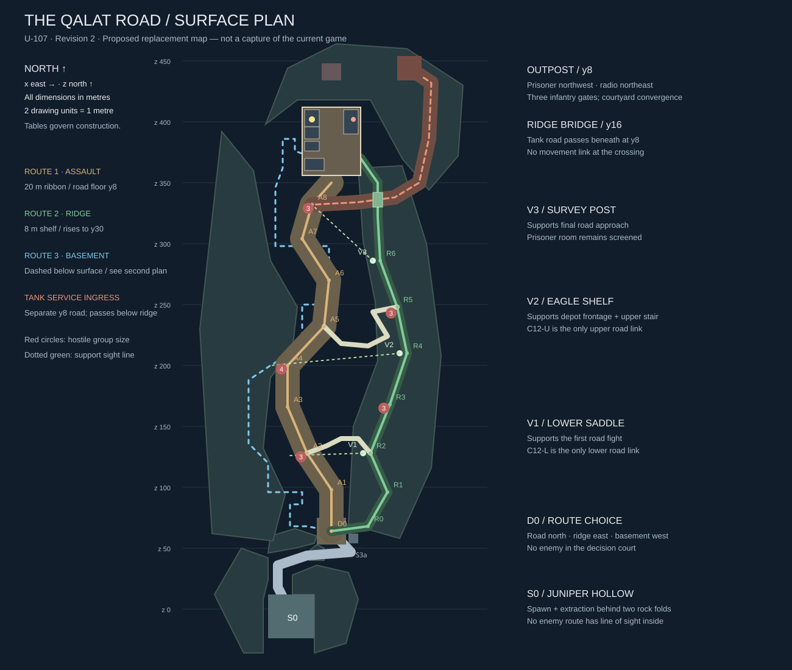
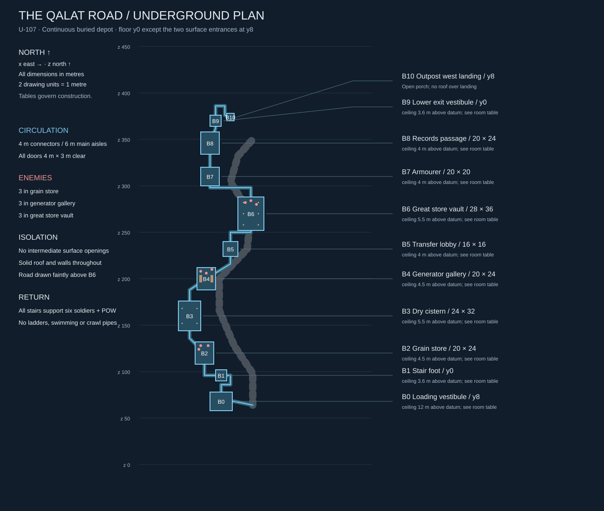
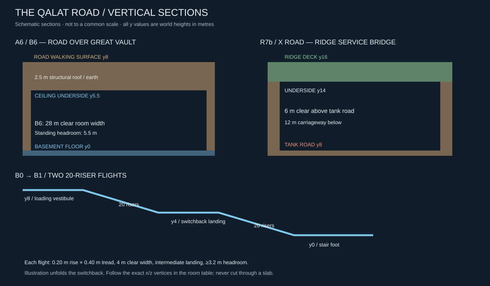

# Mission 1 construction specification — The Qalat Road

**Revision 2 · 2026-10-04 · U-107 · design for a full replacement map.**

**U-138 construction addendum · 2026-10-07:** the owner approved adding a
small bend to preserve the late court reveal when the original straight
S3→D0 connection conflicted with that view requirement. S3a and its rock toe
below implement that decision; the other route nodes remain fixed.

This is the canonical construction brief for campaign mission 1, world/mission
`qalat-road`. It replaces the rectangular valley, terrace slots and surface
riverbed flank delivered by U-106. That implementation remains the current game
until replacement work ships. The owner requested a complete authored redesign:
a naturally concealed spawn, an obvious primary road, a climbable overlooking
ridge and a wholly underground basement route, with enemies on all three.

The measurements, encounter placement and timing below are the design to build,
not optional examples. They have not been implemented or playtested. Engineers
must resolve the explicitly listed capability work, not silently approximate this
with the old map. Artists may vary surface detail within the tolerances in §15;
route geometry, cover, openings, enemy sockets and mission behaviour are fixed.
The owner has requested this redesign, not yet approved its resulting play feel.

Companions: [mission brief](../MISSION-01.md), [shared creation standard](../MAP-MISSION-CREATION.md),
[task/evidence](../../backlog/U-107.md), [historical U-106](../../backlog/U-106.md).

## Contents

1. [Experience and fiction](#1-experience-and-fiction)
2. [Coordinates and construction rules](#2-coordinates-and-construction-rules)
3. [Topology and terrain](#3-topology-and-terrain)
4. [Concealed insertion and route discovery](#4-concealed-insertion-and-route-discovery)
5. [Primary road](#5-primary-road)
6. [Ridge route](#6-ridge-route)
7. [Underground depot](#7-underground-depot)
8. [Prisoner outpost](#8-prisoner-outpost)
9. [Enemy placement and behaviour](#9-enemy-placement-and-behaviour)
10. [Objectives and event sequence](#10-objectives-and-event-sequence)
11. [Armoured return and extraction](#11-armoured-return-and-extraction)
12. [Supplies and recovery](#12-supplies-and-recovery)
13. [Presentation and readability](#13-presentation-and-readability)
14. [Engineering prerequisites and data contract](#14-engineering-prerequisites-and-data-contract)
15. [Construction order and tolerances](#15-construction-order-and-tolerances)
16. [Verification and review](#16-verification-and-review)

## 1. Experience and fiction

A winter supply road winds between eroded limestone spurs toward an occupied
mountain depot. The depot was built around an older caravanserai: surface
storehouses, buried food vaults and a covered service spine. A military extension
connected those cellars to the newer outpost. This explains a substantial
underground complex without turning Afghanistan in 2001 into a science-fiction
bunker or a sequence of natural caves.

The squad inserts on foot into **Juniper Hollow**, a folded ravine invisible from
the occupied valley. Two bends later, a ruined weigh station reveals three
readable choices. Truck ruts follow the road toward the outpost's water tower;
a conspicuous stone stair climbs east to a saddle; a broad loading ramp disappears
west into the old depot. The three entrances fit in one view from the decision
court, but the player cannot see through the map to the objective.

The road alternates compression and fighting pockets. The ridge first reveals
nearby road defenders, loses sight behind its own crest, then opens into higher
support positions. The basement alternates close corners with large occupied
vaults; it emerges inside the outpost's western service entrance. All three
approaches are valid with the whole squad or with split elements. No route
requires the squad to clear the other two.

The prisoner occupies a converted records room at the back of the outpost.
Rescuing him changes the purpose of the terrain: overlooks become places to
cover a withdrawal, the basement becomes a protected but contested escort route,
and the winding road carries the incoming tank. Extraction is back in the hidden
hollow. The tank blocks the road to it, not the insertion pocket itself.

**Pacing target, not a gate imposed with timers:** 2–3 minutes insertion/planning;
10–14 minutes chosen approach; 6–8 minutes outpost/rescue; 10–15 minutes escort,
armour and return; 1–2 minutes extraction/regroup. Total 29–42 minutes on a first
coordinated playthrough, with the campaign target remaining 30–45. Faster expert
runs are allowed. The route lengths alone will not create that playtime: verify
combat, decisions and escort pacing, not mandatory waiting or inflated distances.

## 2. Coordinates and construction rules

### 2.1 Datum and dimensions

- All coordinate triples are **(x, y, z) metres**, with y at **feet/floor height**
  unless explicitly labelled eye/ceiling. Positive x is east, positive z north.
- Main road, insertion, compound and tank road floor: **y=8**. Basement floor:
  **y=0**. Ridge rises to **y=30**. This keeps the basement above the engine's
  underlying zero plane while still putting eight metres of structure/earth above
  it. Do not move basement actors to the surface to avoid engine changes.
- Traversable content fits approximately x=-52..132, z=-24..454. The widest extent
  is not a playable rectangle. Walkable space is the union of the authored
  corridor ribbons, rooms and courts below, with mountains filling the remainder.
- Technical floor bounds: halfWidth=220, halfDepth=520, centred at the origin.
  This floor is a backing plane, **not visible open ground or an accessible map**.
  Surrounding scenery extends to those bounds and seals all escape paths.
- Coordinates are replacement coordinates; no old U-106 placement is retained by
  implication. Keep `qalat-road` as the registered ID and preserve legacy QA worlds.

### 2.2 How to turn the tables into geometry

A route spine is an ordered polyline. Construct its walking ribbon at the stated
clear width, measured perpendicular to the local segment. Join corners with a
bevel within that width, never a gap or a spike. Road turns use the larger turning
aprons specified in §5/§11. Between unequal floor heights, use the stair recipe
below. Flat segments stay flat. Room bounds are inside wall faces; floors join
passages flush. Corridor tubes terminate at the room boundary and merge with it.
All spans include their endpoints; touching floors must weld without a seam.

Wall dimensions are measured outward from a room/ribbon, so adding plaster or
collision thickness must not steal clearance. Decorative ceilings have a separate
clear-headroom requirement. No structural collision volume may fill a basement
room, passage, stair or the ridge's bridge void. The exterior earth is built
around those voids; a solid slab from y=0 to y=8 over the whole map is forbidden.

| Element | Build rule |
|---|---|
| Standard infantry stairs | 0.20 m rise, 0.40 m tread; 4 m minimum clear width; 2 m level landing after every 10 risers; stone cheek walls 1.0 m above each tread |
| Ridge stairs | 8 m clear where on the main route; same riser/tread rule; width can locally split around a central boulder only where explicitly stated |
| Basement stairs | 4 m clear, 3.2 m minimum overhead; two 20-riser flights for an 8 m change, each with its required intermediate landing |
| Flat underground corridor | 4 m clear × 3.2 m clear high; 0.6 m side walls, 0.8 m structural roof minimum |
| Standard infantry doorway | 4 m clear × 3 m high; 0.6 m jambs; always open, no interactive door unless explicitly named |
| Low cover | 1.1 m high above local floor; 0.8 m deep; lengths listed per cover socket |
| High cover | 2.2 m high × 1.2 m deep; lengths listed per cover socket |
| Route separator | Continuous natural rock face or building envelope; no traversable slope/roof/drop bypass, even when downhill |
| Outpost walls | 1 m thick, 6 m above y=8; no usable wall-top walkway |
| Clearance | At least 4 m through every required infantry passage after props; two actors pass without vaulting; no ladder, jump puzzle, crouch-only pipe or swimming |

For a height-changing spine segment, distribute risers evenly along its horizontal
length; use remaining length as flat treads/landings. The given rises/run lengths
fit this recipe. Connect stair support to the next floor, not to the global ground.
Collision can use stepped boxes in blockout; the art skin must conceal stair-step
mountain silhouettes without creating a walkable shortcut.

### 2.3 Legend and diagrams

`S`: insertion; `D`: route decision; `A`: assault; `R`: ridge; `B`: basement;
`O`: outpost; `X`: tank road; `C`: legal route crossing. Spine nodes name geometry;
enemy, cover, pickup and trigger IDs below are separate stable IDs.





Diagrams are coordinate-based orientation aids. Tables and dimensions in this
file govern construction. The drawings show no permission to walk between lines.

## 3. Topology and terrain

### 3.1 Exhaustive movement graph

```text
S0 -- S1 -- S2 -- S3 -- S3a -- D0
                       |\
                       | +-- R0--R1--R2--R3--R4--R5--R6--R7--R7b--R8--R9--east gate
                       |            |           |
                       |           C12-L       C12-U
                       |            |           |
                       +-- A1------A2--A3--A4---A5--A6--A7--A8--A9--south gate
                       |
                       +-- B0--B1--B2--B3--B4--B5--B6--B7--B8--B9--west gate

West / south / east gates join only inside the outpost courtyard.
All infantry edges work in both directions. X tank ingress is not a fourth approach.
```

There are **two intermediate road↔ridge connections**, C12-L and C12-U. There
are **zero intermediate basement↔surface connections**. D0's bounded decision
court and the outpost courtyard are the only three-route convergence spaces.
Old C12-S/M/N, firing slots and riverbed waypoints are removed, not moved here.

The basement has large rooms, so its chamber footprint may exceed the ridge's
width. Its **4–6 m circulation lanes** are narrower, isolated and more constrained.
This explicitly replaces the former requirement that every piece of the flank
be narrower than every surface space; do not shrink the great vault into a pipe.

### 3.2 Terrain mass register

Each row gives a polygon in (x,z) around a solid earth/rock mass and its minimum
crest y. Interpolate the visual summit between the listed crest anchors; keep
collision non-traversable outside authored floors. Subtract the **explicit**
ribbons/room voids where they intersect a mass. Never subtract a whole vertical
column: preserve roofs, bridge undersides and ridge separation above/below routes.
Ground visible between masses is scree descending into closed gullies, not a
flat connecting apron. Close all gaps beyond authored walking edges with terrain.

| Mass | Plan polygon vertices in order | Crest anchors / job |
|---|---|---|
| T-SW hollow flank | (-40,-36),(-24,-36),(-24,8),(-20,24),(-20,42),(-42,50),(-64,12) | y=32 throughout; hides insertion from west and blocks perimeter escape |
| T-SE hooked spur | (18,-36),(44,-28),(54,8),(46,30),(20,36),(0,28),(0,12),(18,12) | y=38; the hook blocks the spawn-to-decision/valley view, including high ridge views |
| T-SN second fold | (-20,46),(-18,60),(2,66),(20,60),(18,54),(2,50) | y=34; forces the second reveal turn rather than a straight ravine sight line |
| T-S3 reveal toe (U-138 addendum) | (14,40),(26,40),(26,50),(20,53),(14,48) | y=26; carved by the clear ribbons, screens the late eastward approach to D0 |
| T-W depot escarpment | (-66,62),(-16,56),(-6,94),(-24,132),(-18,190),(0,214),(4,248),(-18,286),(-32,360),(-58,392),(-76,230) | y=26; ruined depot roofs embedded along east foot; protects buried route from surface fire |
| T-E ridge body | (46,70),(88,58),(114,116),(122,208),(110,300),(90,364),(54,362),(58,302),(68,252),(70,204),(50,150) | y=20 at z128, 34 at z168, 38 at z210, 34 at z248, 30 at z286; carved walking shelf at R nodes |
| T-C road spurs | Three masses centred (-12,142), (10,214), (16,292), each 14 × 18 m in plan | y=20,22,20 respectively; truncate the road corridor beyond each battle, carve only road/crossing ribbons |
| T-N outpost shoulder | (-22,398),(-4,444),(36,464),(94,460),(140,430),(136,372),(112,344),(90,370),(64,418),(4,418) | y=34; encloses reserve doglegs, creates outpost backdrop, seals north perimeter |

Where a mass meets a playable edge, use rock strata, broken scree and retaining
foundations as its visual explanation. Cover-sized boulders may sit in front of
it, but must not form a stair to its top. Around the road, use asymmetric shoulders:
rock on one side, a drop into blocked rubble/depot rooftops on the other. On the
ridge's west edge, use a natural 1.0 m projecting stone lip with a **solid rock
canopy underside 1.70 m above the shelf at its outer edge** at the three firing bays, plus full-height
side returns. This yields an open view beneath a broad geological overhang while
physically rejecting jumping/dropping across the edge. This overhang treatment is
localized; between bays the inner ridge spine or rock fins block the road view.
Do not reproduce a continuous artificial wall with repeated gun slots.

## 4. Concealed insertion and route discovery

### 4.1 Juniper Hollow and the two bends

| ID | Centre (x,y,z) | Clear floor / width | Construction and view |
|---|---|---|---|
| S0 | (0,8,-6) | x=-20..18, z=-24..12 | Gravel pocket, rooted juniper on west ledge, dry channel entering from behind; no enemy, road, outpost or ridge firing position visible |
| S1 | (-12,8,18) | 8 m ribbon from S0 | Turn left around hooked spur; east face rises to y38 |
| S2 | (-12,8,36) | 8 m ribbon | Narrow ravine head; first turn still hides S0; see only a broken cart at S3 |
| S3 | (12,8,44) | 8 m ribbon | Turn right between spur toes, then east around the reveal toe |
| S3a | (48,8,46.75) | 8 m ribbon, beveled join | Added bend: turn northwest to D0; rock fold hides the decision court until the final 12 m |
| D0 | (32,8,64) | x=20..44, z=53..75 | Weigh-station court: well at (37,8,61), main road north, ridge stair east, depot loading entrance west |

The late-reveal distance is measured horizontally to the **nearest D0 court
floor boundary**, rather than to the centre of its 24×22 m floor. Verify standing
eye rays to the entire court on a 1 m grid from all legal approach floor centres
on a 0.5 m grid and both ribbon shoulders at ≤0.25 m interpolation. No court point
may be visible from an approach centre more than 12 m from that boundary. U-138
records this construction measure; finished landmark/readability and play feel
remain owner review in U-118/U-119.

Six initial feet positions: slots 0..5 at `(-6,8,-10),(-2,8,-10),(2,8,-10),
(-6,8,-6),(-2,8,-6),(2,8,-6)`, all facing north. Host/local/headless starts use
the same authored array. Extraction centre `(0,8,-6)`, radius 12 m, vertical
acceptance y=7.5..10.5. Do not use the engine's old ground-level default spawns.

S0 is screened **by landform**, not a free-standing wall or an invisible LOS rule.
A continuous 1.2 m thick rock overhang projects over x=-8..18, z=-18..12 with
underside y=13, and merges into T-SE. Its irregular art edge plus the y38 spur
screens elevated observers; its five metres of headroom keeps the hollow open.
The exit passes west of it. Sky is visible through the western opening. No roof
is traversable and no enemy route enters S0–S3a or comes south of the D0 court.

### 4.2 Spawn protection is a geometric contract

For **every** initial spawn and every point in S0's floor rectangle, rays from
each possible enemy patrol point, guard socket, rooftop/overlook and complete tank
route must intersect solid terrain before reaching standing, crouched or prone
body sample heights. Include tank muzzle y offsets and full patrol interpolation,
not just endpoint rays. Aim cameras cannot see through overhang backs. This
requirement lasts after alert and on return, not merely during a scripted grace
period. AI's minimum pursuit bound is z=78 for surface route guards; underground
guards never leave B1 northward into the entrance stairs. Landform must still
pass LOS tests without that AI leash.

There is no enemy spawn in D0; the first road sentry is beyond a bend at z122.
The court may become visible to the tank late in the return, but the spawn never
is. Players can regroup at S0 without being shot through a decorative rock shell.

### 4.3 Route signage and first impressions

At S3a's turn toward D0, frame the split with the well on the right and the ruined depot loading
arch left. A pale truck-rut strip leads from D0 north; one stone stair at `(56,8,68)`
and the ridge skyline make the high route unmistakable; twin timber loading doors,
fixed open, frame the descending depot stair. The water tower is first glimpsed
from A1/R1, not from S0. No floating arrows or explanatory cutscene are required.
First-entry HUD text at D0: **“Road ahead. Ridge to the right. Depot cellars to the
left. All three reach the outpost.”** Show once per run; checkpoint restores it.

## 5. Primary road

### 5.1 Spine and encounter spaces

Build a **12 m clear vehicle carriageway** plus **4 m infantry shoulder per side**
(20 m total walking ribbon), all at y8. At A2, A5 and A8 use a 36 m diameter turning
apron centred on the node, clipped only by the named cover; keep the central 12 m
vehicle swept corridor unobstructed. Truck ruts occupy the central 4 m but are
visual only. No bridge demolition, doors, mines or required lever gates.

| Node | (x,y,z) | Authored beat |
|---|---|---|
| A0 / D0 | (32,8,64) | Decision court; road leaves north |
| A1 | (32,8,98) | Rock-cut throat; outpost tower appears over bend; no direct long shot into the outpost |
| A2 | (12,8,128) | **Toll bend**: abandoned weighing office, disabled truck off carriageway, first road patrol; lower ridge crossing starts here |
| A3 | (-4,8,166) | **Orchard shelf**: four bare almond trees on west shoulder; view back to lower overlook, view forward cut by rock |
| A4 | (-4,8,200) | **Broken depot frontage**: recessed loading bays on west; road MG occupies a shallow west-side emplacement |
| A5 | (26,8,232) | **Switchback court**: widened bend around a limestone spur; upper ridge crossing starts here |
| A6 | (30,8,270) | **Vault roof causeway**: buried great hall below; cracked stone parapets show the depot's buried scale |
| A7 | (8,8,304) | **Last fold**: low orchard wall and rock shoulder; no view of the prisoner room |
| A8 | (16,8,332) | **Forecourt bend**: main road meets tank service ingress; outpost south gate first fully revealed |
| A9 | (32,8,350) | Final 6 m open run to the 8 m south gate at (32,8,356) |

Three separate fights, not one uninterrupted shooting gallery: toll bend A2,
frontage A4/A5, then forecourt A8. T-C spurs cut longitudinal firing lines. Between
fights, show the next objective landmark briefly rather than exposing the whole
corridor. No straight hostile firing lane exceeds 90 m except deliberate ridge
views specified in §6. Keep 4–8 m spaces behind cover free for regrouping.

### 5.2 Road cover and landmarks

Box dimensions below are **length × depth × height**, on the local floor.
For `along-road`, long axis follows the route segment at the nearest node;
`across-road` is perpendicular. Boxes stay on the shoulders/outside swept volume.
Visual truck geometry uses the listed solid box proxy and cannot be entered.

| ID | Centre feet | Size / orientation | Use |
|---|---|---|---|
| A-C01 | (45,8,106) | 4×1.2×2.2, along-road rock | Player's first protected observation of A2 |
| A-C02 | (-4,8,126) | 6×2.6×2.4, along-road disabled truck | First patrol cover; cab faces north, wheels buried, no explosive barrel |
| A-C03 | (24,8,138) | 5×0.8×1.1, across-road stone wall | Alternative player firing side; visible from lower overlook |
| A-C04 | (-18,8,170) | 6×0.8×1.1, along-road orchard wall | Mid-route recovery point |
| A-C05 | (10,8,184) | 4×1.2×2.2, along-road rock | Prevent a single road MG lane reaching A2 |
| A-C06 | (-18,8,200) | 6×0.8×1.1, along-road sandbag breastwork | Road MG nest; gun has frontage, not 360-degree protection |
| A-C07 | (8,8,212) | 4×1.2×2.2, along-road masonry pier | Covered advance toward switchback |
| A-C08 | (12,8,244) | 6×0.8×1.1, along-road loading plinth | Withdrawal staging below upper crossing |
| A-C09 | (43,8,270) | 6×0.8×1.1, along-road broken parapet | Road-side flank of great vault; no holes into basement |
| A-C10 | (-6,8,306) | 6×1.2×2.2, along-road rock | Covered preparation for final gate approach |
| A-C11 | (2,8,336) | 4×0.8×1.1, across-road orchard wall | Lower tank firing position |
| A-C12 | (44,8,344) | 4×1.2×2.2, along-road rock | Upper tank firing position and forecourt protection |

If a rotated footprint touches a turning apron, preserve the 12 m swept corridor
by trimming the apron shoulder **around the listed cover**, not by moving cover
into the carriageway. Exact tank capsule sweep is a construction gate (§16).

Toll office shell: inside x=-8..0,z=114..122, floor 8, ceiling 11.5; open east
wall doorway z116..120, no north window, roof 12.3 nonwalkable. Four orchard trees
at `(-20,8,158),(-24,8,168),(-24,8,178),(-20,8,186)` have 0.35 m radius trunk
collision; branches never stop projectiles. Ruined loading façades along
x=-24..-20,z184..216 visually merge into the buried depot escarpment; closed
recesses are 1 m deep, not extra passages.

## 6. Ridge route

### 6.1 Ridge spine

The ridge is a continuous hiking/service shelf with broad stairs cut into rock,
not three isolated platforms. **8 m clear shelf**, widening to 12 m at R2/R4/R6.
The mountain rises to its east; its road-facing edge reveals the road only at
three authored bays. Ridge defenders occupy inland recesses so supporting the
road does not automatically clear the ridge itself.

| Node | (x,y,z) | Geometry / beat |
|---|---|---|
| R0 | (62,8,68) | 8 m stair mouth visible from D0; flat 30 m connection east from court |
| R1 | (78,14,96) | First climb, 30 risers; broken shepherd hut inland |
| R2 | (64,20,128) | **Lower saddle**, 30 more risers; first usable road overview; C12-L landing |
| R3 | (80,26,168) | 30-riser climb behind a rock fin; road temporarily hidden; ridge patrol encounter |
| R4 | (94,30,210) | **Eagle shelf**, final 20-riser climb; middle support bay projects west |
| R5 | (86,30,248) | Level saddle; C12-U landing; defendable upper crossing |
| R6 | (72,26,286) | **Broken survey post**, 20-riser descent; upper support bay and road/forecourt overview |
| R7 | (70,20,322) | 30-riser descent behind outer shoulder |
| R7b | (70,16,336) | Stone service bridge over tank road; 20-riser descent from R7 |
| R8 | (70,12,350) | 20-riser descent after bridge; sheltered final landing |
| R9 | (56,8,370) | Last 20 risers, meets outpost east gate approach; gate centre (56,8,374) |

At R1 make a 12×12 m flat landing centred on the node at y14, with a 4 m-wide
flat spur from `(82,14,100)` to the shepherd hut's open west face. R2/R4/R5/R6
have 12×12 m flat landings at their listed elevations. R3 has a flat combat shelf
x74..86,z158..182 at y26. Stair interpolation ends at each flat landing's edge
and resumes at its far edge, not through the flat interior. Exact guard/cover
sockets on these pads remain at the listed floor y. R7/R8 have 8×4 m flat
landings, their long axis east-west; bridge-specific approaches below take
precedence over their generic landing north/south extents. The V bays join these
pads at the same elevation. Keep all named rifleman sockets on the pad, never
floating over an interpolated slope.

The bridge is centred `(70,16,336)`, deck 8 m east-west × 12 m north-south,
structural underside y14. Deck extends z330..342; bridge approaches R7→north/
south abutments must absorb the listed elevation change **outside** that flat
deck: from R7 y20 down to deck y16 before z330, and from z342 y16 to R8 y12.
This is a bridge-specific exception to uniform stair distribution. Use 0.20 m
risers with 0.30 m treads on those two 8 m approaches (20 risers = 6 m plus 2 m
landing), preserving 8 m width. Tank road passes under it at y8; six metres clear
under the deck. Abutments are outside the tank's swept corridor. Parapets/rock
returns reject drops off the bridge; it is not a third road↔ridge crossing.

### 6.2 Support bays and limits

Bays extend west from their ridge node, at the node's floor y. Each is 8 m long
north-south × 8 m east-west with the road-facing natural overhang treatment in §3.
For each feet anchor in the table, bay bounds are x=anchor.x-0.8..anchor.x+7.2,
z=anchor.z-4..anchor.z+4. Facing west, its rear connects at full shelf width.
The 1.0 m lip occupies the westernmost 0.25 m of the bay; the canopy's low edge
projects only over that same strip, with underside floor+1.70 m. Behind that
strip, canopy underside rises to floor+3 m, preserving standing/camera clearance.
Thus the listed firing anchor is 0.8 m back from the edge, clear of the low
canopy with a 0.35 m actor radius. Its 0.70 m outer opening blocks the existing
0.8 m prone body, while standing-eye rays reach the downward targets. Verify
with actual controller dimensions; do not lower the ceiling across the whole bay.
Shape the visible lip/overhang as irregular strata around the required opening,
not a repeated rectangular frame. The view reads as looking out from under a
rock ledge; the wide rear opens back onto the ridge.

| Bay | Standing feet anchor | Mandatory visible target(s), target feet y8 | Deliberate blind spot |
|---|---|---|---|
| V1 lower saddle | (58,20,128) | Truck patrol cover (-4,8,126); eastern road wall (24,8,138) | A4 nest at (-18,8,200), screened by rock fin F1 at (36,8,150) |
| V2 Eagle shelf | (88,30,210) | MG nest (-18,8,200); crossing approach (26,8,232) | Toll bend behind lower spur; compound interior behind upper ridge shoulder |
| V3 survey post | (66,26,286) | A7 road at (8,8,304); A8 at (16,8,332); south-gate gun at (38,8,360) | Prisoner and radio rooms, west service gate and basement |

The terrain mass polygons are envelopes, not permission to obstruct these views.
Excavate each bay's road-facing view fan through T-E: in plan, take the convex
hull of its west-edge endpoints and all listed target points, expanded 1 m. Within
that fan outside the walkable bay, cap the rock surface at **0.30 m below the
lowest listed standing-eye ray crossing that x/z**, using linear interpolation
along each ray and between adjacent rays. Keep the solid lip/canopy at the bay
edge; this excavation removes intervening hillside, not that movement barrier.
No corridor floor or nav link is generated inside a view fan. Outside the fan,
retain the terrain envelope and these exact blind-spot fins (solid from y8):
F1 x33..39,z146..154, top y26; F2 x49..55,z168..176, top y32;
F3 x66..72,z260..274, top y36. F1 blocks V1→A4, F2 blocks V2→A2,
F3 blocks V2→compound. They avoid both C12 stairs and the ridge walking shelf.
The outpost walls/roofs provide V3's named blind spots.

Use actual standing eye height from the movement configuration for verification;
these are floor coordinates. Longest intended target ray is about 112 m. A rifle
shot may be possible at that range without guaranteeing high accuracy. No new
weapon range or damage tuning is implied.

Ridge cover: 4 m long low rock at `(84,26,170)`, high rock 4 m long at
`(94,30,238)`, low wall 5 m long at `(76,26,286)` and high rock 4 m long at
`(82,20,320)`, all long axes north-south, standard depths/heights. The shepherd
hut occupies x82..90,z98..106, floor 14, no walkable roof, open west face; four sacks
inside against east wall. Survey post is x78..86,z278..288, floor 26, missing west
wall, two broken roof beams fixed above head clearance. No sniper archetype is
required: use the riflemen specified below.

### 6.3 Two legal crossings

| ID | Ordered spine (x,y,z) | Clear width | Purpose |
|---|---|---|---|
| C12-L | A2 (12,8,128) → (28,8,134) → (40,12,140) → (54,16,140) → R2 (64,20,128) | 4 m | Lower shepherd stair, 60 total risers; swap roles after first fight |
| C12-U | A5 (26,8,232) → (40,8,218) → (62,14,216) → (78,20,224) → (66,24,244) → R5 (86,30,248) | 4 m | Upper quarry/service stair, 110 total risers; reinforce before outpost |

These crossings are exposed to their adjacent route enemies, not spawn points.
Use 4×4 m landings at interior waypoints; the standard extra landings still apply
within flights. No door, unlock, one-way drop, third shortcut or link to basement.
Route changes use these paths or D0/outpost, regardless of alert or mission stage.

## 7. Underground depot

### 7.1 Volume and navigation rules

This is one continuous **covered basement route**, not a succession of surface
courtyards with roofs. After B0's descending stair, every point is underground
until the western outpost exit. No usable skylight, lift, ladder, surface hatch,
vent crawlway or mid-route escape. Closed ventilation pipes are set dressing.
No water requires swimming; wet floors are cosmetic.

The circulation ribbon between rooms is 4 m wide; main aisles within rooms are
6 m except the 4 m side aisles around fixed obstacles. Doors are 4×3 m. Standard
corridor ceiling y3.2, room ceilings as below. All vaulted room ceilings must leave
at least their listed clear height at every required aisle; decorative arches
rise above, not into that envelope. Floor 0 is continuous from B1 through B9's
lower landing. Walls are 0.6 m thick, vaulted roof/earth is solid up to the surface.
Exterior earth at y8 or higher roofs every corridor, including under A6.



### 7.2 Rooms and the connecting spine

Listed room dimensions are east-west × north-south. Each room's centre is a spine
node. Doors sit where the incoming/outgoing spine intersects its wall, centred
on that intersection; the adjacent corridor widens/bevels locally to the 4 m
opening, without cutting through a corner pillar. A 4×4 m inside landing is kept
free behind every door. Use the intermediate corridor vertices listed here,
never a straight connection through another room or back to the surface.

| ID / room | Centre | Inside size / ceiling | Incoming path from previous room | Purpose |
|---|---|---|---|---|
| B0 loading vestibule | (-2,8,68) | 24×20 m, ceiling 12 | D0 → (12,8,68) → B0; entrance east wall | Giant timber loading doors, lamp over descending stair; 6 m delivery lane narrows to 4 m stair |
| B1 stair foot | (-2,0,96) | 12×12 m, ceiling 3.6 | B0 → (-2,8,76) → (-2,4,86) → (8,4,86) → (8,0,96) → B1 | Two flights with switchback landing; first underground landmark: blue service pipe |
| B2 grain store | (-20,0,120) | 20×24 m, ceiling 4.5 | B1 → (-20,0,96) → B2 | First occupied room; sacks, cart and transverse cover, no immediate doorway ambush |
| B3 dry cistern | (-36,0,160) | 24×32 m, ceiling 5.5 | B2 → (-36,0,136) → B3 | Large vaulted reveal; four masonry piers and dry stone channels |
| B4 generator gallery | (-18,0,200) | 20×24 m, ceiling 4.5 | B3 → (-36,0,188) → B4 | Two inert diesel engines; enemies seen between machines |
| B5 transfer lobby | (8,0,232) | 16×16 m, ceiling 4 | B4 → (8,0,216) → B5 | Quiet regroup pocket, next vault heard before visible |
| B6 great store vault | (30,0,270) | 28×36 m, ceiling 5.5 | B5 → (8,0,250) → (30,0,250) → B6 | Double-height-feeling hall beneath A6; three aisles, occupied northern end |
| B7 armourer's room | (-14,0,310) | 20×20 m, ceiling 4 | B6 → (30,0,298) → (-14,0,298) → B7 | Reload/regroup recess after last basement fight; supplies at west wall |
| B8 records passage | (-14,0,346) | 20×24 m, ceiling 4 | B7 → (-14,0,330) → B8 | Long shelves, narrow view of the last doorway; no new wave |
| B9 lower exit vestibule | (-8,0,370) | 12×12 m, ceiling 3.6 | B8 → (-8,0,362) → B9 | Painted upward arrow; foot of the outpost stair |
| B10 west gate landing | (8,8,374) | 8×8 m, sky/open porch | B9 → (-8,0,376) → (-8,4,386) → (2,4,386) → (2,8,376) → B10 | Two 20-riser flights; last segment reaches west gate at (8,8,374) |

B0→B1 and B9→B10 stairs have 8 m horizontal tread runs plus a 2 m intermediate
landing per 20-riser flight. The 10 m east-west link between flights is a broad
landing at y4. Overlap the landing into the adjoining room only at its floor;
cut corresponding stair wells through the y8 surface slab. Roof these stair
wells with depot/outpost porch architecture until the endpoint doorway, with at
least 3.2 m above the walking surface. At B0, unbroken 0.6 m stone balustrades
around the stair opening prevent a drop shortcut to B1.

### 7.3 Fixed room internals

All coordinates below use y0. Low and high crates use standard cover dimensions.
Room walls/pillars are structural, not destructible. Dark alcoves are shallow
set dressing; all navigable doorways lead to the next named space.

| Room | Structural/cover layout | Clear route and combat intention |
|---|---|---|
| B1 | 3 m low crate at (-6,0,98), long axis east-west | 4 m south/east entry landing and west exit kept open; look left to see B2 connector |
| B2 | 4 m low sack stack at (-24,0,116); 4 m high crate at (-14,0,124), both north-south | Central 6 m aisle x=-23..-17; cover offset toward walls, trim crate depth outside aisle; first guard visible beyond first cover |
| B3 | 1.2×1.2 piers centred (-44,0,152),(-28,0,152),(-44,0,168),(-28,0,168), full ceiling height; low 4 m wall at (-36,0,164), east-west | 6 m central aisle splits around low cover through 4 m side gaps; water stains explain cistern, no deep pit |
| B4 | Engine blocks 3×8×2.2 at (-24,0,200),(-12,0,200), long axes north-south | 6 m aisle between engines; incoming northwest/outgoing northeast doors cannot shoot straight through the room |
| B5 | Low 4 m bench at (3,0,234), north-south; sealed service doors on east wall | At least 8×8 m regroup space centred (9,0,230); no hostile spawn |
| B6 | Six 1.2 m square full-height piers at x=22/38,z=258/270/282; high 4 m crate stacks at (19,0,265),(41,0,277), north-south; low 4 m stack at (30,0,276), east-west | Central 6 m aisle x=27..33, left/right 4 m aisles; central low stack forces a choice of cover side but leaves two ≥4 m bypasses; north guards are not all visible from south door |
| B7 | Workbench 6×1×1 at (-22,0,312), north-south; two wall racks west; central floor empty | Whole escorted group can regroup; no engine, fire or explosive prop |
| B8 | Shelves 1×16×2.2 at (-22,0,346),(-6,0,346), north-south | 6 m central lane; no maze of repeated shelves; end door is the obvious onward path |
| B9 | Empty central floor; high 3 m crate at (-12,0,367), north-south | Protected hold point before climbing into the compound; no door interaction required |

B2's central aisle is a circulation guide, not a solid rail: low cover can be
flanked within the room. No crate stack touches a pier/roof in a way that enables
climbing onto ceilings. Ensure all required bypasses meet actual actor collision
clearance; decorative sacks are noncolliding unless listed as cover above.

Basement reward: approach the outpost without exposure to road/ridge fire, and
arrive beside the west service porch. Cost: three close fights, limited long-range
support, longer travel and total commitment between entrances. All nine basement
guards remain possible threats on the return if bypassed; no automatic refill.

## 8. Prisoner outpost

### 8.1 Envelope and entries

Inside courtyard bounds x=8..56,z=356..412, floor 8; outer walls extend outward
1 m and to y14. Four 8 m gate openings: south centred `(32,8,356)`, east
`(56,8,374)`, west `(8,8,374)`, north `(32,8,412)`. Side gates have 4 m
clear infantry doors centred within their 8 m structural arches, with the rest
infilled by masonry. South/north arches are fully 8 m open. No locked gate,
destructible wall, rooftop traversal or required breach charge. Entry arch ceiling
is y12. Gate leaves are fixed folded against interior walls, never nav blockers.

Only south/east/west are player approach routes. North connects to a 4 m-wide
L-shaped reserve service corridor to a sealed reserve room (§9); it is a short
outpost annex, not a way around the valley or onto the tank road.

| Space | Inside bounds (x range; z range), floor / ceiling | Doors and purpose |
|---|---|---|
| South barracks | x10..26; z360..370, y8 / 12 | North door x18..22 at z370; south wall closed; rifleman watching court from inside |
| West refuge porch | x10..22; z376..384, y8 / 12.5 | East door z378..382 at x22; all other faces solid; covered escorted hold point |
| Prison antechamber | x10..22; z386..396, y8 / 12 | East door z390..394 at x22; north doorway x14..18 at z396 |
| Prison cell / records room | x10..22; z396..410, y8 / 12 | South doorway above, barred north window x14..18, sill y10.4, height 0.6; POW feet (16,8,402) |
| Radio room | x42..54; z390..410, y8 / 12 | West door z394..398 at x42; west window z402..406, sill y9.1, height 0.7; radio table east wall |
| Central court | Remaining space | No internal floor-level building overlaps; pathways ≥4 m around cover |
| North reserve room | x24..40; z434..448, y8 / 12 | South door x30..34 at z434; opaque bends screen it from every approach |

Room walls 0.6 m thick outside the inner bounds; prevent adjacent envelopes from
closing a doorway. Prison cell's south divider has a fixed-open door, not a
second rescue interaction. The existing 3-second rescue is the only prisoner
release action. POW posture before rescue: kneeling/sitting presentation within
the captive implementation; collision/target remains at the authored feet point.
No new captor execution timer, escort dialogue system or cinematic.

### 8.2 Courtyard cover and landmarks

- O-C01 low sandbag line, centre `(38,8,359)`, length 6 east-west; mounted MG use
  point `(38,8,361)` faces south toward A8. MG hostile socket is that use point.
- O-C02 high stone trough, `(30,8,376)`, length 4 north-south, standard high-cover
  dimensions; blocks south-gate view to prisoner doorway without sealing movement.
- O-C03 low cart, `(40,8,385)`, length 5 east-west, 1.8 m deep, 1.1 m high.
- O-C04 high stores crate, `(32,8,400)`, length 4 north-south; leaves the northern
  gate approach and radio-room door accessible.
- Water tower: base footprint x46..52,z414..420 outside northeast wall, legs
  contained in that footprint, top y26. It is a visual destination, nonclimbable,
  and has no firing platform. Do not add ladder collision or a new sniper.
- Radio table centre `(52,8,404)`, 2×1×1 m; lamp and aerial lead identify it.
  Room occupant is the optional `radio-operator` group. Equipment is dressing;
  no unrequested radio-use interaction is needed.
- Painted blue cell door trim, paperwork on wall and the captive distinguish the
  rescue room. It is not marked solely with a generic glowing objective disc.

The prisoner cannot be seen/hit from the south gate, any ridge bay, tank road or
basement until the player reaches the antechamber/inner doorway. Test bullets,
blast occlusion and camera rays against the room walls; a roof must not be only
a visual texture. Do not spawn guards immediately behind the POW in the cell.

## 9. Enemy placement and behaviour

### 9.1 Counts, readiness and fairness

Use only existing rifleman/MG/tank archetypes plus the captive POW. **32 initial
hostiles**, **4 counterattack riflemen**, **1 tank**, **1 POW**: at most **38**
encounter entities if no one is killed, under the current aliveCap 42. Six squad
members are additional friendly slots, not part of that encounter count. Retain
fixed counts at 1–6 human budgets; existing budget-based behaviour applies, not
randomly empty routes. No infinite reinforcements or global extermination target.

All 32 guards and the POW are placed before players receive control. No garrison
pops into view when the compound trigger fires. Author exact 3D spawn sockets;
if a socket is invalid, fail content validation rather than choose a random roof.
Counterattack/tank reserve placement follows §10/§11 and is screened even from
ridge/mobile cameras. No guard begins shooting at S0 through an alert script.

Each socket below names feet position and initial facing target (x,z; target
height follows its floor). `R` means rifleman, `M` MG. Table row ID plus member
number is a persistent entity/spawn ID, used by saves and acceptance tests.

| Group | Members: ID, archetype, feet position | Initial facing target |
|---|---|---|
| road-toll | AT1 R (6,8,122); AT2 R (16,8,130); AT3 R (8,8,138) | (32,98) |
| road-frontage | AF1 M (-16,8,202); AF2 R (-8,8,194); AF3 R (4,8,208); AF4 R (18,8,224) | (-4,166) |
| road-forecourt | AG1 R (10,8,322); AG2 R (24,8,338); AG3 R (34,8,346) | (8,304) |
| ridge-lower | RL1 R (76,26,164); RL2 R (82,26,172); RL3 R (78,26,178) | (64,128) |
| ridge-upper | RU1 R (82,30,244); RU2 R (88,30,252); RU3 R (72,26,282) | (94,210) |
| basement-grain | BG1 R (-26,0,124); BG2 R (-16,0,128); BG3 R (-24,0,128) | (-20,108) |
| basement-generator | BE1 R (-18,0,206); BE2 R (-24,0,208); BE3 R (-12,0,210) | (-26,194) |
| basement-vault | BV1 R (24,0,282); BV2 R (36,0,280); BV3 R (30,0,284) | (30,254) |
| garrison | OG1 M (38,8,361); OG2 R (18,8,368); OG3 R (48,8,378); OG4 R (18,8,390); OG5 R (28,8,402); OG6 R (36,8,386) | OG1/2 (32,350); OG3 (56,374); OG4 (22,392); OG5/6 (32,376) |
| radio-operator | OR1 R (50,8,402) | (42,396) |

The generic `garrison` group comprises five riflemen and one MG. Its members use
individual sockets and local assignments, not a random common spawn disc. OG1
uses the emplacement if available and fights on foot if dismounted. AF1 uses
an ordinary MG weapon behind A-C06; it is not a second player-usable emplacement.
No optional sniper prerequisite blocks building this specification.

### 9.2 Patrols, cover regions and alert

All other members hold at their socket until normal perception alerts them.
Listed patrols walk, reverse at the end, pause **3 seconds** at each endpoint;
initial phase starts at the first listed point. Within a listed patrol group,
only the named soldier patrols; companions hold. This prevents a generic group
patrol from synchronizing three soldiers into one point.

| Soldier | Ordered patrol feet points | Alert movement bounds |
|---|---|---|
| AT2 | (16,8,130) → (20,8,116) → (14,8,136) | Road ribbon A1..A3; never south of z98 |
| AF4 | (18,8,224) → (18,8,226) → (10,8,218) | Road A3..A5; C12-U first landing only |
| AG2 | (24,8,338) → (22,8,342) → (16,8,332) | Road A7..south gate; no north service road |
| RL2 | (82,26,172) → (80,26,168) → (84,26,178) | Ridge R2..R4, with real floor height along transitions |
| RU2 | (88,30,252) → (86,30,248) → (90,30,242) | Ridge R4..R7; no bridge-edge drop |
| BG2 | (-16,0,128) → (-16,0,118) → (-20,0,124) | B2/B3 and their connecting corridor; never B0/B1 stairs |
| BE1 | (-18,0,206) → (-18,0,194) → (-18,0,204) | B4 and B3→B4/B4→B5 connectors |
| BV2 | (36,0,280) → (36,0,262) → (34,0,282) | B6 and its entry/exit corridors; never surface |
| OG6 | (36,8,386) → (36,8,376) → (28,8,384) | Courtyard; cannot enter cell or west refuge |

All alert bounds use the actual navigation regions, not an x/z disc that also
selects a basement below. Surface groups do not hunt the squad through floors;
basement groups cannot use roof polygons as cover. AI may lean/move to legal
cover inside its region, but never enter S0–S3a, jump a route boundary or chase
through the unchosen route to create a surprise flank outside this plan.
Implement per-member region/patrol support where current data lacks it (§14).

Players may alert groups by existing sight, gunfire and noise behaviour. Walls
block sight and bullets. This design does not require a new stealth model or
promise soundproof concrete. If sound alert crosses a floor, the guard may become
alerted but still cannot see/fire through it or abandon its region. All paths
contain enemies even if another route's group has already been eliminated.

No enemy grenade placement at a doorway, explosive barrels, RPG ambush, scripted
instant hit or spawn immediately behind the squad. Encounter difficulty comes
from authored angles and cover. Rifleman tuning remains existing tuning for the
first blockout; change it only with measured balance evidence in the later card.

### 9.3 Reinforcement staging

Counterattack C1..C4 feet `(28,8,440),(32,8,440),(36,8,440),(32,8,444)` in the
north reserve room. Facing south. Service corridor spine `(32,8,434) →
(32,8,426) → (20,8,426) → (20,8,418) → (32,8,418) → (32,8,412)`, width 4,
ceiling 12, full-height opaque walls. Two bends prevent viewing the reserve from
the courtyard, north gate or ridge. Corridor ends at the north gate and room;
no opening reaches X tank road. Once released, C1/2 move to `(30,8,404)` and
`(38,8,404)`, C3/4 to `(28,8,388)` and `(44,8,388)` using cover. Their bounded
region is the outpost, excluding the prison cell and refuge porch. Four total,
no respawn. They can be fought, avoided, or pre-emptively killed if the squad
pushes into the reserve annex; the event never resurrects dead members.

Place counterattack physically at mission start, inert/holding in their room
until the release event. They count toward the 38-entity worst-case cap even
before release. Do not create them at a visible door when a player watches it.

## 10. Objectives and event sequence

### 10.1 Objective contract

Keep stable mission objective indices 0..4 to ease implementation, but migrate
old checkpoint data (§14). All areas below include vertical bounds. A player
walking in the basement beneath an objective must not satisfy it.

| Index / stage | Label and predicate | Checkpoint / failure |
|---|---|---|
| 0 / approach | **Reach the prisoner outpost.** Any standing squad member inside circle centre (32,382), radius 32, feet y7.5..10.5. Includes south/west/east ground entries, excludes ridge and basement. | Save full world once on completion |
| 1 / rescue | **Free the prisoner.** Existing rescue interaction on `prisoner`, 3 s hold, ≤2 m reach, line of sight, same accessible floor; cannot act through wall/ceiling. | Save on completion; protected POW death fails mission |
| 2 / rescue | **Silence the radio operator (optional).** Destroy `radio-operator`. | No checkpoint; never blocks leaving rescue stage |
| 3 / return | **Destroy the tank.** Destroy `tank`; no requirement to clear remaining infantry. | Save on destruction |
| 4 / extraction | **Extract with all seven standing.** All six living, standing soldiers and the rescued living POW inside centre (0,-6), radius 12, feet y7.5..10.5; tank objective must also be complete. | Activate only after the tank objective completes; success on this predicate, no extra defend timer |

First squad death, POW death or existing all-downed failure ends the mission;
no new per-route time limit. Downed soldiers cannot satisfy all-standing extraction.
Rescue and optional radio share a stage. Killing the radio early persists and
counts when that stage opens. Extraction is a separate final stage after tank destruction. Visiting S0 early
does not credit its reach objective: all seven must be there and standing once
that final stage is active. Do not bank an early visit and later award success
while the squad is fighting elsewhere. No helicopter bypasses the tank objective.

### 10.2 Ordered events and texts

Times below are **simulation time since rescue completes**, not wall clock.
Keep timer progress and fired flags in checkpoint state. Sequence numbers
resolve events on the same simulation tick; restore never replays one-shot loot.

| Event | Trigger | Actions, in order |
|---|---|---|
| init | Mission start before input | Place squad, 32 guards, POW, four reserve guards and tank at authored hidden sockets; reserve/tank inactive; create fixed supplies; clear one-shot flags |
| briefing | Ready/start | Briefing below; no cutscene or forced camera |
| route-reveal | First standing soldier in D0 bounds x20..44,z53..75,y7.5..10.5 | Show route-choice text from §4 once |
| approach-complete | Objective 0 completes | “Outpost reached. The prisoner is in the northwest records room.”; checkpoint |
| prisoner-released | Objective 1 completes, t=0 | POW follows rescuer; set `pow-freed`; activate tank objective and arm return timers; “Prisoner free. Move him to cover. Armour is inbound.”; checkpoint includes armed timers |
| escort-hint | t=3 s, once | “Use Hold to shelter the prisoner, Move to send him to cover, Regroup to bring him with you.” |
| armour-early | t=5 s, radio operator alive, tank not released | Activate tank; set `tank-arrived`; “The radio operator called in armour. Tank entering the north service road.” |
| armour-delayed | t=20 s, tank not released | Activate tank; set same flag; “Armour entering the north service road. Keep the prisoner behind cover.” |
| reserve-release | t=45 s, once | Activate surviving C1..C4 along authored corridor; “Movement at the north gate.” |
| tank-destroyed | Objective 3 completes | “Armour destroyed. Bring all seven back to Juniper Hollow.”; checkpoint |
| extraction | Extraction stage complete | Existing debrief/mission success and carry-over |

Armour timing preserves current 5/20-second radio behaviour: the radio condition
is evaluated at t5, so killing him before t5 still earns the delay. Once released,
killing him cannot despawn or stop the tank. The longer external service road
provides physical warning time before the tank reaches the main approach.
**Reserve release changes from immediate to t45** to make room for the escort
teaching beat. This is an explicit redesign decision, not a description of current
scripts. No forced waiting: players can leave immediately via any route.

If tank/guard reserve is attacked before activation, normal damage applies;
dead members stay dead and later activation is a no-op. Their hiding geometry
must make this an intentional push beyond the objective, not a ridge spawn exploit.
No difficulty scaling removes a required group or blocks the tank objective.

Briefing text:

> An allied prisoner is held in the records room of the Qalat depot outpost.
> Approach by the supply road, the eastern ridge or the old depot cellars.
> Free him and bring the squad back to Juniper Hollow. The outpost has a radio
> operator and an armoured reserve. Expect trouble on the return.

Debrief success: **“Prisoner recovered. All seven extracted. The Qalat route is
open for the next operation.”** Failure uses the existing explicit failure reason.
No new voice recording, named real-world unit or cinematic is a content dependency.

### 10.3 Escort lesson and retries

The intended first escort leg is cell `(16,8,402)` → antechamber door `(22,8,392)`
→ court `(26,8,388)` → refuge `(16,8,380)`. The player chooses the order; no autopilot
teleports the POW to the refuge. Refuge walls/roof shelter him from every external
lane and tank ray, while a 4 m door lets the squad retrieve him. Surviving courtyard
guards can still threaten the approach, so the brief says **shelter**, not invulnerability.
Counterattack may cover the porch exit but may not enter it or fire through its walls.

Checkpoints preserve each entity's x/y/z, health, stance, group death, rescue state,
POW order, route/nav floor, alert state, supplies, ammunition, radio outcome, all
one-shot flags, tank position/path progress and pending timer offsets. Retry cannot
restore a basement squad onto the surface or replay a reserve wave. Initial mission
restart restores starting carry-over loadout; checkpoint retry restores the saved
world. No unearned completion/loot persists from the failed attempt.

## 11. Armoured return and extraction

### 11.1 Tank service ingress

One tank, existing health 1000, speed 1.6 m/s and weapon tuning. Entire vehicle road
is y8; implement elevated vehicle support, do not lower the surface to global 0.
A 12 m clear carriageway follows the following ordered path, with a 36 m diameter
turning apron at X1/X2/X3/X4 and all A nodes where the tangent changes. Test the
full rotating hull, not just a point along the centreline.

| Node | Feet/vehicle origin (x,y,z) | Detail |
|---|---|---|
| X0 | (96,8,444) | Hidden motor pool, x86..106,z434..454; opaque rock/roof shelter, ceiling 14 |
| X1 | (114,8,432) | First bend southeast out of shelter; no direct shot to insertion |
| X2 | (112,8,386) | Eastern gully below outer ridge; no infantry entrance from ridge |
| X3 | (104,8,350) | Western turn behind outpost shoulder |
| X4 | (84,8,338) | Road under ridge bridge begins |
| X5 | (54,8,334) | Emerges west of bridge; first tank silhouette visible from V3/forecourt |
| X6 / A8 | (16,8,332) | Merges onto assault road southbound; never drives into courtyard |
| Main return | A7 → A6 → A5 → A4 → A3 → A2 → A1 | Same listed coordinates, descending z, y8 throughout |
| X-stop / A1 | (32,8,98) | Stop, face southwest toward D0; do not continue through S bends or into spawn |

The motor pool and X road are bounded by T-N/T-E geology; its only infantry
access is walking north along X from A8. This is an out-and-back service spur,
not a fourth route from the start. At X0, merge a 2 m thick rock canopy at
underside y14 into T-N, and two offset 6 m tall retaining returns at its exit.
Keep a 12 m clear S-turn through them; rays from V3 and the outpost cannot see
X0. The squad may intentionally advance along the road to the dormant tank and
attack it; the objective must recognise a pre-activation destruction and never
spawn a replacement. The tank cannot see or hit the POW cell through its roof.

Vehicle movement stops to engage under current tank behaviour. The listed path
is its route, not a guarantee of fixed arrival time. First movement/engine cue
begins at t5 or t20. Record measured travel times with and without target contact;
do not move the spawn forward to manufacture the set piece sooner.

### 11.2 Fight locations and escorted retreat

Players may engage anywhere a valid shot exists. Author these **three supported
engagement choices** with enough clearance to launch rockets out of cover:

1. **Forecourt:** A-C11/A-C12 and V3 give opposite firing angles onto X5/A8.
   Prisoner can wait in the west refuge or below the west exit stair.
2. **Switchback:** A-C07/A-C08 and the C12-U landing let a road/ridge split trade
   targets. Prisoner holds behind A-C07 on the road side or on R5's inland side.
3. **Southern stop:** A-C01 and A-C02 support final shots toward X-stop. D0's
   eastern weigh-station store has a sheltered resupply/POW alcove described below.

At D0, build the **weigh-station store** inside x46..54,z54..62, floor 8,
ceiling 12, 0.6 m stone walls, west door z56..60 at x46. This building adjoins
the approach court; it is not a route separator placed across open ground.
Its north/east walls screen the holding point `(50,8,58)` from X-stop. Join its west door to the court with a 4 m-wide flat path from `(44,8,58)`. Store
wall collision and cover must leave the D0→B0 and D0→S3 connections open.

Tank fire must not penetrate basement ceilings, spawn terrain, prisoner cell or
shelter walls. Explosions use the real blast-cover rules; test an actor behind each
shelter, not just an empty ray. No player immunity volume or scripted tank miss.
Open exposure outside those shelters still carries ordinary danger.

Once the tank is dead, return through D0/S3/S2/S1 to S0. Extraction has no enemy
wave, timed hold or vehicle boarding animation. All seven standing plus tank
destroyed ends the mission. This **changes the old tank parking location** from
the spawn/extraction centre to A1, because firing into the hidden spawn would
contradict the new insertion geometry. Destroying the tank remains mandatory.

## 12. Supplies and recovery

The enlarged map cannot assume two starting rockets are enough to defeat a
1000-health tank. Current rocket blastDamage 170 gives a theoretical six ideal
hits before armour/occlusion/falloff details; actual controlled tests must measure
hits required. Provide **24 authored rocket rounds**, distributed below, with no
random drop dependency. A carried capacity of two remains two; caches transfer
only the free capacity and retain their unclaimed inventory. Brennan remains the
rocket equipment user; a dead squad member already fails the mission.

These are new supply-cache requirements, not supported `pickup` script JSON.
Current authored pickups are firearms, so §14 requires projectile/medical/ammo
resupply support. Never name a rocket as a firearm to bypass validation.

| Cache ID | Feet/placement | Fixed contents | Access |
|---|---|---|---|
| P-SOUTH | (50,8,58), weigh-station store | 6 rocket rounds; 6 primary-magazine refills; 2 health-kit charges | Start and final tank stop |
| P-ROAD | (-6,8,118), toll office | 3 primary-magazine refills; 1 health-kit charge | After toll fight |
| P-RIDGE | (86,14,102), shepherd hut | 3 primary-magazine refills; 1 health-kit charge | Ridge approach, before lower fight |
| P-BASEMENT | (-22,0,314), armourer's bench | 6 rocket rounds; 3 primary-magazine refills; 1 health-kit charge | After basement vault fight, before outpost |
| P-OUTPOST | (14,8,380), west refuge | 12 rocket rounds; 6 primary-magazine refills; 3 health-kit charges | Available from every approach before/after rescue |

A primary-magazine refill restores up to one magazine capacity of the interacting
soldier's held primary, consuming only the fraction actually transferred from that
cache's magazine-equivalent pool; full weapon consumes nothing. It does not replace
the weapon or create spare-magazine mechanics absent from the current system.
Use the firearm's existing ammo representation. A health charge restores one
existing health-kit charge up to its current capacity; it never directly heals.
A cache interaction takes 1 s of uninterrupted use within 2 m and line of sight,
transfers one chosen item type, and is server-authoritative. Show remaining stock;
reject unavailable/incompatible items without consuming time or stock. One item
type per interaction, explicit UI choice where several are compatible. Simultaneous
users serialize server-side; no duplication on reconnect or retry. Exhausted boxes
stay as scenery with empty-state label. Cache IDs/inventories persist in saves.

No pickups are hidden in unreachable props; these five caches are exhaustive.
Enemy firearms still drop under existing rules. The optional radio choice changes
warning time, not reward loot. Do not add collectible objectives or extra locks.

## 13. Presentation and readability

### 13.1 Art and composition

“AAA-like” here means authored composition, coherent geography, clear encounters,
credible architecture and finished transitions. It does not override
[ADR-013](../../adr/013-performance-budget.md)'s browser budgets or require a new
rendering engine. Retain [the setting](../../adr/020-setting.md), code-built art
pipeline and grounded style. Use variation in silhouette rather than a larger
rectangle covered with props.

| Zone | Dominant materials / colour | Silhouette and dressing rule |
|---|---|---|
| Juniper Hollow | Cool limestone, grey gravel, dark roots | Overhanging rock and one twisted tree; no military concrete barrier |
| Road | Warm packed earth, two faded ruts, scattered light gravel | Alternating cut rock and broken depot façades; no straight boundary wall to horizon |
| Ridge | Pale fractured rock, sparse dead scrub | Jagged skyline, continuous shelf, three unique ledges, clear inland shelter |
| B0/B2 | Sandstone, rough timber, dusty sacks | Large loading arch transitions to lower vault; recognisable depot entrance |
| B3 | Dark water-stained stone, mineral rings | High dry cistern vault and four piers; stained waterline at y1.4, no live pool |
| B4/B5 | Sooted plaster, dull metal, blue pipe | Two engine silhouettes, pipe leads onward, daylight absent |
| B6 | Pale ribbed vault, ochre crates | Largest underground reveal; piers and three aisles readable from doorway |
| B7/B8 | Dusty plaster, dark shelves, paper | Smaller spaces prepare the exit; no endless identical corridor tiling |
| Outpost | Worn mud plaster, timber, restrained blue trim | Water tower above uneven roof line; cell/radio buildings visually distinct |

Terrain skin and collision agree to 0.05 m on walking surfaces; stricter existing
asset skin checks remain if applicable. Rock visual forms may overhang nonwalkable
areas but cannot imply an accessible path absent from collision. Never replace
natural spurs with invisible blockers in empty air. Occlusion volumes coincide
with substantial visible rock/roof/wall material.

### 13.2 Light and sound

Static late-afternoon winter light: sun from southwest, elevation 28 degrees;
soft distance haze starts at 180 m and obscures backdrop by 450 m. This is an art
target, not permission for enemies to see through opaque haze farther than players.
Preserve one shadowed sun and bake interior/local illumination, with no realtime
per-bulb shadow requirement. Draw-call and load budgets apply inside as outside.

Basement route uses wired cage lamps: 2700 K at room entrances and 4000 K over
work areas. Place one lamp 0.4 m below ceiling at each room centre and doorway,
plus corridor lamps at 12 m spacing measured from each incoming room boundary;
add one at each corner irrespective of spacing. Geometry/emissive fixtures remain
static, light is baked. B6 centre lamp pair at `(24,5.1,270)` and `(36,5.1,270)`
replaces its single centre fixture. No flicker, blackout, night-vision or flashlight
requirement. Entrances and exits have a 6 m lit transition so outdoor/indoor
exposure does not hide silhouettes or targets.

Use existing ambient/audio systems where available: hollow wind outside, faint
pipe/structure creaks in B3, low electrical hum B4, tank engine audible before X5.
These are nonessential ambience, never a new voice-asset gate. Distinct footstep
surfaces can follow existing capabilities; no extra acoustic simulation is needed
for mission logic. Gunfire from the surface must not give the impression of a
visible shooter inside the basement.

### 13.3 Camera and command usability

Third-person/spectator/mobile camera collision must work under overhangs and
ceilings. When its arm shortens, retain the followed character on screen; never
put the camera above the roof to reveal enemies/POW inside adjacent rooms. Mobile
move/hold targets resolve on the **visible clicked floor**, including basement and
bridge, not the highest x/z surface. Use explicit level/floor metadata in commands
as needed (§14). A command on the main road over B6 must stay on the road; one
inside B6 must stay below. Do not make the basement usable only in first person.

### 13.4 Dressing placement rule

Critical cover, piers, buildings, trees, lights and caches are enumerated above.
Additional noncolliding gravel/sacks/debris uses a fixed content seed 107 and only
0.5 m wall-edge strips outside door/aisle/landing clearances. Density: one small
cluster per 8 m of exterior rock foot and per 6 m of interior wall; max cluster
footprint 0.6×0.6 m, height 0.25 m. Use three scale variants 0.8/1/1.2 cyclically.
No dense grass, loose collision rocks, explosive props or extra cover in combat
sight lines. Visual wear does not create new climbable steps. This is the allowed
art variation; changes to tactical geometry require updating this document.

## 14. Engineering prerequisites and data contract

### 14.1 Observed gaps on merged main

These findings are from the source inspected for U-107, not assumptions that the
current game can already represent all of the design. Close them before art lock.

| Area / verified entry point | Existing limitation | Required result |
|---|---|---|
| `packages/shared/src/sim/world.ts` — GroundArea/SpawnZone; `encounters.ts` circle/patrol/path parsing | Areas and authored patrol/vehicle points are ground x/z; y-bounded volumes are not this schema | Optional y bounds and authored 3D actor/path sockets, with backwards-compatible defaults for QA worlds |
| `packages/server/src/session/Session.ts` — encounter surface projection | Calls `supportUnder` with Infinity before nav projection; can choose the roof instead of basement | Spawn on specified floor and validate headroom without moving to another storey |
| `packages/tools/src/nav/bake.ts` — boxSoup | Describes boxes as closed but omits underside faces because old boxes sat on ground | Include overhead undersides in collision/nav input as needed and prove headroom/stacked-floor rejection; no nav link through slab |
| `packages/server/src/ai/nav/NavMesh.ts` and command goal projection | Supports 3D NavPoint, but every upstream x/z conversion/floor snap must be audited | Preserve intended floor in spawn, click, group order, cover, path following and retry |
| `packages/shared/src/sim/encounters.ts` vehicle path validation; Session vehicle spawn | Vehicle clearance/spawn uses ground 0 | Authored y8 vehicle path, hull/aim/muzzle heights and clearance agree on road and under bridge |
| `packages/shared/src/sim/events.ts` — pickup action | Authored pickups are weapons with magazine ammo | Separate finite projectile/health/ammo cache contract from firearm replacement; no fake weapon IDs |
| Encounter postures/director | Current group posture does not encode this per-member socket/patrol/region plan | Fixed member IDs, 3D sockets, individual patrol/pause, bounded cover regions and inactive reserve activation |
| Campaign checkpoint/version handling | Existing `qalat-road` checkpoint contains old coordinates/state | Detect map revision mismatch; require mission restart using start-of-mission inventory; never load an old checkpoint into new geometry |

This table fixes required behaviour, not JSON keys that already exist. In the
implementation, document the final schema additions and use shared validation;
unknown fields must continue to fail. The pseudocode below is a content contract,
**not a file to paste into the current parser**:

```text
mapRevision = 2
spawnSlot[i] = authored feet(x,y,z), facing, floorRegion
spawnMember[id] = archetype, feet(x,y,z), facingTarget, floorRegion,
                  patrol?, boundedCombatRegion, initiallyActive
triggerVolume = shape(x,z), minFeetY, maxFeetY
pathPoint = feet(x,y,z), floorRegion
cache = id, feet(x,y,z), finiteStock, consumedStock
checkpoint = mapRevision + fullWorld + outstandingTimers + oneShotFlags
```

Floor regions: `surface-road`, `ridge`, `basement`, `outpost`, `reserve`,
`motor-road`, `insertion`; stair and crossing polygons explicitly connect named
regions. Region tags aid validation/AI bounds; they are not movement permissions
that let actors cross solid walls. Transform y and nav polygon membership both
matter. A C12 stair transitions surface-road↔ridge; B0/B10 stairs transition
surface↔basement; the R7b bridge and road below remain separate.

### 14.2 Collision, verticality and occlusion acceptance

1. Bake a minimal fixture with floor 0, solid ceiling slab y5.5..8, walking surface
   y8, and a separate bridge at y16. Spawn one actor on each, command it, shoot
   toward another and retry. No snapping, shooting or camera traversal through slabs.
2. `supportUnder` must be queried below the actor's intended layer; do not change
   its semantics globally to guess a floor. Fixed spawn point y is authoritative
   after validation. Invalid points produce a named content error.
3. Static shells must have underside collision/render faces where visible. At B6,
   floor 0/ceiling 5.5/surface 8 leave 2.5 m structural thickness. At corridors,
   ceiling 3.2/surface 8 leave 4.8 m. Include basement headroom in nav bake; no box
   top counted as an underground target just because x/z overlaps.
4. Areas/events/objectives include vertical bounds; 2D legacy areas continue
   working for legacy worlds. Unit-test a player at `(30,0,270)` versus
   `(30,8,270)` and at bridge `(70,16,336)` versus road `(70,8,336)`.
5. Rescuer→POW and cache interactions need same-floor reach and LOS. Explosions,
   bullets, cover search and AI sight respect solid floors/roofs. Friendly orders
   carry enough information to distinguish visible floors over the network.
6. Tank stays y8 even under elevated ridge decks; turret/projectiles originate
   relative to its supported y. No falling to 0 when it stops, saves or turns.
7. The global y0 plane must have no accessible nav connection around the outer
   masses. All authored underground voids are enclosed. No walking under the map.

### 14.3 Performance and migration

Keep <300 draw calls/frame, initial download<80 MB, playable<30 s on the existing
4 Mbit/s check, and 60 fps target on 2020 integrated graphics at 1080p. No budget
increase is authorized. Partition terrain/art by space/material and instance
repeat kit assets. Frustum/room visibility can reduce work, but must not hide a
room or its enemies before a valid doorway view. No loading screen between lanes.

All data remains in the `qalat-road` registry entry. Replace its level, encounters,
script, mission areas, nav, cover and map review camera paths together. Keep the
old U-106 SVG/evidence as historical artifacts, not a second source of coordinates.
Use a map-content revision in checkpoints. On mismatch, host sees **“This mission
map has changed. Restart the mission to continue.”** Offer restart or mission
select; preserve campaign progress, prisoner pools and pre-mission carry-over.
No silent checkpoint relocation or deletion of unrelated campaign saves.

## 15. Construction order and tolerances

Build in this order; each handoff includes evidence for the following discipline:

1. **Capabilities:** stacked-floor fixture, y-aware spawns/areas/orders, actor
   start positions, elevated tank, finite caches and checkpoint revision support.
2. **Terrain/whitebox:** S0–D0, road ribbon, ridge spine, C12 stairs and X ingress.
   Prove spawn occlusion and vehicle clearances before committing art silhouettes.
3. **Basement shell:** all rooms, connectors, stairs, ceiling thickness and B6/A6
   overlap. Prove every room-to-room path and the two legitimate surface exits.
4. **Outpost:** envelope, three entry routes, cell/refuge/radio, reserve corridor.
   Check rescue approach rays and all ground-floor trigger entrances.
5. **Combat:** fixed cover and enemy sockets; region-bounded patrols; cross-route
   support sight lines; staged tank/reserve behaviour; supplies and objective flow.
6. **Art/light:** replace construction shapes with coherent geological and depot
   forms; match collision; bake light; add deterministic noncritical dressing.
7. **Whole mission:** combat/escort simulations, split squads, all route pairings,
   saves/retries, desktop/mobile camera and human 30–45-minute review.

Nominal coordinate precision 0.1 m. Required floors, doorways and endpoints may
vary ≤0.05 m for seamless joins. Decorative silhouette can vary outside clear
ribbons. Do not move a cover/socket/crossing by more than 0.25 m without updating
the table and rerunning its sight/path test. Minimum clear widths, roof thickness,
protected sight lines and route counts are hard constraints, not tolerances.
The art pass cannot remove a barrier because it is hard to model.

Implementation should be split into focused follow-up cards for these packages
of work; this design PR does not claim to deliver any of them. A detected engine
limit is an engineering task with the behaviour in §14, not an invitation to
replace the basement with a trench or reduce the ridge to a flat side lane.

## 16. Verification and review

### 16.1 Required geometry and route checks

| Check ID | Reproduction / pass condition |
|---|---|
| GEO-01 | Generate every walking ribbon/room from the tables; validate continuous supports, ceiling clearance, door widths and no occupied solid interiors |
| GEO-02 | Traverse S0→each gate and back with real controller and bot PathFollower; assert route-region sequence, not endpoint reachability alone |
| GEO-03 | Traverse both C12 stairs each direction with all six soldiers and POW at Tight/Standard/Wide; no vaulting, stranded member or roof snap |
| GEO-04 | Remove legal junction edges in a test graph; road, ridge and basement approach regions disconnect; compare actual boundary crossings with the exact register |
| GEO-05 | Attempt jump/vault/crouch/prone/drop at ridge edges, bridge parapets, basement roof, stair balustrades, mass edges and decorative stacks; zero unlisted route changes |
| GEO-06 | Walk every basement doorway both directions with seven entities; confirm passing/regroup in B3/B5/B6/B7; never walk above ceiling or through machine/column |
| GEO-07 | Sample S0 at 1 m grid plus all six spawn feet; test body rays against guards/patrols (≤1 m path samples), reserve and tank route; terrain blocks every enemy-to-spawn ray |
| GEO-08 | Verify V1/V2/V3 target rays and deliberate blind spots, main road fight segmentation, prisoner/refuge screening and B6 floor/ceiling occlusion |
| GEO-09 | Sweep tank hull continuously over X and main road through turns, stops and bridge; no obstacle hit, floor drop or bridge-body overlap |
| GEO-10 | Path sample all hostile patrols at ≤0.5 m; every sample remains on intended floor, clear of cover and inside legal combat region |
| GEO-11 | 3D click/order tests on overlapping road/B6 and bridge/road; server and all clients agree on destination storey, including mobile commander |
| GEO-12 | Validate initial enemy count 32 plus four inactive reserves, one inactive tank and captive; no initial attack line reaches insertion; every lane has its listed groups |

Spawn ray endpoints use actual archetype eye/muzzle heights, not just soldier eyes.
A downward ray from ridge/tank is as important as a horizontal ray. Run tests with
render art enabled as well as blockout; art may not contradict collision/visibility.

### 16.2 Required mission matrix

Run all **nine approach/return pairs**: road→road/ridge/basement,
ridge→road/ridge/basement, basement→road/ridge/basement. For each, release the POW,
command hold/move/regroup, destroy the tank and extract all seven. Mechanic fixtures
may disable unrelated combat to isolate movement, but label those fixtures and
also run real combat measurements. Include a 3+3 road/ridge split and a 3+3
road/basement split; mixed-floor squad orders cannot teleport one group to another.

- Radio alive at t5, killed before t5, killed after tank release; exactly one tank
  activation, correct 5/20-second branch, no respawn of a pre-killed reserve.
- Return by basement while tank travels directly overhead; no damage through slab,
  no trigger/AI/cover selected on wrong floor.
- Reach extraction before killing tank, then leave S0: no completion when tank dies;
  return with all seven to finish. Tank killed before
  rescue: no replacement; the return stage recognises the dead group.
- Death/downed and retry at each of the three checkpoints; also save with a player
  in B6 and another on A6, and with the tank under the bridge. Restore exact layer.
- Radio/loot consumed before a checkpoint stays consumed; after a failed attempt,
  world reverts to snapshot inventories. Simultaneous cache users cannot duplicate.
- No health/rocket cache softlock: clear intended armour encounter from ordinary
  carried weapons plus authored stock, record rounds used and remaining.
- Old map-revision save produces the specified restart UI and preserves campaign
  start inventory; ordinary same-revision save still resumes.

### 16.3 Commands, captures and human sign-off

After implementing/generating content: `pnpm gen:nav`, `pnpm gen:art`,
`pnpm gen:assets`, `pnpm verify`, `pnpm check:assets`, `pnpm check:packs`,
`pnpm exec tsx packages/tools/src/level-check.ts`, client production build and
`SANDLINE_LOAD_WORLD=qalat-road pnpm check:load-time`. Run
`pnpm sim-run --scenario mission --mission packages/shared/src/data/missions/qalat-road.json --seeds 20`
at both director budgets as the scenario runner does, plus the all-missions
3-seed CI sweep. Record completion/loss reasons; old U-106 0/20 rates are historical,
not a success floor. Do not weaken existing gates to accept a redesigned mission.

Replace Qalat review capture positions with these **feet anchors**, using actual
camera eye height and stated facing. Capture standing third-person plus a clean
free review camera; never label these as human playtest evidence:

| Capture | Anchor / facing target | Required visible evidence |
|---|---|---|
| CAP-S | (0,8,-6) → (-12,8,18) | Natural protected spawn, no enemy route in view |
| CAP-D | (20,8,50) → (32,8,72) | Three readable entrances and their different elevations |
| CAP-A | (32,8,100) → (12,8,128) | Winding road, toll encounter, ridge above |
| CAP-V1/2/3 | V1/V2/V3 → their first target in §6 | Actual support ray and natural cover, not an abstract line |
| CAP-B0 | (-2,8,72) → (-2,4,86) | Obvious underground descent |
| CAP-B3 | (-36,0,146) → (-36,0,174) | Cistern scale, piers, clear route |
| CAP-B6 | (30,0,254) → (30,0,284) | Large vault under road, three combat aisles |
| CAP-B10 | (2,8,376) → (18,8,378) | Basement emerges beside outpost service porch |
| CAP-O | (32,8,360) → (30,8,394) | Courtyard layout, indirect prisoner access |
| CAP-X | (16,8,332) → (70,8,336) | Tank ingress under occupied ridge bridge |
| CAP-RETURN | (44,8,58) → (32,8,98) | Sheltered POW staging and tank stop |

Also export a top-down surface plan, an underground plan and a vertical section
with labels. Human review must walk all three routes and escort returns, judge
natural concealment, route discovery, encounter fairness, support usefulness,
underground scale/light, camera behaviour, congestion and timing. No screenshot,
green CI or this detailed design constitutes an owner quality verdict.
